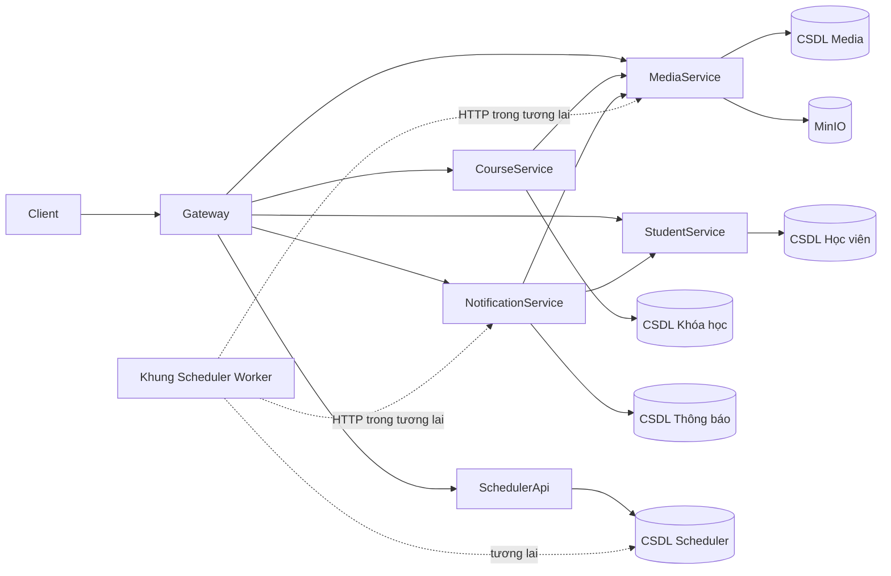
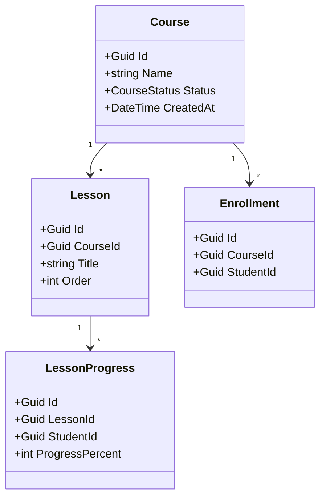
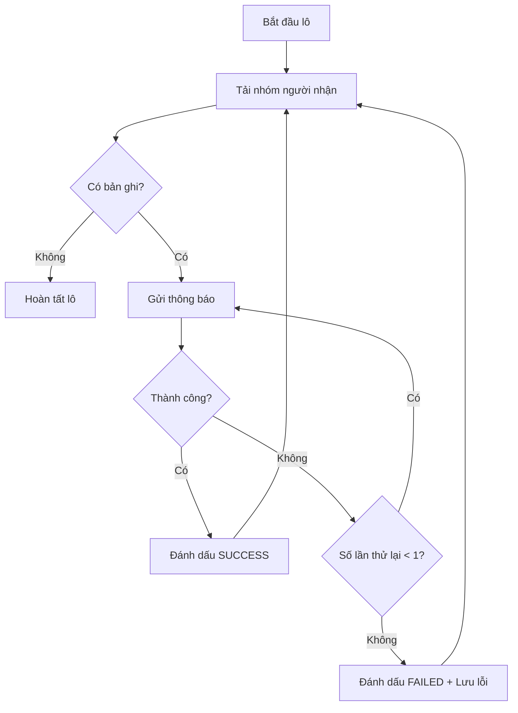

# 41. Các sơ đồ UML cần chuẩn bị

Tối thiểu 4 sơ đồ.

## 41.1. Sơ đồ thành phần



---

## 41.2. Sơ đồ lớp Course



---

## 41.3. Sơ đồ tuần tự Thông báo

```mermaid
sequenceDiagram
    participant Admin as Quản trị viên
    participant API as API Thông báo
    participant DB as CSDL Thông báo
    participant Worker as Tiến trình nền
    participant Student as Student Service

    Admin->>API: POST /notification-batches
    API->>DB: Tạo lô + chụp danh sách người nhận
    API-->>Admin: 202 Đã chấp nhận

    Note over Worker: Giai đoạn tương lai; phần nền tảng chưa triển khai
    Worker->>DB: Lấy lô đang chờ
    Worker->>Student: Lấy lô Học viên
    Student-->>Worker: 500 Học viên

    loop từng lô
        Worker->>Worker: Gửi thông báo
        Worker->>DB: Cập nhật trạng thái mục
    end

    Worker->>DB: Hoàn tất lô
```

---

## 41.4. Sơ đồ hoạt động xử lý hàng loạt



---
