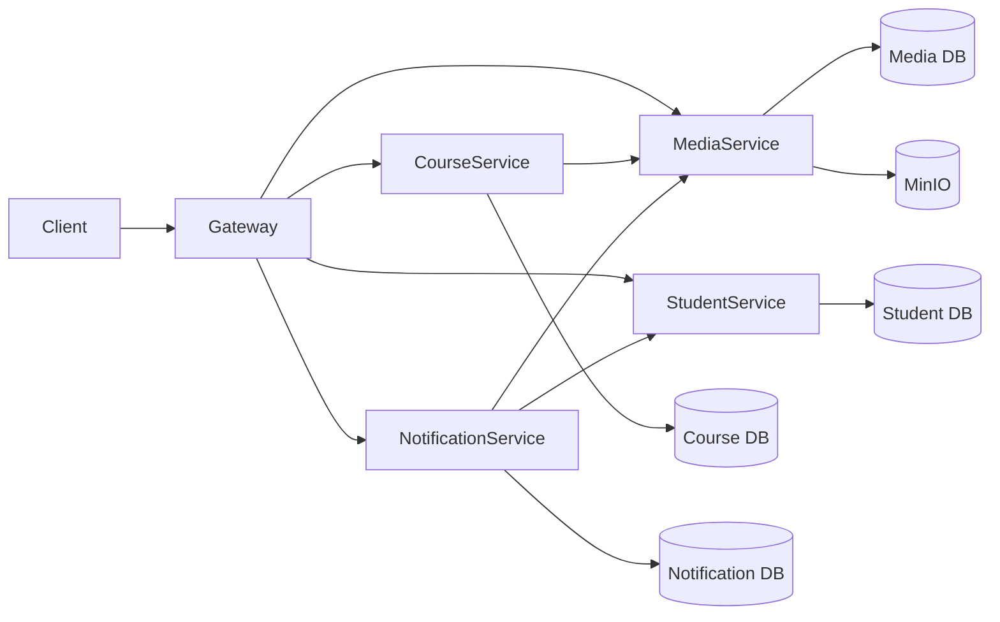
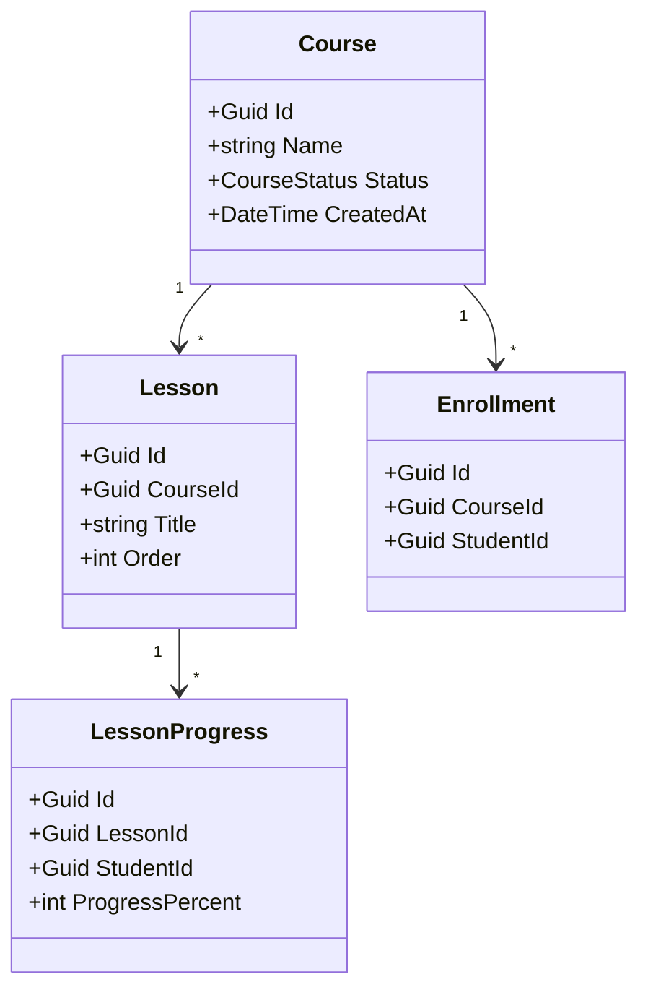
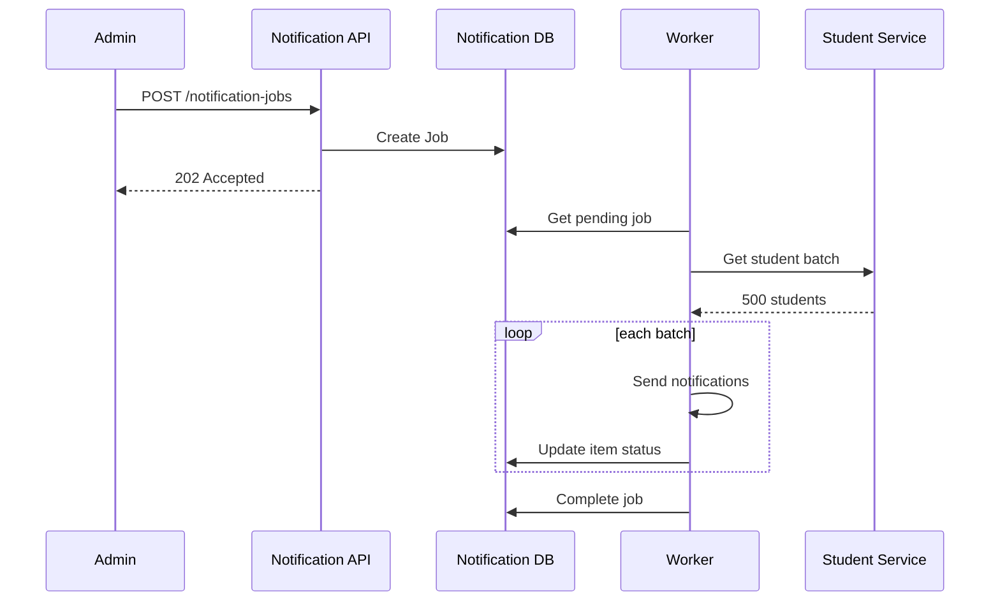
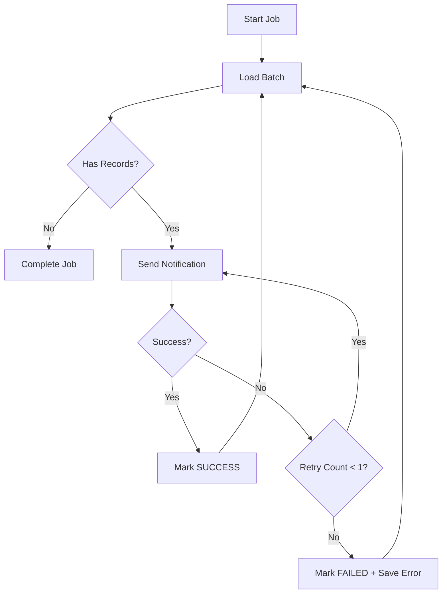

# 41. UML cần chuẩn bị

Tối thiểu 4 diagram.

## 41.1. Component Diagram

---

## 41.2. Course Class Diagram

---

## 41.3. Notification Sequence Diagram

---

## 41.4. Batch Activity Diagram

---
