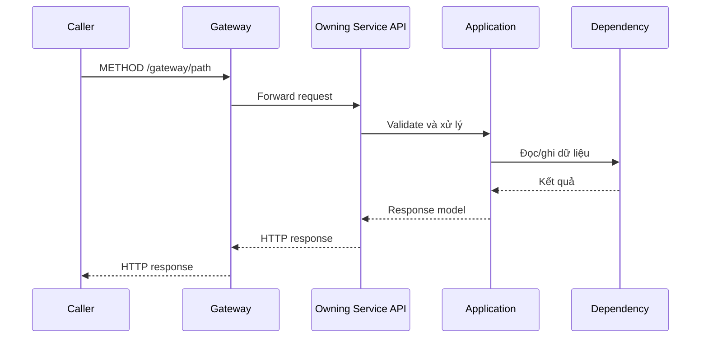

# `METHOD /gateway/path` — Tên flow

API contract: [`docs/api/<service>/endpoints/<method>-<resource>.md`](../../../api/<service>/endpoints/<method>-<resource>.md)

## Mục tiêu

Nêu kết quả nghiệp vụ hoặc vận hành mà actor/hệ thống nhận được.

## Actor và thành phần

- Actor/caller.
- Gateway.
- Owning service.
- Dependency liên quan.

## Điều kiện trước

- Authentication/authorization.
- Trạng thái dữ liệu bắt buộc.
- Validation hoặc dependency prerequisite.

## UML luồng chạy

## Luồng chính

1. Caller gửi request.
2. Gateway/service kiểm tra contract.
3. Application thực thi nghiệp vụ.
4. Infrastructure đọc/ghi dependency.
5. Service trả response.

## Luồng lỗi

- Validation và error code.
- Not found/conflict.
- Dependency unavailable.

## Dữ liệu và side effects

- Database đọc/ghi.
- Message/event/job.
- Storage hoặc HTTP dependency.
- Cache/idempotency/concurrency.

## Test mapping

- Unit test.
- Component test.
- Integration test.
