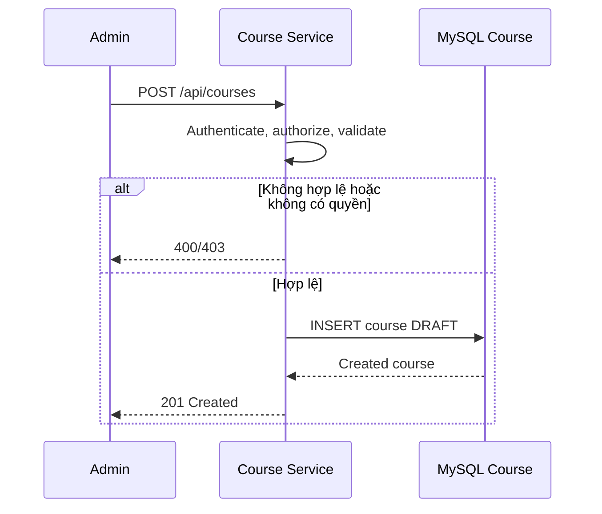
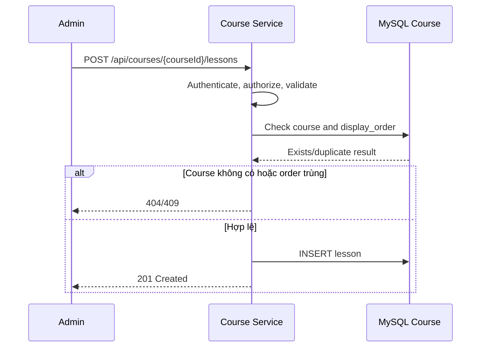

# Quản lý Khóa học và Bài học

## Mục đích

Quản trị viên tạo, cập nhật, xuất bản và quản lý Bài học cho một Khóa học.

## Tác nhân

Quản trị viên.

## Điều kiện đầu vào

- Quản trị viên đã được xác thực và có quyền quản lý Khóa học.
- `name` hợp lệ; `descriptionMarkdown` là Markdown an toàn.

## UML luồng chạy

### `POST /api/courses`

### `POST /api/courses/{courseId}/lessons`

## Luồng chính

1. Quản trị viên gửi `POST /api/courses` với tên, mô tả Markdown và trạng thái `DRAFT`.
2. Course Service xác thực dữ liệu và lưu một bản ghi `courses`.
3. Quản trị viên thêm Bài học bằng `POST /api/courses/{courseId}/lessons`.
4. Course Service kiểm tra Khóa học tồn tại, lưu `lessons` với `display_order`.
5. Quản trị viên cập nhật Khóa học, Bài học hoặc chuyển Khóa học sang `PUBLISHED`.
6. Học viên chỉ thấy Khóa học và Bài học được phép truy cập theo trạng thái và lượt ghi danh.

## Trường hợp lỗi

- `400`: tên, Markdown, hoặc `display_order` không hợp lệ.
- `404`: Khóa học không tồn tại.
- `409`: Bài học có `display_order` trùng trong cùng Khóa học hoặc Khóa học không thể xuất bản.

## Dữ liệu thay đổi

- Cơ sở dữ liệu Course Service: `courses`, `lessons`.
- Không có dịch vụ nào khác bị ghi dữ liệu trong luồng này.

## Nội dung liên quan

- [Upload media](../media/post-media.md) và
  [tạo media usage](../media/post-media-usages.md) cho ảnh đại diện, tệp đính
  kèm và media nhúng.
- [Ghi danh và tiến độ học tập](enrollment-and-learning-progress.md) cho quyền học của Học viên.
