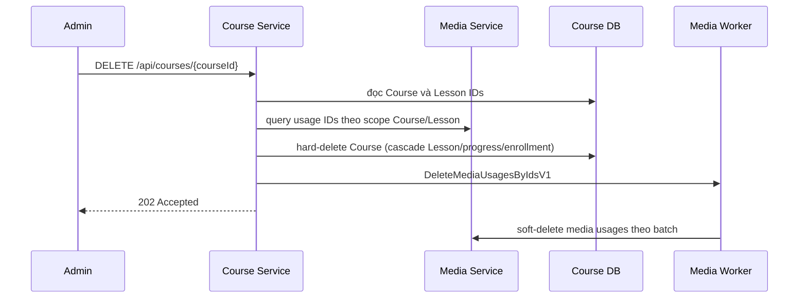

# Xóa Course

API contract: [`DELETE Course`](../../api/course-service/endpoints/delete-course.md).

## Mục tiêu

Xóa hẳn Course cùng toàn bộ Lesson phụ thuộc, đồng thời yêu cầu Media Service dọn mọi media usage của Course và Lesson.

## Luồng

## Quy tắc

- Scope Course: `COURSE_DESCRIPTION`, `COURSE_THUMBNAIL`, `COURSE_GALLERY`.
- Scope từng Lesson: `LESSON_CONTENT`, `LESSON_ATTACHMENT`.
- Media usage không tồn tại/đã xóa khi worker xử lý được bỏ qua để command idempotent.
- Không có distributed transaction; nếu command lỗi sau hard-delete, broker retry theo policy Media Worker.
