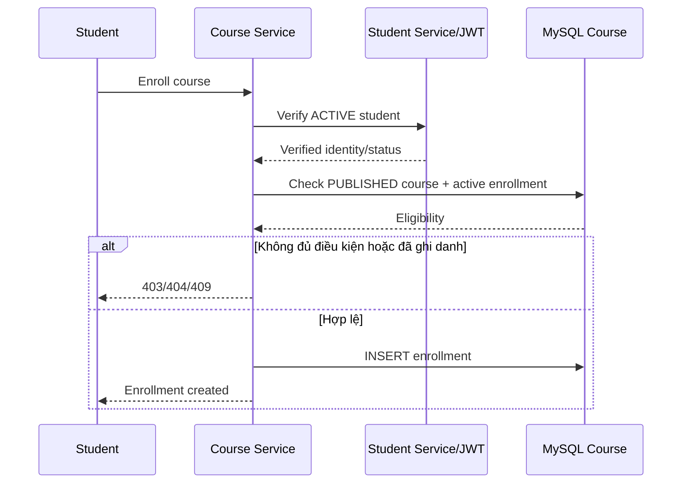

# Ghi danh và tiến độ học tập

## Mục đích

Học viên ghi danh vào Khóa học, xem Bài học và cập nhật tiến độ học.

## Tác nhân

Học viên; Course Service; Student Service.

## Điều kiện đầu vào

- Học viên đã được xác thực và có trạng thái `ACTIVE`.
- Khóa học tồn tại và có trạng thái `PUBLISHED`.

## UML luồng chạy

### Ghi danh Khóa học



### Cập nhật tiến độ Bài học

```mermaid
sequenceDiagram
    participant Student
    participant Course as Course Service
    participant DB as MySQL Course

    Student->>Course: Submit lesson progress
    Course->>DB: Verify enrollment + lesson ownership
    DB-->>Course: Eligible lesson
    alt Không có quyền hoặc lesson không tồn tại
        Course-->>Student: 403/404
    else Hợp lệ
        Course->>DB: UPSERT lesson_progress; set completed_at at 100%
        Course-->>Student: Updated progress
    end
```

## Luồng chính

1. Học viên chọn một Khóa học để ghi danh.
2. Course Service xác nhận Học viên qua Student Service hoặc thông tin xác nhận JWT.
3. Course Service kiểm tra Khóa học cho phép ghi danh và chưa có lượt ghi danh đang hoạt động.
4. Course Service tạo `enrollments` với `course_id`, `student_id`, và `enrolled_at`.
5. Học viên mở Bài học thuộc Khóa học đã ghi danh.
6. Học viên gửi tiến độ hoàn thành Bài học.
7. Course Service thêm mới hoặc cập nhật `lesson_progresses` và đặt `completed_at` khi `progress_percent` đạt 100.

## Trường hợp lỗi

- `401`: chưa xác thực.
- `403`: Học viên không có quyền xem Bài học không thuộc lượt ghi danh.
- `404`: Học viên, Khóa học hoặc Bài học không tồn tại.
- `409`: Học viên đã ghi danh Khóa học.

## Dữ liệu thay đổi

- Cơ sở dữ liệu Course Service: `enrollments`, `lesson_progresses`.
- Cơ sở dữ liệu Student Service không bị ghi trong luồng này; chỉ được đọc để xác thực/tra cứu.
