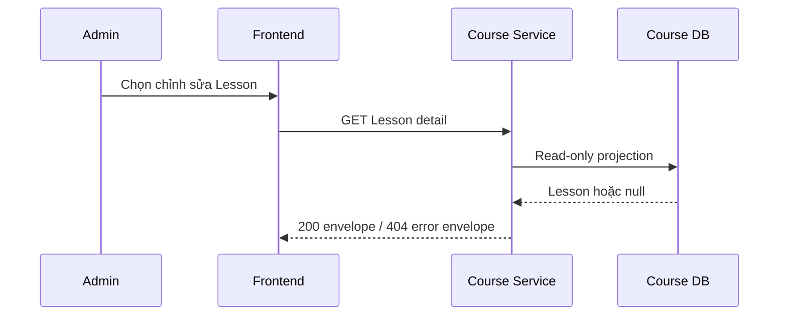

# Lấy chi tiết Lesson

Admin mở right panel chỉnh sửa Lesson. Frontend gửi `GET /course/api/courses/{courseId}/lessons/{lessonId}` để lấy snapshot đầy đủ trước khi render form.

Endpoint không thay đổi database, không publish message và response dùng `no-store`.
