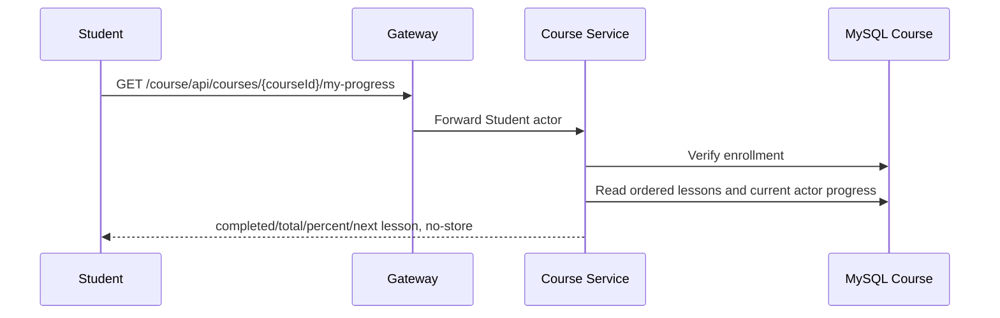

# `GET /course/api/courses/{courseId}/my-progress` — Tiến độ Student

API contract: [`get-course-my-progress.md`](../../../api/course-service/endpoints/get-course-my-progress.md)

## Mục tiêu

Hiển thị tiến độ và Lesson tiếp theo của chính Student trên card Home mà không lộ progress của Student khác.

## Actor và thành phần

- Student đã login.
- Gateway, Course Service và MySQL Course.

## Điều kiện trước

- Actor là Student, `courseId` hợp lệ và đã ghi danh Course.

## UML luồng chạy

## Luồng lỗi

- `400 VALIDATION_FAILED`: UUID sai.
- `403 STUDENT_NOT_ENROLLED`: chưa ghi danh hoặc actor không phải Student.
- `404 COURSE_NOT_FOUND`: Course bị xóa.

## Dữ liệu và side effects

Chỉ đọc `lessons`, `lesson_progresses` của current Student. Một Lesson hoàn thành cần `progress_percent >= 100` và `completed_at` có giá trị. Không có side effect.

## Test mapping

- Unit: `StudentLearningHandlersTests`.
- Component: `StudentLearningEndpointsComponentTests`.
