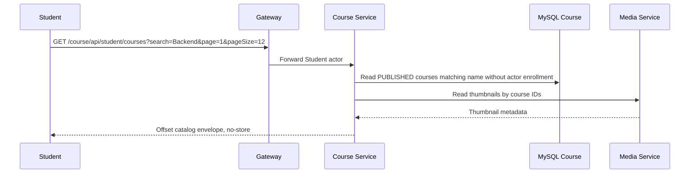

# `GET /course/api/student/courses` — Danh mục Course Student

API contract: [`get-student-course-catalog.md`](../../../api/course-service/endpoints/get-student-course-catalog.md)

## Mục tiêu

Cho Student khám phá và ghi danh các Course mới; Course đã ghi danh không lặp lại trong catalog.

## Actor và thành phần

- Student đã login.
- Gateway.
- Course Service, MySQL Course và Media Service.

## Điều kiện trước

- Actor header hợp lệ, type là `STUDENT`.
- Search (nếu có) được trim và pagination hợp lệ.

## UML luồng chạy

## Luồng lỗi

- `400 VALIDATION_FAILED`: phân trang sai.
- `403 FORBIDDEN`: actor không phải Student.

## Dữ liệu và side effects

Chỉ đọc `courses`, `enrollments` và metadata Media. Search tên Course kết hợp `AND` với điều kiện PUBLISHED/chưa ghi danh; chuỗi rỗng không lọc. Ghi danh là thao tác riêng qua `POST /course/api/courses/{courseId}/enrollments`; frontend thay route sang detail khi POST thành công.

## Test mapping

- Unit: `StudentLearningHandlersTests`.
- Component: `StudentLearningEndpointsComponentTests`.
