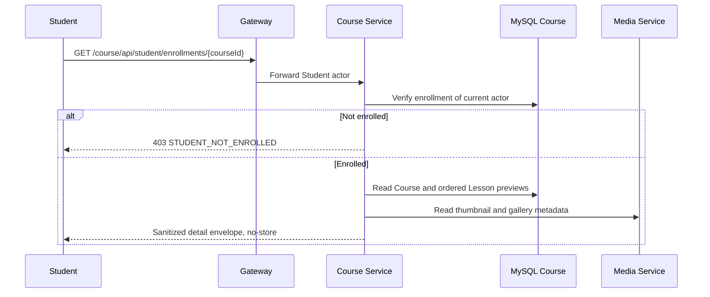

# `GET /course/api/student/enrollments/{courseId}` — Chi tiết Course Student

API contract: [`get-student-enrollment-detail.md`](../../../api/course-service/endpoints/get-student-enrollment-detail.md)

## Mục tiêu

Cho Student đã ghi danh xem Course ở chế độ đọc: thumbnail, gallery, mô tả HTML an toàn và danh sách Lesson preview.

## Actor và thành phần

- Student đã login.
- Gateway, Course Service, MySQL Course và Media Service.

## Điều kiện trước

- Actor là Student và `courseId` hợp lệ.
- Enrollment `(course_id, student_id)` phải tồn tại.

## UML luồng chạy

## Luồng lỗi

- `400 VALIDATION_FAILED`: UUID sai.
- `403 STUDENT_NOT_ENROLLED`: không có enrollment hoặc actor không phải Student.
- `404 COURSE_NOT_FOUND`: Course đã bị xóa sau khi enrollment được xác nhận.

## Dữ liệu và side effects

Chỉ đọc dữ liệu; không trả lesson content/progress của người khác. Markdown được render/sanitize trước response.

## Test mapping

- Unit: `StudentLearningHandlersTests`.
- Component: `StudentLearningEndpointsComponentTests`.
