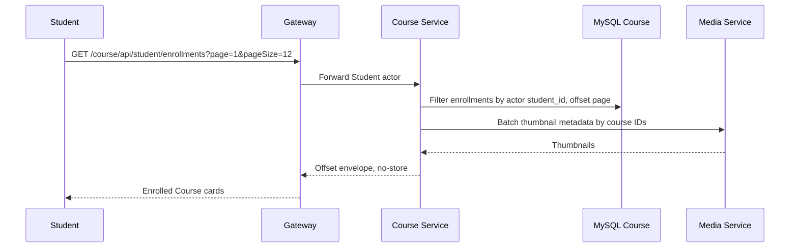

# `GET /course/api/student/enrollments` — Home Student

API contract: [`get-student-enrollments.md`](../../../api/course-service/endpoints/get-student-enrollments.md)

## Mục tiêu

Cho Student xem trang Home với các Course đã ghi danh, có thumbnail và phân trang ổn định.

## Actor và thành phần

- Student đã login.
- Gateway.
- Course Service và MySQL Course.
- Media Service để lấy thumbnail theo batch.

## Điều kiện trước

- Header actor hợp lệ, type là `STUDENT`.
- `page` và `pageSize` hợp lệ.

## UML luồng chạy

## Luồng lỗi

- `400 VALIDATION_FAILED`: phân trang sai.
- `403 FORBIDDEN`: actor không phải Student.

## Dữ liệu và side effects

Chỉ đọc `enrollments`, `courses` và metadata Media; không ghi database hay event.

## Test mapping

- Unit: `StudentLearningHandlersTests` kiểm tra pagination và ownership.
- Component: `StudentLearningEndpointsComponentTests` kiểm tra envelope, thumbnail, no-store và actor.
