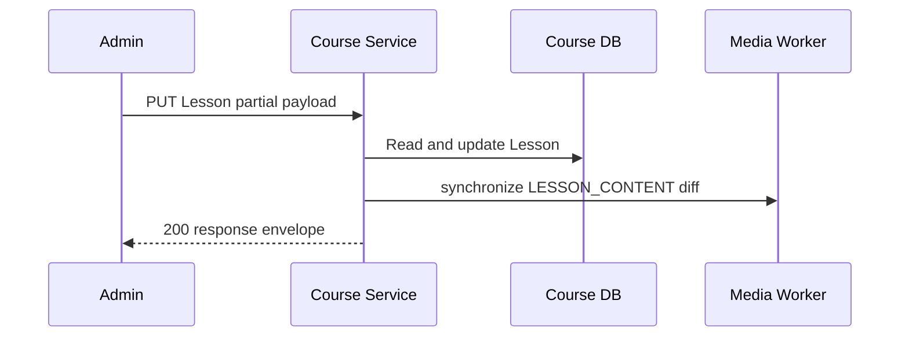

# Cập nhật Lesson

`PUT /course/api/courses/{courseId}/lessons/{lessonId}` chỉ đổi các field có trong request. Khi `contentMarkdown` là `null` hoặc rỗng, nội dung được xóa và toàn bộ media usage cũ được gửi cho worker để gỡ. Field không xuất hiện không tạo media command.

