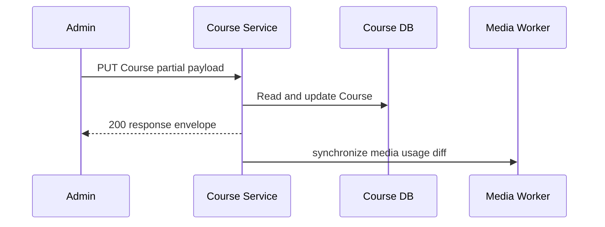

# Cập nhật Course

`PUT /course/api/courses/{courseId}` cho phép Admin cập nhật partial Course. API đọc Course hiện tại, chỉ áp dụng field xuất hiện trong JSON và lưu database. Khi `descriptionMarkdown` xuất hiện, Application so sánh media trước/sau và gửi command add/remove sang Media worker. Worker idempotently tạo hoặc soft-delete usage `COURSE_DESCRIPTION`; response HTTP không chờ worker hoàn thành.

