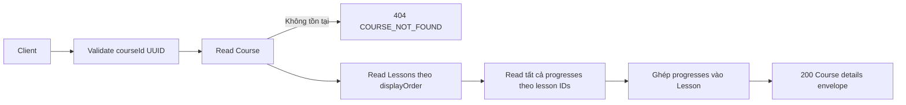

# Lấy chi tiết Course

## Mục đích

Client xem Course cùng Lessons và toàn bộ tiến độ học thuộc các Lesson đó.

## Luồng chính

1. Client gọi `GET /course/api/courses/{courseId}/details`.
2. API parse UUID và Application yêu cầu repository đọc detail.
3. Repository đọc Course, Lessons theo `displayOrder`, rồi batch toàn bộ Progress
   theo danh sách Lesson IDs.
4. Application ghép Progress vào đúng Lesson và API trả `200` envelope.

## Rỗng, lỗi và dữ liệu thay đổi

- Course chưa có Lesson hoặc Progress vẫn trả `200` với mảng rỗng.
- Course không tồn tại trả `404 COURSE_NOT_FOUND`.
- Đây là nhiều read query, nên ghi Progress đồng thời có thể thay đổi dữ liệu
  quan sát được; endpoint không thay đổi dữ liệu.

## N+1

Luồng production dùng batch Progress, số query cố định. Đường N+1 chỉ dùng
benchmark để chứng minh chênh lệch và không được map thành HTTP endpoint.

## Dữ liệu trả về

Mỗi `Lesson` luôn có `progresses`; mảng này bao gồm tất cả bản ghi progress
của Lesson, không chỉ progress của người gọi. Client tự áp quyền hiển thị theo
ngữ cảnh nghiệp vụ ở tầng sử dụng dữ liệu.
