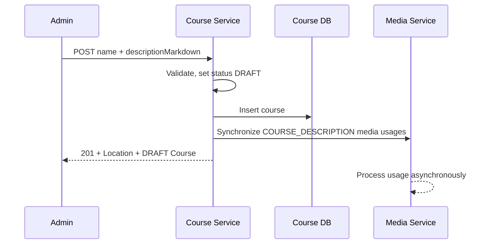

# Tạo khóa học

## Mục đích

Admin tạo một Course mới để tiếp tục chỉnh sửa nội dung và Lesson trước khi xuất
bản. Course mới luôn ở trạng thái `DRAFT`.

## Luồng chính

1. Client gửi tên Course, Markdown mô tả và `X-Actor-Id` tới
   `POST /course/api/courses`.
2. Course Service trim/kiểm tra tên, đặt trạng thái cố định là `DRAFT` và lưu
   Course.
3. Nếu mô tả có Markdown URL Media public hợp lệ, Application trích xuất reference
   và gửi command đồng bộ `COURSE_DESCRIPTION` sang Media Service.
4. API trả `201 Created`, Course trong response envelope và header `Location` tới
   màn hình chi tiết Course.
5. Media worker xử lý command bất đồng bộ để tạo usage; việc này không chặn response
   HTTP chờ worker hoàn thành.

## Ràng buộc và tình huống lỗi

- `status` không nhận từ request; dù client gửi field thừa, Course vẫn là `DRAFT`.
- `name` cần có 3–200 ký tự sau khi trim; sai trả `400 VALIDATION_FAILED` và không
  tạo Course.
- Chỉ URL `/media/api/media/{mediaId}/content` trong Markdown được đồng bộ Media;
  link khác không tạo usage.
- Endpoint không hỗ trợ idempotency key. Nếu timeout sau khi gửi request, client cần
  tra cứu/xác nhận kết quả thay vì retry mù, vì có thể tạo Course `DRAFT` trùng.
