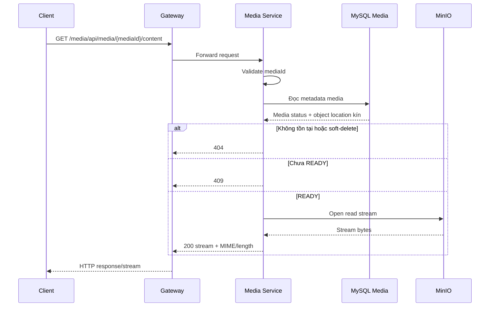

# `GET /media/api/media/{mediaId}/content` — Đọc media content

API contract: [`get-media-content.md`](../../api/media-service/endpoints/get-media-content.md)

## Mục tiêu

Stream object media `READY` từ MinIO qua Media Service/Gateway mà không public
storage location.

## Actor và thành phần

- Client.
- API Gateway.
- Media Service.
- MySQL Media và MinIO.

## Điều kiện trước

- `mediaId` là UUID hợp lệ.
- Media tồn tại, chưa soft-delete và đang `READY`.
- Authentication/authorization chưa được triển khai ở phiên bản hiện tại.

## UML luồng chạy

## Luồng chính

1. Client gọi `contentUrl` qua Gateway.
2. Media Service đọc metadata bằng repository.
3. Application tạo download capability giữ kín bucket/object key.
4. MinIO adapter copy stream trực tiếp vào response body.
5. API trả MIME, length, filename an toàn và `Cache-Control: no-store`.

## Luồng lỗi

- UUID sai: `400`.
- Media thiếu/đã soft-delete: `404`.
- Media chưa `READY`: `409`.
- Storage lỗi trước khi response bắt đầu: `503`.
- Storage lỗi sau khi đã stream một phần làm kết nối bị ngắt.

## Dữ liệu và side effects

- Chỉ đọc metadata và object.
- Không buffer toàn bộ file.
- Không hỗ trợ range request/presigned URL ở phiên bản hiện tại.

## Test mapping

- Unit: trạng thái media và storage error mapping.
- Component: bytes/MIME/length/cache headers.
- Integration: MinIO download đúng bytes.
