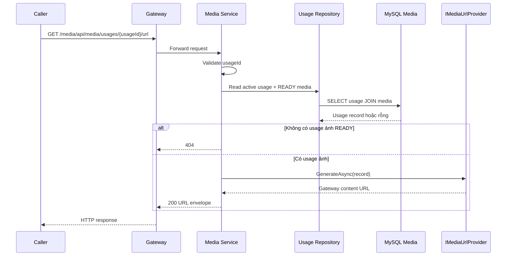

# `GET /media/api/media/usages/{usageId}/url` — Lấy URL cho một usage ảnh

API contract: [`get-media-usage-url.md`](../../api/media-service/endpoints/get-media-usage-url.md).

## Mục tiêu

Cho Student Service, Course Service hoặc client lấy URL hiển thị của một usage ảnh mà không biết storage location.

## UML luồng chạy

## Luồng chính

1. Caller gửi `usageId` qua Gateway.
2. Media Service đọc usage active và media `READY` tương ứng.
3. Application xác nhận media là `IMAGE`.
4. `IMediaUrlProvider` sinh URL; implementation hiện tại trả content URL qua Gateway.
5. API trả `200` JSON envelope.

## Luồng lỗi

- `400`: UUID sai.
- `404`: usage thiếu/soft-delete hoặc media không còn active/`READY`.
- `409`: không áp dụng.

## Dữ liệu và side effects

Chỉ đọc `media_usages` và `media_objects`; không gọi MinIO, không thay đổi dữ liệu.
