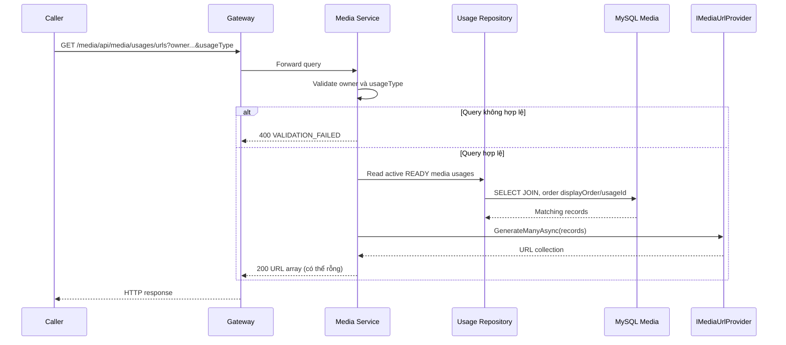

# `GET /media/api/media/usages/urls` — Lấy URL cho usage media của owner

API contract: [`get-media-usage-urls.md`](../../api/media-service/endpoints/get-media-usage-urls.md).

## Mục tiêu

Cho một service lấy toàn bộ URL media active của một owner, ví dụ avatar Học viên, thumbnail Khóa học hoặc tệp đính kèm Lesson.

## UML luồng chạy

## Luồng chính

1. Caller gửi `ownerService`, `ownerType`, `usageType`, `ownerId`.
2. Media Service đọc usage active khớp toàn bộ owner và usage type, join với media `READY` theo thứ tự `displayOrder`, `usageId`.
3. Application xác nhận mọi media `READY`; chỉ giữ thumbnail khi thumbnail là ảnh `READY`.
4. `IMediaUrlProvider.GenerateManyAsync` sinh URL tương ứng.
5. API trả `200` với mảng, hoặc mảng rỗng nếu owner chưa có usage.

## Luồng lỗi

- `400`: owner service/type, usage type thiếu hoặc owner ID sai.

## Dữ liệu và side effects

Chỉ đọc `media_usages` và `media_objects`; không thay đổi dữ liệu và không gọi MinIO.
