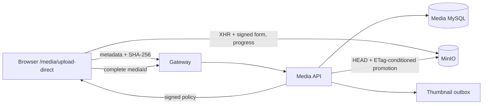
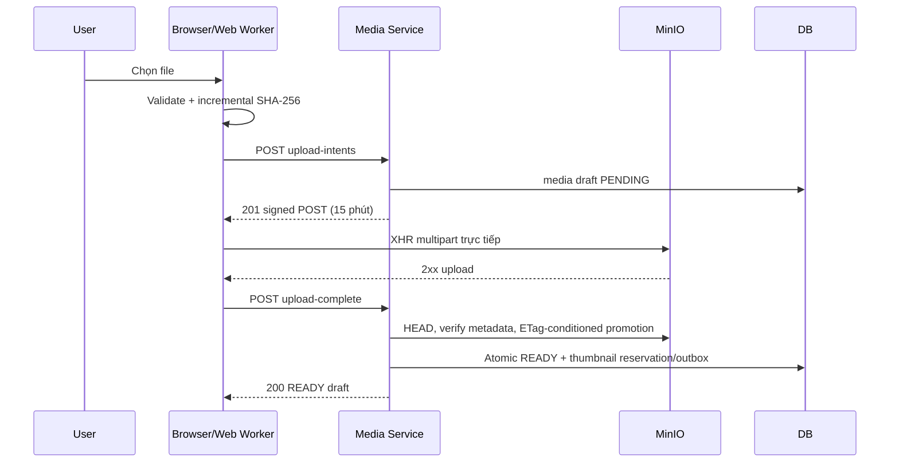

# Upload media trực tiếp từ browser

API contracts:
[`upload-intents`](../../api/media-service/endpoints/post-media-upload-intents.md) và
[`upload-complete`](../../api/media-service/endpoints/post-media-upload-complete.md).

## Mục đích

Cho phép browser tải file tối đa 500 MiB trực tiếp lên MinIO với tiến độ cục bộ,
trong khi Media Service vẫn sở hữu validation, metadata, draft state và bước
commit cuối. Multipart hiện hữu vẫn được giữ lại.

## Kiến trúc

## Usage và trạng thái frontend

Trang `/media/upload-direct` hiển thị ba stage `Checksum → Upload → Finalize`.
Checksum chạy trong Web Worker; XHR `upload.onprogress` chỉ phản ánh bytes browser
đã gửi. State file, intent, signed fields và progress chỉ nằm trong runtime
Redux/component. Reload hoặc rời trang reset toàn bộ và bắt buộc chọn file/tạo
intent mới; không restore transfer đang dở.

Actor hiện do request truyền theo convention `STUDENT` vì chưa có JWT. Client
validation giúp phản hồi nhanh nhưng backend và signed policy vẫn là boundary
bắt buộc.

## Promotion, retry và lỗi mơ hồ

Intent không idempotent. Upload/policy lỗi hoặc hết 15 phút thì tạo intent mới;
PENDING/staging cũ chờ cleanup của P5-20. Complete idempotent: HEAD xác minh
size, MIME và checksum metadata do frontend khai báo, sau đó copy sang unique
immutable final key với điều kiện ETag. Server không đọc lại bytes để tự băm.

Hai complete đồng thời có một transition thắng; loser chỉ dọn object mà attempt
của nó sở hữu. Nếu API mất kết nối sau promotion hoặc commit có kết quả mơ hồ,
retry cùng `mediaId`: established `READY` được trả lại. Object staging/final
không chắc chắn được giữ để cleanup sau này recheck database reference trước khi
xóa.

## Troubleshooting

| Hiện tượng | Xử lý |
| --- | --- |
| Browser chặn CORS | Đặt `MINIO_API_CORS_ALLOW_ORIGIN` đúng origin frontend và chạy lại `minio-init`; origin gồm scheme/port. |
| URL upload là `minio:9000` | Sửa `MINIO_PUBLIC_ENDPOINT=localhost:9000`; internal `Storage:Minio:Endpoint=minio:9000` chỉ dùng giữa container. |
| Policy expired/signature mismatch | Không sửa signed fields; tạo intent mới, kiểm tra clock và SSL/public endpoint. |
| Progress đứng hoặc reload | Transfer không được persist; cancel attempt và chọn/tải lại file để nhận intent mới. |
| Complete trả `409` | Kiểm tra upload MinIO đã 2xx; không đổi MIME/file/form fields; ETag stale hoặc metadata mismatch cần intent mới. |
| Complete `503`/timeout | Giữ `mediaId` và retry complete; không tạo intent mới cho đến khi xác định object chưa upload hoặc policy đã hết hạn. |
