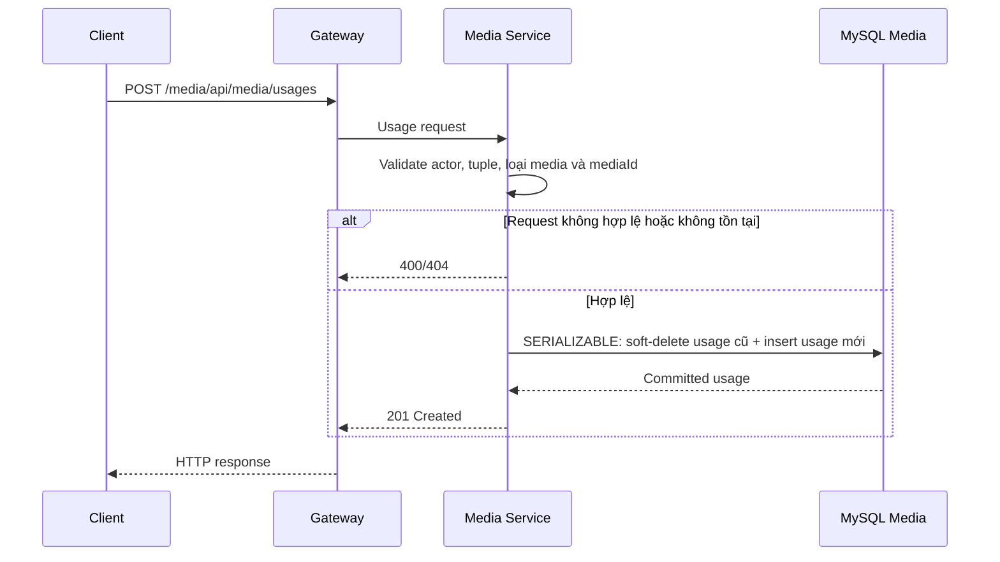

# `POST /media/api/media/usages` — Thay avatar hoặc thumbnail

API contract: [`post-media-usages.md`](../../api/media-service/endpoints/post-media-usages.md)

## Mục tiêu

Đăng ký media `READY` theo policy avatar/Course, đồng thời giữ history usage đã
soft-delete khi tuple có tính thay thế.

## Actor và thành phần

- Học viên/client.
- API Gateway.
- Media Service.
- Student Service.
- MySQL Media.

## Điều kiện trước

- Student chỉ gán `STUDENT/STUDENT_AVATAR/AVATAR` cho chính mình.
- Admin tạo các tuple `MEDIA/MEDIA_THUMBNAIL/THUMBNAIL` hoặc Course được public.
- Media tồn tại, chưa soft-delete và đang `READY`; policy xác định ảnh nguồn,
  WebP derivation hoặc media nguồn hợp lệ cho tuple.

## UML luồng chạy

## Luồng chính

1. Client gửi JSON usage qua Gateway.
2. Media Service validate actor tách biệt với owner và áp dụng assignment policy.
3. Student chỉ thao tác avatar của chính mình; Course usage yêu cầu Admin và
   không lookup Course/Lesson owner trong release này.
4. Repository mở transaction `SERIALIZABLE`.
5. Usage avatar/thumbnail active cũ được soft-delete và usage mới được tạo.
6. API trả `201` với actor/owner không bị trộn lẫn.

## Luồng lỗi

- Field/UUID/tuple sai: `400`.
- Actor hoặc media không tồn tại: `404`.
- Media chưa `READY` hoặc duplicate active reference: `409`.
- Student Service/database không khả dụng: `503`.

## Dữ liệu và side effects

- Soft-delete usage active cũ.
- Tạo một hàng `media_usages`.
- Generated guards bảo đảm chỉ một avatar, media thumbnail hoặc Course thumbnail
  active trên mỗi owner; gallery và Lesson attachment giữ nhiều usage.
- Chuỗi A → B → A hợp lệ; gửi lại A khi A đang active trả conflict.

## Test mapping

- Unit: actor/owner, normalization và validation.
- Component: request/response/error envelope.
- Integration: transaction, unique guard và A → B → A.
