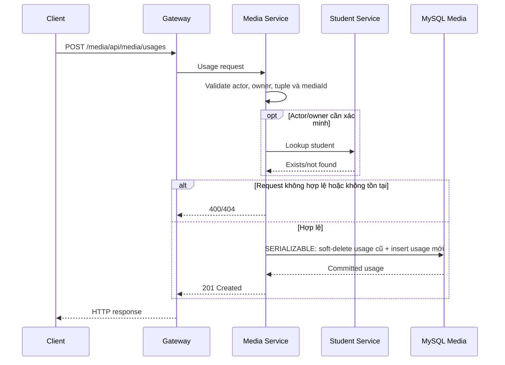

# `POST /media/api/media/usages` — Thay avatar hoặc thumbnail

API contract: [`post-media-usages.md`](../../api/media-service/endpoints/post-media-usages.md)

## Mục tiêu

Đăng ký một media `READY` làm avatar Học viên hoặc thumbnail của media gốc,
đồng thời giữ history usage đã soft-delete.

## Actor và thành phần

- Học viên/client.
- API Gateway.
- Media Service.
- Student Service.
- MySQL Media.

## Điều kiện trước

- Actor và owner tồn tại.
- Media tồn tại, chưa soft-delete và đang `READY`.
- Tuple hỗ trợ là `STUDENT/STUDENT_AVATAR/AVATAR` và
  `MEDIA/MEDIA_THUMBNAIL/THUMBNAIL`.

## UML luồng chạy

## Luồng chính

1. Client gửi JSON usage qua Gateway.
2. Media Service validate actor tách biệt với owner.
3. Service tra cứu owner khi actor không phải chính owner.
4. Repository mở transaction `SERIALIZABLE`.
5. Usage avatar/thumbnail active cũ được soft-delete và usage mới được tạo.
6. API trả `201` với actor/owner không bị trộn lẫn.

## Luồng lỗi

- Field/UUID/tuple sai: `400`.
- Actor, owner hoặc media không tồn tại: `404`.
- Media chưa `READY` hoặc duplicate active reference: `409`.
- Student Service/database không khả dụng: `503`.

## Dữ liệu và side effects

- Soft-delete usage active cũ.
- Tạo một hàng `media_usages`.
- Generated guards bảo đảm chỉ một avatar hoặc thumbnail active trên mỗi owner.
- Chuỗi A → B → A hợp lệ; gửi lại A khi A đang active trả conflict.

## Test mapping

- Unit: actor/owner, normalization và validation.
- Component: request/response/error envelope.
- Integration: transaction, unique guard và A → B → A.
