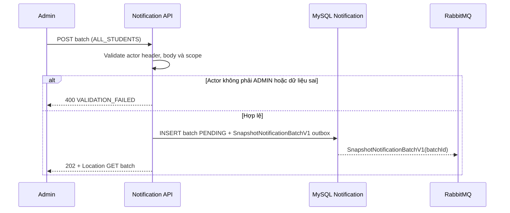
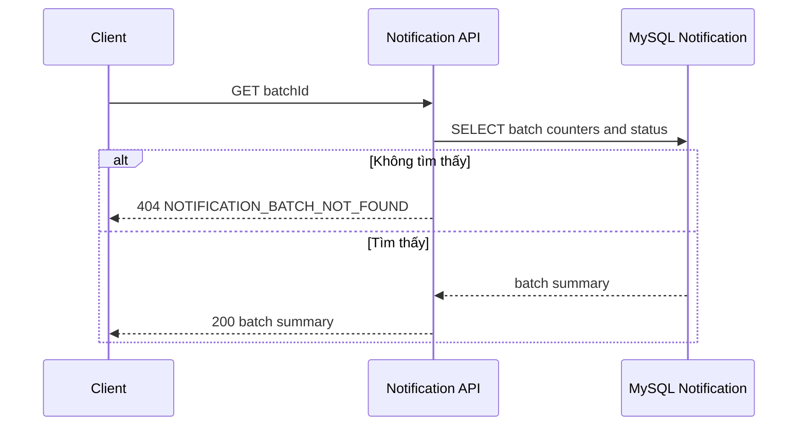
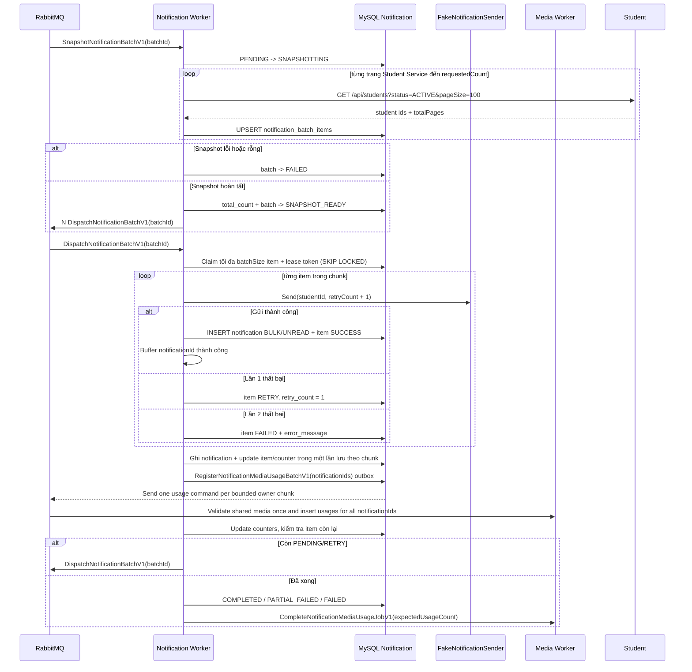

# Thông báo hàng loạt

## Mục đích

Quản trị viên tạo một lô và snapshot tất cả học viên đang hoạt động. Notification Worker xử lý lô bất đồng bộ; API không gửi inbox trong HTTP request.

## Tác nhân

Quản trị viên; Notification API; Student Service; MySQL Notification; RabbitMQ; Notification Worker.

## Điều kiện đầu vào

- `targetScope` là `ALL_STUDENTS`.
- Header `X-Actor-Type` là `ADMIN`, `X-Actor-Id` là UUID hợp lệ; cùng với `title` và `bodyMarkdown` hợp lệ.
- `requestedCount` bỏ trống hoặc nằm trong `1..100000`; bỏ trống nghĩa là toàn bộ.
- Notification database và MassTransit outbox sẵn sàng nhận batch command.

## UML luồng chạy

### `POST /api/notification-batches`

### `GET /api/notification-batches/{batchId}`

### `SnapshotNotificationBatchV1` và `DispatchNotificationBatchV1` (Notification Worker)

## Quy tắc xử lý

1. POST chỉ tạo batch; Worker bắt đầu snapshot sau khi command được durable handoff. Snapshot dùng từng trang từ Student Service, không giữ toàn bộ recipient trong memory hoặc HTTP request. Retry/redelivery upsert theo `UNIQUE(batch_id, student_id)` nên không tạo item trùng.
2. Một chunk có tối đa `batchSize` item, mặc định 500; Worker không tải toàn bộ lô vào bộ nhớ. `NOTIFICATION_BATCH_DISPATCH_CHUNK_CONCURRENCY` xác định số chunk cùng chạy và phải đồng nhất với `Messaging__Consumer__ConcurrencyLimit` của Notification Worker. Mặc định cả hai là 1.
3. Claim là transaction ngắn dùng `FOR UPDATE SKIP LOCKED`: item được gắn `lease_token` và `lease_expires_at`. Chỉ kết quả có token khớp mới cập nhật item; `PROCESSING` chỉ được worker khác nhận lại khi lease hết hạn.
4. Trong một chunk, sender chạy song song tối đa `NOTIFICATION_BATCH_MAX_CONCURRENT_SENDS` (mặc định 1). Sau đó notification, trạng thái item và counter được ghi một lần theo chunk; không commit từng người nhận.
5. Fake sender thất bại lần một khi `hash(studentId) % 20 == 0`, và lần hai khi `hash(studentId) % 100 == 0`.
6. Item `SUCCESS` không được xử lý lại. Unique `(batch_id, student_id)` và `(notification_batch_id, recipient_student_id)` bảo vệ dữ liệu nghiệp vụ khỏi trùng lặp.
7. Khi không còn item claim được hay item `PROCESSING` active: không có lỗi là `COMPLETED`; chỉ lỗi là `FAILED`; có cả thành công và lỗi là `PARTIAL_FAILED`.
8. Markdown media được kiểm tra ngay khi tạo batch. Sau một dispatch chunk, các `notificationId` thành công cùng bodyMarkdown được gom thành `RegisterNotificationMediaUsageBatchV1`; command chứa tối đa 500 owner IDs và tối đa 1,000 usage rows. Media Worker kiểm tra mỗi media `READY` một lần rồi tạo idempotent usage `NOTIFICATION/NOTIFICATION_BODY/EMBED|ATTACHMENT` cho từng notification ID. Item lỗi không có usage.
9. Retry tạo batch con, copy riêng item `FAILED` từ nguồn và không gọi Student Service; unique `source_batch_id` làm replay trực tiếp idempotent.
10. UI polling tuần tự: snapshot status tại Notification Service; snapshot hoàn tất mới gọi delivery status; delivery terminal mới gọi Media Usage job status tại Media Service.

## Dữ liệu thay đổi

- Notification DB: `notification_batches`, `notification_batch_items`, `notifications`, MassTransit `InboxState`, `OutboxState`, `OutboxMessage`.
- Student Service chỉ đọc danh sách học viên.
- Không có Scheduler Service hoặc `background_jobs` trong flow này.
