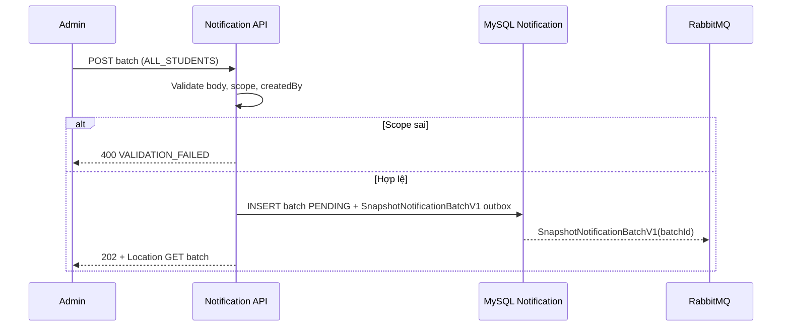
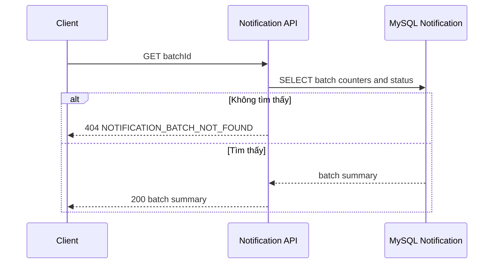
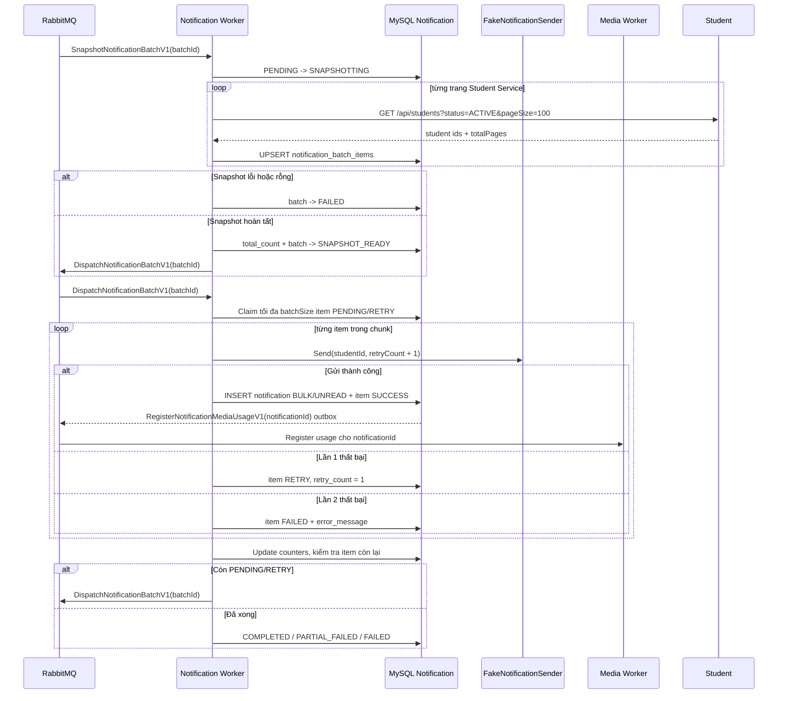

# Thông báo hàng loạt

## Mục đích

Quản trị viên tạo một lô và snapshot tất cả học viên đang hoạt động. Notification Worker xử lý lô bất đồng bộ; API không gửi inbox trong HTTP request.

## Tác nhân

Quản trị viên; Notification API; Student Service; MySQL Notification; RabbitMQ; Notification Worker.

## Điều kiện đầu vào

- `targetScope` là `ALL_STUDENTS`.
- `createdBy`, `title` và `bodyMarkdown` hợp lệ.
- Notification database và MassTransit outbox sẵn sàng nhận batch command.

## UML luồng chạy

### `POST /api/notification-batches`

### `GET /api/notification-batches/{batchId}`

### `SnapshotNotificationBatchV1` và `DispatchNotificationBatchV1` (Notification Worker)

## Quy tắc xử lý

1. POST chỉ tạo batch; Worker bắt đầu snapshot sau khi command được durable handoff. Snapshot dùng từng trang từ Student Service, không giữ toàn bộ recipient trong memory hoặc HTTP request. Retry/redelivery upsert theo `UNIQUE(batch_id, student_id)` nên không tạo item trùng.
2. Một chunk có tối đa `batchSize` item, mặc định 500; Worker không tải toàn bộ lô vào bộ nhớ. Consumer xử lý tuần tự một message; item `PROCESSING` còn lại sau khi process bị dừng được claim lại ở lượt dispatch tiếp theo.
3. Fake sender thất bại lần một khi `hash(studentId) % 20 == 0`, và lần hai khi `hash(studentId) % 100 == 0`.
4. Item `SUCCESS` không được xử lý lại. Unique `(batch_id, student_id)` và `(notification_batch_id, recipient_student_id)` bảo vệ dữ liệu nghiệp vụ khỏi trùng lặp.
5. Khi không còn item: không có lỗi là `COMPLETED`; chỉ lỗi là `FAILED`; có cả thành công và lỗi là `PARTIAL_FAILED`.
6. Markdown media được kiểm tra ngay khi tạo batch. Với mỗi item gửi thành công, Media Worker tạo usage `NOTIFICATION/NOTIFICATION_BODY/EMBED|ATTACHMENT` theo notification ID; item lỗi không có usage.

## Dữ liệu thay đổi

- Notification DB: `notification_batches`, `notification_batch_items`, `notifications`, MassTransit `InboxState`, `OutboxState`, `OutboxMessage`.
- Student Service chỉ đọc danh sách học viên.
- Không có Scheduler Service hoặc `background_jobs` trong flow này.
