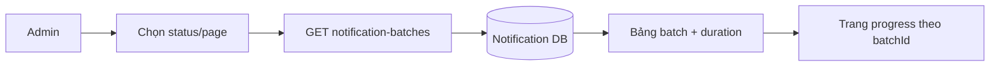

# Liệt kê Notification Batch

Quản trị viên mở trang quản lý, chọn status và trang offset. FE gọi `GET /api/notification-batches`, hiển thị số lượng yêu cầu/thực tế, counter và tổng thời gian; khi trang còn batch chưa terminal, FE poll mỗi 5 giây và tick duration mỗi giây.

Nút **Xem** chuyển tới `/notification/batches/{batchId}/progress`. Batch terminal có lỗi hiển thị thêm **Retry lỗi** ngay tại dòng quản lý; action tạo child rồi chuyển sang tiến trình của child. Batch ID nằm trong URL nên reload/chia sẻ vẫn đọc lại đúng tiến trình. Endpoint list chỉ đọc database và đặt `Cache-Control: no-store`.

