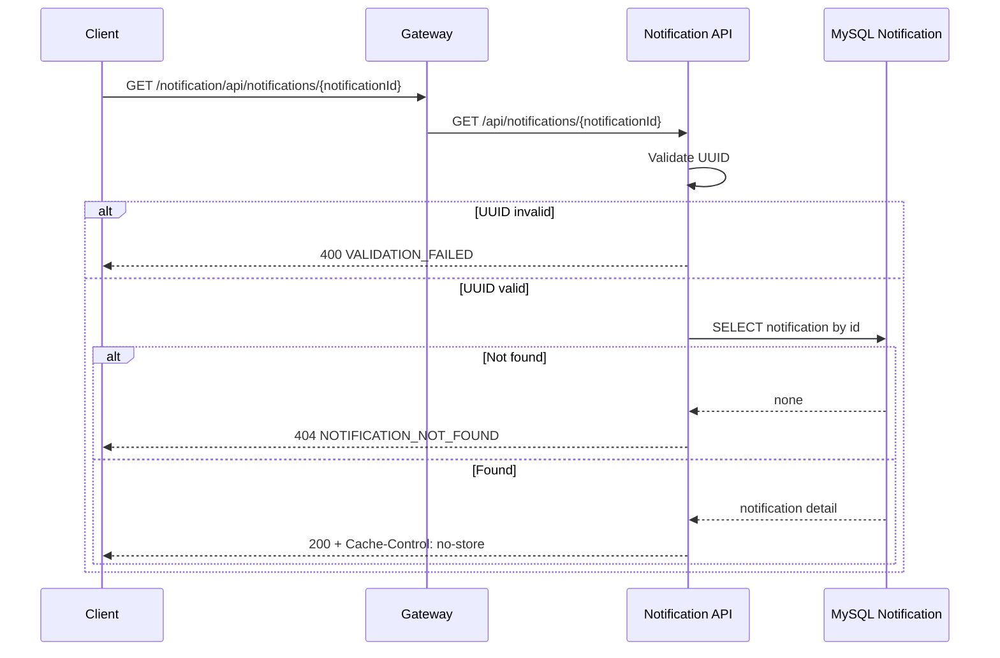

# Xem chi tiết thông báo

## Mục đích

Đọc một notification theo ID để theo dõi kết quả gửi đơn hoặc item thành công của batch.

## Tác nhân và điều kiện

Client gọi Gateway với UUID `notificationId`. MVP chưa áp dụng auth.

## UML luồng chạy

## Dữ liệu thay đổi và kiểm thử

Endpoint chỉ đọc `notifications`; không tạo media usage hoặc thay đổi batch/status. Contract: [`GET notification by id`](../../api/notification-service/endpoints/get-notification-by-id.md).
