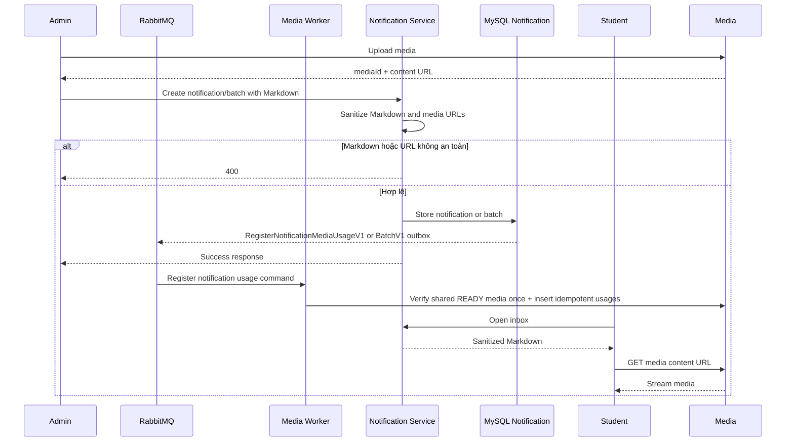

# Markdown của Thông báo và media nhúng

## Mục đích

Quản trị viên soạn nội dung thông báo bằng Markdown và nhúng hình ảnh, video, tài liệu, âm thanh hoặc loại media khác một cách an toàn.

## Tác nhân

Quản trị viên; Media Service; Notification Service; Học viên.

## Điều kiện đầu vào

- Quản trị viên có quyền gửi thông báo.
- Media đã được tải lên Media Service thành công.
- Bộ hiển thị có bộ làm sạch Markdown và chỉ cho phép URL do Media Service cấp.

## UML luồng chạy

## Luồng chính

1. Quản trị viên tải media lên Media Service và nhận `mediaId` cùng URL nội dung.
2. Quản trị viên soạn `bodyMarkdown`, ví dụ ``.
3. Notification Service chỉ chấp nhận link Markdown trỏ đúng `contentUrl` công khai của Media Service. Image syntax `` là `EMBED`; link `` là `ATTACHMENT`.
4. Sau khi notification đơn lẻ được tạo thành công, Notification Service ghi `RegisterNotificationMediaUsageV1` vào transactional outbox. Với batch, Notification Worker gom các notification thành công trong một chunk và ghi `RegisterNotificationMediaUsageBatchV1`. Media Worker dùng cùng core `EnsureMediaUsagesAsync` để tạo `media_usages` với:
   - `owner_service = NOTIFICATION`
   - `owner_type = NOTIFICATION_BODY`
   - `usage_type = EMBED` hoặc `ATTACHMENT`
5. Với batch, worker chỉ phát command sau khi sender thành công, `notifications` đã được ghi và item chuyển `SUCCESS`; owner luôn là `notification.id`, không phải `batch.id`. Một media dùng cho N notification vẫn tạo N usage rows, nhưng được validate và ghi theo bounded batch thay vì N command riêng.
6. Học viên mở hộp thư đến; ứng dụng khách hiển thị Markdown đã được làm sạch và tải media từ Media Service.

## Trường hợp lỗi

- `400`: Markdown không hợp lệ hoặc URL không thuộc Media Service.
- Link sai bị từ chối `400` ngay khi tạo notification/batch.
- Media chưa `READY` hoặc tạm lỗi ở Media Worker được retry/redeliver; notification thành công không bị rollback.
- Unique active usage làm command idempotent khi RabbitMQ redeliver.

## Dữ liệu thay đổi

- Cơ sở dữ liệu Media Service: `media_usages`.
- Cơ sở dữ liệu Notification Service: `notifications` hoặc `notification_batches`.
- MinIO không bị gọi bởi Notification Service.
