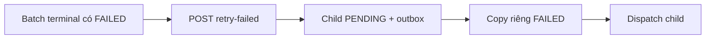

# Retry recipient thất bại của Notification Batch

Khi batch terminal còn lỗi, quản trị viên nhấn **Retry lỗi**. FE gọi `POST /api/notification-batches/{batchId}/retry-failed`; Notification Service chuẩn bị batch con, ghi snapshot command trong cùng transaction outbox rồi trả `202` và chuyển UI sang URL tiến trình của child.

Snapshot child dùng `INSERT ... SELECT` riêng item `FAILED` của nguồn, không gọi Student Service và không gửi lại item `SUCCESS`. Unique `source_batch_id` bảo đảm hai request trực tiếp trên cùng nguồn cùng nhận một child; candidate/outbox thua concurrency được rollback cùng transaction.

