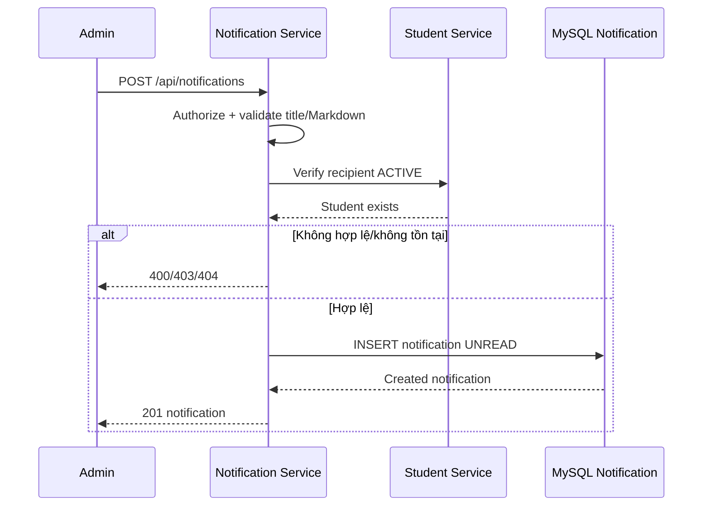
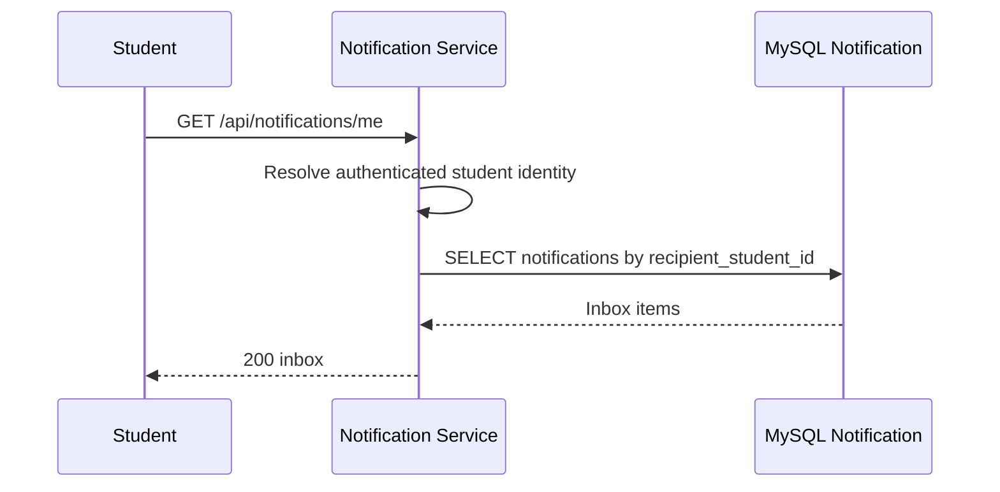
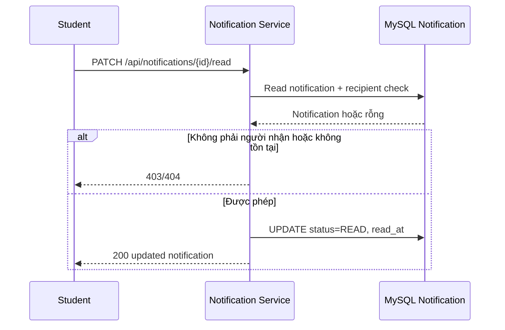

# Thông báo đơn lẻ và hộp thư đến của Học viên

## Mục đích

Quản trị viên gửi một thông báo cho một Học viên; Học viên chỉ xem và đánh dấu đã đọc thông báo của chính mình.

## Tác nhân

Quản trị viên; Học viên; Notification Service.

## Điều kiện đầu vào

- Quản trị viên đã được xác thực và được phép gửi thông báo.
- Học viên nhận thông báo tồn tại và có trạng thái `ACTIVE`.
- `bodyMarkdown` là Markdown hợp lệ và đã có lượt sử dụng media nếu nội dung nhúng media.

## UML luồng chạy

### `POST /api/notifications`

### `GET /api/notifications/me`

### `PATCH /api/notifications/{id}/read`

## Luồng gửi đơn

1. Quản trị viên gửi `POST /api/notifications` với `studentId`, `title` và `bodyMarkdown`.
2. Notification Service xác thực dữ liệu và xác nhận Học viên.
3. Notification Service tạo một bản ghi `notifications`:
   - `recipient_student_id` là Học viên nhận.
   - `source_type` là `SINGLE`.
   - `status` là `UNREAD`.
   - `notification_batch_id` là `null`.
4. API trả về mục hộp thư đến đã tạo.

## Luồng đọc hộp thư đến

1. Học viên gọi `GET /api/notifications/me`.
2. Notification Service lọc bằng danh tính đang được xác thực, không nhận `studentId` từ ứng dụng khách.
3. Học viên chọn một mục và gọi `PATCH /api/notifications/{id}/read`.
4. Notification Service kiểm tra `recipient_student_id` trùng Học viên hiện tại.
5. Notification Service chuyển `status` sang `READ` và lưu `read_at`.

## Trường hợp lỗi

- `403`: Quản trị viên không có quyền gửi hoặc Học viên cố đọc thông báo của người khác.
- `404`: Học viên hoặc thông báo không tồn tại.
- `409`: thông báo đã ở trạng thái `READ` nếu API chọn xử lý xung đột thay vì trả về thành công theo cách lũy đẳng.

## Dữ liệu thay đổi

- Cơ sở dữ liệu Notification Service: một bản ghi `notifications`.
- Không tạo `notification_batches`, `notification_batch_items` hoặc lượt chạy Scheduler.
