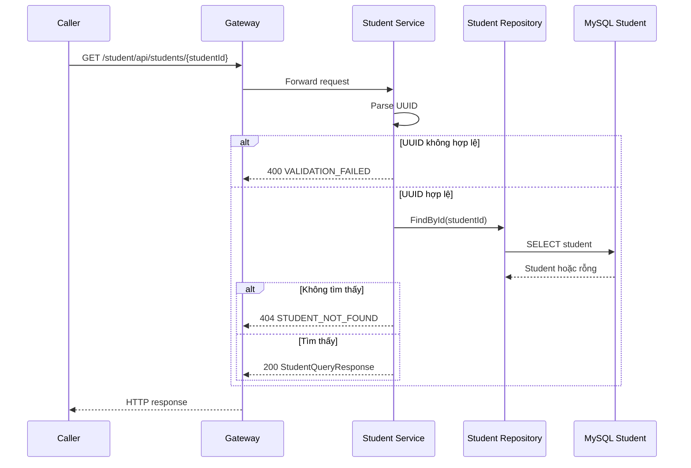

# `GET /student/api/students/{studentId}` — Tra cứu Học viên

API contract: [`get-student-by-id.md`](../../api/student-service/endpoints/get-student-by-id.md)

## Mục tiêu

Trả contract Học viên tối thiểu cho client hoặc service caller mà không cho
service khác truy vấn database Student.

## Actor và thành phần

- Client hoặc Media Service.
- API Gateway khi gọi public path.
- Student Service.
- MySQL Student.

## Điều kiện trước

- `studentId` là UUID khác rỗng.
- Authentication/authorization chưa được triển khai ở phiên bản hiện tại.

## UML luồng chạy

## Luồng chính

1. Caller gửi GET request.
2. Student API validate route parameter.
3. Application handler gọi repository port.
4. Infrastructure đọc `students` bằng `StudentDbContext`.
5. API map shared `StudentQueryResponse` vào response envelope.

## Luồng lỗi

- UUID sai/rỗng: `400 VALIDATION_FAILED`.
- Học viên không tồn tại: `404 STUDENT_NOT_FOUND`.
- Database không khả dụng: safe dependency error.

## Dữ liệu và side effects

- Chỉ đọc database Student.
- Không thay đổi state và không phát message.
- Media Service deserialize cùng shared contract trong
  `BuildingBlocks.Contracts`.

## Test mapping

- Unit: handler success/validation/not-found.
- Component: endpoint `200/400/404` và envelope.
- Client contract: route, deserialize, `404 -> null`, dependency failure.
