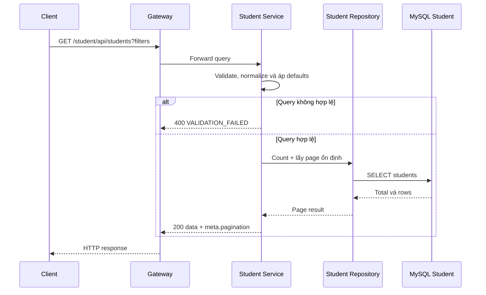

# `GET /student/api/students` — Liệt kê Học viên

API contract:
[`get-students.md`](../../api/student-service/endpoints/get-students.md).

## Mục tiêu

Client lấy một page Học viên, có thể tìm theo tên/email, lọc theo trạng thái và sắp xếp theo field
được cho phép, đồng thời nhận tổng số item/page để xây dựng UI phân trang.

## Actor và thành phần

- Client hoặc màn hình quản trị.
- API Gateway.
- Student Service.
- MySQL Student.

## Điều kiện trước

- Authentication/authorization chưa được triển khai.
- `page >= 1`, `pageSize` từ `1` đến `100`.
- `search` được trim; nếu có thì khớp một phần `displayName` hoặc `email`.
- `status`, `sortBy`, `sortDirection` thuộc allowlist.

## UML luồng chạy

## Luồng chính

1. Client gửi GET không body qua Gateway.
2. Application chuẩn hóa search/status/sort/direction và áp dụng defaults.
3. Repository dùng cùng predicate search + status để đếm `totalItems` và lấy page.
4. Repository sắp xếp theo field đã chọn, sau đó thêm `id` làm tie-breaker.
5. API trả `data` array và `meta.pagination` kiểu `offset`.
6. Client dùng `page`, `totalPages` để điều hướng tới page tiếp theo.

## Trường hợp rỗng và lỗi

- Không có Học viên phù hợp: `200`, `data: []`, totals bằng `0`.
- Query không hợp lệ: `400 VALIDATION_FAILED` với field details.
- Endpoint không trả `404` cho list rỗng.

## Tính nhất quán và hiệu năng

- Offset pagination có thể dịch chuyển item giữa các page khi có concurrent
  insert/delete.
- Filter `status` kết hợp sort `createdAt` sử dụng index hiện có.
- Search substring theo tên/email chưa dùng được B-tree hiện có; chưa thêm migration/index.
- Sort `displayName` có thể cần filesort; không dùng cho workload lớn trước khi
  kiểm tra query plan.
- Response dùng `Cache-Control: no-store`.

## Dữ liệu và side effects

- Chỉ đọc table `students`.
- Không thay đổi database.
- Không phát COMMAND/EVENT và không gọi service khác.

## Test mapping

- Unit: defaults, normalization, validation và offset boundary.
- Component: HTTP binding, success/error envelope và pagination metadata.
- Integration: migration thật, MySQL filter, stable ordering và page boundaries.
