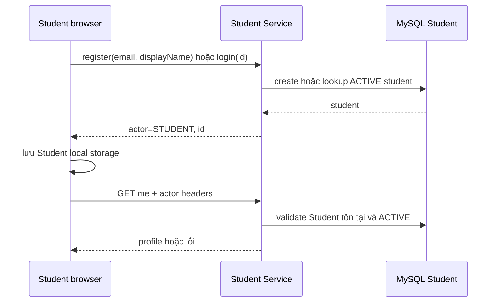

# Demo Student identity không JWT

API contract: [register](../../api/student-service/endpoints/post-student-auth-register.md),
[login](../../api/student-service/endpoints/post-student-auth-login.md),
[me](../../api/student-service/endpoints/get-student-auth-me.md).

## Luồng

Frontend chỉ tự điều hướng vào trang loading khi đã có `actor=STUDENT` và UUID.
Loading gọi `me`; lỗi sẽ xóa Student local storage và đưa người dùng về login.
Admin storage độc lập, vì vậy logout Student không ảnh hưởng Admin.
