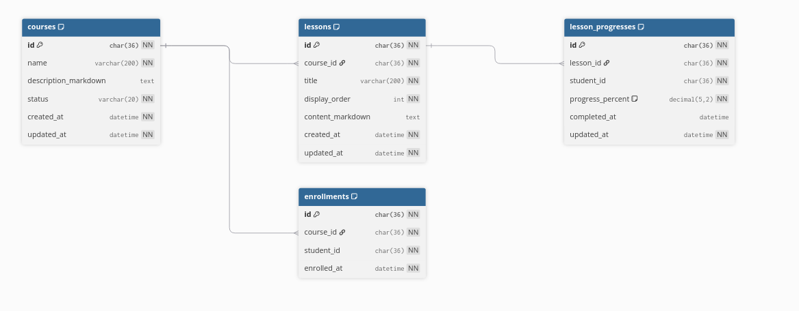

# Data model — Course Service

**Service/database sở hữu:** Course Service / `lms_course_db`.

Course Service là nguồn dữ liệu cho export CSV lớn, list/cursor pagination,
benchmark index/`EXPLAIN ANALYZE` và API minh họa N+1. Mọi UUID liên quan
Student là logical reference; không tạo foreign key sang `lms_student_db`.
Tất cả bảng dùng InnoDB, UUID `CHAR(36)` ASCII và timestamp `DATETIME(6)` UTC.

## `courses`

| Cột | Kiểu / null / mặc định | Ý nghĩa |
| --- | --- | --- |
| `id` | `CHAR(36)`, PK | UUID Course. |
| `name` | `VARCHAR(200)`, `NOT NULL` | Tên hiển thị. |
| `description_markdown` | `MEDIUMTEXT`, `NULL` | Markdown gốc; chỉ nhúng URL do Media Service cấp, không lưu HTML chưa sanitize. |
| `status` | `VARCHAR(20)`, `NOT NULL` | `DRAFT`, `PUBLISHED`, `ARCHIVED`. |
| `created_at` | `DATETIME(6)`, `NOT NULL`, `CURRENT_TIMESTAMP(6)` | Lúc tạo UTC. |
| `updated_at` | `DATETIME(6)`, `NOT NULL`, tự cập nhật | Lần sửa cuối UTC. |

Ràng buộc/chỉ mục: `chk_courses_status`;
`ix_courses_status_created_at(status, created_at DESC)` phục vụ lọc trạng thái,
mốc thời gian và `ORDER BY created_at DESC` trong benchmark.

List Course có thể tìm substring trên `name`. Đây không phải prefix/full-text
search nên chưa thêm B-tree index hoặc migration mới; khi cần SLA cho dataset lớn,
đánh giá Full-Text Search hoặc search service riêng trước khi thay đổi contract.

## `lessons`

| Cột | Kiểu / null / mặc định | Ý nghĩa |
| --- | --- | --- |
| `id` | `CHAR(36)`, PK | UUID Lesson. |
| `course_id` | `CHAR(36)`, `NOT NULL`, FK | `courses.id`, `ON DELETE CASCADE`. |
| `title` | `VARCHAR(200)`, `NOT NULL` | Tiêu đề bài học. |
| `display_order` | `INT UNSIGNED`, `NOT NULL` | Vị trí Lesson trong Course. |
| `content_markdown` | `MEDIUMTEXT`, `NULL` | Markdown gốc, có thể nhúng media URL. |
| `created_at` | `DATETIME(6)`, `NOT NULL`, `CURRENT_TIMESTAMP(6)` | Lúc tạo UTC. |
| `updated_at` | `DATETIME(6)`, `NOT NULL`, tự cập nhật | Lần sửa cuối UTC. |

`uq_lessons_course_id_display_order(course_id, display_order)` chặn trùng thứ tự
và đồng thời hỗ trợ lấy Lessons của một Course theo thứ tự, tránh query riêng cho
từng Course trong use case N+1.

## `enrollments`

| Cột | Kiểu / null / mặc định | Ý nghĩa |
| --- | --- | --- |
| `id` | `CHAR(36)`, PK | UUID lượt ghi danh. |
| `course_id` | `CHAR(36)`, `NOT NULL`, FK | Course được ghi danh; `ON DELETE CASCADE`. |
| `student_id` | `CHAR(36)`, `NOT NULL` | UUID Student logical reference, không có FK xuyên database. |
| `enrolled_at` | `DATETIME(6)`, `NOT NULL`, `CURRENT_TIMESTAMP(6)` | Lúc ghi danh UTC. |

`uq_enrollments_course_id_student_id(course_id, student_id)` bảo đảm mỗi học
viên chỉ ghi danh một lần/Course.
`ix_enrollments_student_id_enrolled_at(student_id, enrolled_at DESC)` phục vụ
lịch sử Course của một học viên.

## `lesson_progresses`

| Cột | Kiểu / null / mặc định | Ý nghĩa |
| --- | --- | --- |
| `id` | `CHAR(36)`, PK | UUID progress. |
| `lesson_id` | `CHAR(36)`, `NOT NULL`, FK | `lessons.id`, `ON DELETE CASCADE`. |
| `student_id` | `CHAR(36)`, `NOT NULL` | UUID Student logical reference. |
| `progress_percent` | `DECIMAL(5,2) UNSIGNED`, `NOT NULL`, `0` | Giá trị `0`–`100`. |
| `completed_at` | `DATETIME(6)`, `NULL` | Có giá trị khi hoàn thành; application giữ nhất quán với 100%. |
| `updated_at` | `DATETIME(6)`, `NOT NULL`, tự cập nhật | Lần cập nhật cuối UTC. |

`uq_lesson_progresses_lesson_id_student_id(lesson_id, student_id)` vừa chặn
progress trùng vừa có tiền tố `lesson_id` để join/aggregate progress theo tập
Lesson. `chk_lesson_progresses_progress_percent` giới hạn `0..100`;
`ix_lesson_progresses_student_id_updated_at(student_id, updated_at DESC)` phục
vụ trang tiến độ gần đây.

## Chỉ mục cho yêu cầu hiệu năng

| Use case | Chỉ mục | Trạng thái |
| --- | --- | --- |
| `WHERE status = ? AND created_at >= ? ORDER BY created_at DESC LIMIT ?` | `(status, created_at DESC)` | Đã có. |
| Cursor `created_at DESC, id DESC` ổn định | `(created_at DESC, id DESC)` | Chỉ tạo bằng migration khi endpoint thực tế chọn sort này. |
| Lessons theo Course | `(course_id, display_order)` | Đã có qua unique key. |
| Aggregate progress theo Lesson | `(lesson_id, student_id)` | Đã có qua unique key. |

CSV streaming, N+1, index và pagination không cần bảng hay Outbox/Inbox mới.
Course hiện không publish/consume message nghiệp vụ. Nếu sau này Course vừa ghi
database vừa publish `CoursePublishedV1`, phải thêm `OutboxState` và
`OutboxMessage`; nếu consume message có side effect, thêm cả `InboxState`.

## Seed và migration

`V001__create_learning_tables.sql` là migration nguồn sự thật. Seeder tạo 100k
Course, 1–5 Lesson/Course và Enrollment sử dụng `student_id` xác định được từ
Student seed; không seed `lesson_progresses`. Seed không thuộc migration và
không ghi `schema_migrations`.

Xem thêm: [Student Service](../student-service/data-model.md),
[Media Service](../media-service/data-model.md),
[Notification Service](../notification-service/data-model.md),
[Scheduler Service](../scheduler-service/data-model.md).
