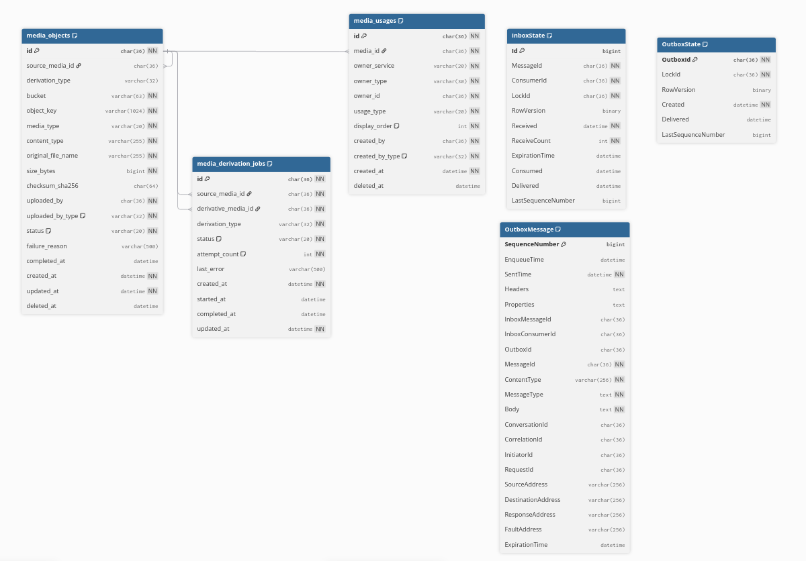

# Data model — Media Service

**Service/database sở hữu:** Media Service / `lms_media_db`.

Media Service lưu metadata/quan hệ dùng media; bytes file nằm trong MinIO. UUID
liên quan actor, Course, Student hay Notification là logical reference. Các bảng
dùng InnoDB, UUID `CHAR(36)` ASCII và timestamp `DATETIME(6)` UTC.

## `media_objects`

| Cột | Kiểu / null / mặc định | Ý nghĩa |
| --- | --- | --- |
| `id` | `CHAR(36)`, PK | UUID media. |
| `source_media_id` | `CHAR(36)`, `NULL`, FK | Source của object dẫn xuất; null với upload gốc; `ON DELETE RESTRICT`. |
| `derivation_type` | `VARCHAR(32)`, `NULL` | `THUMBNAIL` với derivative, null với source. |
| `bucket` / `object_key` | `VARCHAR(63)` / `VARCHAR(1024)`, `NOT NULL` | Vị trí MinIO nội bộ; không trả object key cho client. |
| `media_type` | `VARCHAR(20)`, `NOT NULL` | `IMAGE`, `VIDEO`, `DOCUMENT`, `AUDIO`, `OTHER`. |
| `content_type` | `VARCHAR(255)`, `NOT NULL` | MIME type đã xác thực. |
| `original_file_name` | `VARCHAR(255)`, `NOT NULL` | Chỉ phục vụ hiển thị. |
| `size_bytes` | `BIGINT UNSIGNED`, `NOT NULL` | Kích thước object. |
| `checksum_sha256` | `CHAR(64)`, `NULL` | SHA-256; có khi object `READY`. |
| `uploaded_by` / `uploaded_by_type` | `CHAR(36)` / `VARCHAR(32)`, `NOT NULL` | Actor logical reference và loại actor đã validate. |
| `status` | `VARCHAR(20)`, `NOT NULL`, `PENDING` | `PENDING`, `READY`, `FAILED`. |
| `is_draft` | `TINYINT(1)`, `NOT NULL`, mặc định `1` | `1` khi chưa có usage active. |
| `failure_reason` | `VARCHAR(500)`, `NULL` | Lỗi an toàn khi thất bại, không trả chi tiết nội bộ. |
| `completed_at` | `DATETIME(6)`, `NULL` | Lúc thành `READY`. |
| `drafted_at` | `DATETIME(6)`, `NULL` | Thời điểm bắt đầu draft; null với media non-draft. |
| `created_at` / `updated_at` | `DATETIME(6)`, `NOT NULL` | Lúc tạo / lần thay đổi cuối. |
| `deleted_at` | `DATETIME(6)`, `NULL` | Soft-delete; null là active. |

Ràng buộc: `uq_media_objects_bucket_object_key(bucket, object_key)`, check
`media_type`, `status`, và check source/derivation phải cùng null hoặc derivative
phải là `THUMBNAIL`. Chỉ mục: `(uploaded_by, created_at DESC)`,
`(status, created_at)`, `(source_media_id, derivation_type)` và
`ix_media_objects_draft_cleanup(is_draft, status, deleted_at, drafted_at)`.

Migration `V005__add_media_draft_state.sql` backfill deterministic: media có ít
nhất một `media_usages.deleted_at IS NULL` thành `is_draft=0,
drafted_at=NULL`; mọi media còn lại thành draft với
`drafted_at=COALESCE(completed_at, created_at)`. Upload multipart và direct mới
đều draft; direct intent `PENDING` có `drafted_at=NULL`, lúc complete đặt bằng
completion time.

P5-13 sở hữu việc bỏ draft (`0/NULL`) khi tạo active usage đầu tiên và khôi phục
draft (`1/current UTC`) sau khi xóa usage active cuối. P5-20 sở hữu cleanup theo
lịch nhưng phải recheck active usage và reference database ngay trước xóa.
Loser final object, staging object, PENDING intent và orphan từ commit mơ hồ đều
được giữ cho cleanup tham chiếu-an-toàn; ticket này không chạy cleanup.

Upload là database-first: tạo `PENDING`, stream MinIO đồng thời tính checksum,
chuyển `READY` khi hoàn tất; lỗi thì xóa object best effort và đánh dấu `FAILED`.
Direct flow dùng staging object, kiểm tra ETag rồi promotion sang unique final key.

## `media_derivation_jobs`

| Cột | Kiểu / null / mặc định | Ý nghĩa |
| --- | --- | --- |
| `id` | `CHAR(36)`, PK | UUID operation. |
| `source_media_id` / `derivative_media_id` | `CHAR(36)`, `NOT NULL`, FK | Media source và WebP cấp trước; đều `ON DELETE RESTRICT`. |
| `derivation_type` | `VARCHAR(32)`, `NOT NULL` | Hiện chỉ `THUMBNAIL`. |
| `status` | `VARCHAR(20)`, `NOT NULL`, `QUEUED` | `QUEUED`, `PROCESSING`, `READY`, `FAILED`. |
| `attempt_count` | `INT UNSIGNED`, `NOT NULL`, `0` | Số lần worker bắt đầu. |
| `last_error` | `VARCHAR(500)`, `NULL` | Lỗi an toàn lần cuối. |
| `created_at`, `started_at`, `completed_at`, `updated_at` | `DATETIME(6)` | Vòng đời job; created/updated không null, hai cột còn lại nullable. |

`uq_media_derivation_jobs_source_type(source_media_id, derivation_type)` và
`uq_media_derivation_jobs_derivative(derivative_media_id)` làm retry idempotent.
Có check type/status và index `(status, updated_at)`.

## `media_usages`

| Cột | Kiểu / null / mặc định | Ý nghĩa |
| --- | --- | --- |
| `id` | `CHAR(36)`, PK | UUID usage. |
| `media_id` | `CHAR(36)`, `NOT NULL`, FK | `media_objects.id`, `ON DELETE RESTRICT`. |
| `owner_service` | `VARCHAR(20)`, `NOT NULL` | `COURSE`, `NOTIFICATION`, `STUDENT`, `MEDIA`. |
| `owner_type` | `VARCHAR(30)`, `NOT NULL` | `COURSE_THUMBNAIL`, `COURSE_DESCRIPTION`, `LESSON_CONTENT`, `NOTIFICATION_BODY`, `STUDENT_AVATAR`, `MEDIA_THUMBNAIL`. |
| `owner_id` | `CHAR(36)`, `NOT NULL` | ID owner; logical reference nếu ngoài Media. |
| `usage_type` | `VARCHAR(20)`, `NOT NULL` | `THUMBNAIL`, `EMBED`, `ATTACHMENT`, `AVATAR`. |
| `display_order` | `INT UNSIGNED`, `NOT NULL`, `0` | Vị trí render. |
| `created_by` / `created_by_type` | `CHAR(36)` / `VARCHAR(32)`, `NOT NULL` | Actor tạo usage và loại đã validate. |
| `created_at` / `deleted_at` | `DATETIME(6)` | Tạo / soft-delete usage. |
| `active_course_thumbnail_owner_id` | Generated `CHAR(36)`, nullable | `owner_id` chỉ với Course thumbnail active. |
| `active_student_avatar_owner_id` | Generated `CHAR(36)`, nullable | `owner_id` chỉ với Student avatar active. |
| `active_media_thumbnail_owner_id` | Generated `CHAR(36)`, nullable | `owner_id` chỉ với Media thumbnail active. |
| `active_reference_guard` | Generated `TINYINT`, nullable | `1` khi active, null sau soft-delete. |

Unique active reference `(media_id, owner_service, owner_type, owner_id,
usage_type, active_reference_guard)` chặn duplicate active nhưng cho phép tạo lại
sau soft-delete. Ba generated owner columns có unique index nên mỗi Course chỉ
có một thumbnail, mỗi Student một avatar, mỗi media source một thumbnail active.
Index `(owner_service, owner_type, owner_id, display_order)` phục vụ render.

## `notification_media_usage_jobs`

Migration `V006__add_notification_media_usage_jobs.sql` tạo job theo dõi phần xử lý Markdown do Media Service sở hữu.

| Cột | Kiểu / null / mặc định | Ý nghĩa |
| --- | --- | --- |
| `id` | `CHAR(36)`, PK | Cùng UUID với Notification Batch; logical reference, không có cross-service FK. |
| `status` | `VARCHAR(20)`, `PENDING` | `PENDING`, `PROCESSING`, `COMPLETED`, `PARTIAL_FAILED`, `FAILED`. |
| `expected_usage_count` | `INT UNSIGNED`, null | Notification Service chốt khi delivery terminal. |
| `processed_usage_count`, `failed_usage_count` | `INT UNSIGNED`, `0` | Counter Worker cập nhật nguyên tử theo command. |
| `last_error` | `VARCHAR(500)`, null | Lỗi an toàn cuối cùng sau khi hết transport retry. |
| `created_at`, `started_at`, `completed_at`, `updated_at` | `DATETIME(6)` | Mốc vòng đời job. |

Job chỉ terminal khi tổng processed và failed đạt `expected_usage_count`. Completion marker đến trước chunk cuối không đóng job sớm. Index `(status, updated_at)` phục vụ vận hành.

## MassTransit persistence: đã có từ `V004`

Media vừa gửi `GenerateMediaThumbnailV1` cùng transaction tạo/retry derivation,
vừa consume command có side effect. Vì vậy ba bảng sau trong **chính
`lms_media_db`** là bắt buộc; chúng không phải dữ liệu media hiển thị.

### `InboxState`

| Cột | Kiểu / null | Ý nghĩa |
| --- | --- | --- |
| `Id` | `BIGINT`, auto-increment, PK | Khóa surrogate. |
| `MessageId`, `ConsumerId`, `LockId` | `CHAR(36)`, `NOT NULL` | ID delivery, consumer endpoint và lock MassTransit. |
| `RowVersion` | `BINARY(8)`, `NULL` | Optimistic concurrency token. |
| `Received`, `ExpirationTime`, `Consumed`, `Delivered` | `DATETIME(6)` | Nhận lần đầu / hạn retain / consume xong / outbox liên quan delivered; ba cột cuối nullable. |
| `ReceiveCount` | `INT`, `NOT NULL` | Số delivery transport. |
| `LastSequenceNumber` | `BIGINT`, `NULL` | Outbox sequence cuối sinh bởi consumer transaction. |

`PK_InboxState(Id)` và unique `(MessageId, ConsumerId)` deduplicate cùng message
cho cùng consumer. Vẫn phải giữ unique key business như derivation job/usage.

### `OutboxState`

| Cột | Kiểu / null | Ý nghĩa |
| --- | --- | --- |
| `OutboxId` | `CHAR(36)`, PK | Scope outbox MassTransit. |
| `LockId` | `CHAR(36)`, `NOT NULL` | Dispatcher claim lock. |
| `RowVersion` | `BINARY(8)`, `NULL` | Concurrency token. |
| `Created` | `DATETIME(6)`, `NOT NULL` | Lúc tạo scope. |
| `Delivered` | `DATETIME(6)`, `NULL` | Đã handoff broker, không đồng nghĩa consumer đã xử lý. |
| `LastSequenceNumber` | `BIGINT`, `NULL` | Sequence cao nhất đã xử lý. |

`PK(OutboxId)` và index `(Created)` phục vụ dispatcher.

### `OutboxMessage`

| Nhóm cột | Kiểu / null | Ý nghĩa |
| --- | --- | --- |
| `SequenceNumber` | `BIGINT`, auto-increment, PK | Thứ tự gửi bền vững. |
| `EnqueueTime`, `SentTime`, `ExpirationTime` | `DATETIME(6)` | Lúc enqueue (nullable), ghi outbox (bắt buộc), hạn transport (nullable). |
| `Headers`, `Properties`, `MessageType`, `Body` | `LONGTEXT` | Serialized metadata/type/payload; type/body bắt buộc; không chứa secret/entity DB. |
| `InboxMessageId`, `InboxConsumerId`, `OutboxId` | `CHAR(36)`, nullable | Liên kết consumer outbox/scope. |
| `MessageId` | `CHAR(36)`, `NOT NULL` | ID message RabbitMQ. |
| `ContentType` | `VARCHAR(256)`, `NOT NULL` | Serializer content type. |
| `ConversationId`, `CorrelationId`, `InitiatorId`, `RequestId` | `CHAR(36)`, nullable | Trace/correlation metadata. |
| `SourceAddress`, `DestinationAddress`, `ResponseAddress`, `FaultAddress` | `VARCHAR(256)`, nullable | Endpoint transport. |

Index: `(EnqueueTime)`, `(ExpirationTime)`, `(InboxMessageId, InboxConsumerId,
SequenceNumber)`, `(OutboxId, SequenceNumber)`. Application commit media row/job
và outbox trong cùng transaction; dispatcher gửi sau commit. RabbitMQ là
at-least-once, nên Inbox + business unique key đều cần thiết.

Xem thêm: [Notification Service](../notification-service/data-model.md),
[Course Service](../course-service/data-model.md),
[Scheduler Service](../scheduler-service/data-model.md).
