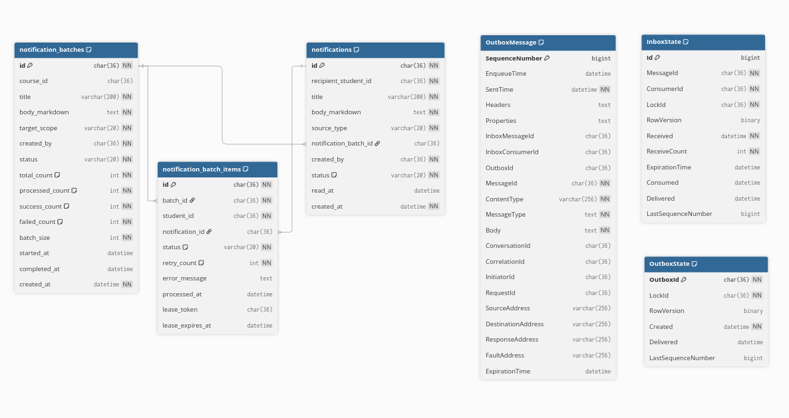

# Data model — Notification Service

**Service/database sở hữu:** Notification Service / `lms_notification_db`.

Notification Service sở hữu batch, recipient snapshot và inbox notification;
không sở hữu Student/Course/Media. Các ID của service kia là logical reference.
Mọi bảng dùng InnoDB, UUID `CHAR(36)` ASCII và timestamp `DATETIME(6)` UTC.

## `notification_batches`

| Cột | Kiểu / null / mặc định | Ý nghĩa |
| --- | --- | --- |
| `id` | `CHAR(36)`, PK | UUID yêu cầu gửi hàng loạt. |
| `course_id` | `CHAR(36)`, `NULL` | Logical Course reference; null nếu scope không theo Course. |
| `title` | `VARCHAR(200)`, `NOT NULL` | Tiêu đề chung. |
| `body_markdown` | `MEDIUMTEXT`, `NOT NULL` | Markdown gốc chung; media dùng URL Media Service. |
| `target_scope` | `VARCHAR(20)`, `NOT NULL` | Thêm `FAILED_RECIPIENTS` cho batch retry. |
| `created_by` | `CHAR(36)`, `NOT NULL` | Logical admin/system actor. |
| `status` | `VARCHAR(20)`, `NOT NULL` | `PENDING`, `SNAPSHOTTING`, `SNAPSHOT_READY`, `PROCESSING`, `COMPLETED`, `PARTIAL_FAILED`, `FAILED`. |
| `total_count`, `processed_count`, `success_count`, `failed_count` | `INT UNSIGNED`, `NOT NULL`, `0` | Counter snapshot/terminal; cập nhật theo chunk, không `COUNT(*)` lại. |
| `batch_size` | `INT UNSIGNED`, `NOT NULL` | Số recipient tối đa/chunk, phải > 0. |
| `requested_count` | `INT UNSIGNED`, `NULL` | `1..100000`; null nghĩa là toàn bộ active Student. |
| `source_batch_id` | `CHAR(36)`, `NULL`, self-FK unique | Batch nguồn; mỗi nguồn có tối đa một retry trực tiếp. |
| `started_at`, `completed_at` | `DATETIME(6)`, `NULL` | Mốc worker bắt đầu/kết thúc. |
| `created_at` | `DATETIME(6)`, `NOT NULL`, `CURRENT_TIMESTAMP(6)` | Lúc API tạo batch. |

Check scope/status/counts/requested count bảo đảm `processed_count <= total_count` và
`success_count + failed_count <= processed_count`. Index `(status, created_at
DESC)` phục vụ worker/operation. Vòng đời là `PENDING -> SNAPSHOTTING ->
SNAPSHOT_READY -> PROCESSING -> COMPLETED | PARTIAL_FAILED | FAILED`.

## `notification_batch_items`

| Cột | Kiểu / null / mặc định | Ý nghĩa |
| --- | --- | --- |
| `id` | `CHAR(36)`, PK | UUID recipient snapshot. |
| `batch_id` | `CHAR(36)`, `NOT NULL`, FK | `notification_batches.id`, `ON DELETE CASCADE`. |
| `student_id` | `CHAR(36)`, `NOT NULL` | Logical Student recipient. |
| `notification_id` | `CHAR(36)`, `NULL`, FK | Inbox notification thành công; `ON DELETE SET NULL`. |
| `status` | `VARCHAR(20)`, `NOT NULL`, `PENDING` | `PENDING`, `PROCESSING`, `SUCCESS`, `RETRY`, `FAILED`. |
| `retry_count` | `INT UNSIGNED`, `NOT NULL`, `0` | Retry nghiệp vụ đã dùng; requirement hiện tại chỉ một retry. |
| `error_message` | `TEXT`, `NULL` | Lỗi cuối an toàn để trace, không secret. |
| `processed_at` | `DATETIME(6)`, `NULL` | Lúc terminal. |
| `lease_token` | `CHAR(36)`, `NULL` | Token claim; update kết quả phải khớp token. |
| `lease_expires_at` | `DATETIME(6)`, `NULL` | Chỉ reclaim sau mốc này. |

Unique `(batch_id, student_id)` làm snapshot idempotent khi command redelivery.
Worker claim bằng transaction ngắn `FOR UPDATE SKIP LOCKED`, set token/lease,
commit rồi gửi bên ngoài transaction. Index claim `(batch_id, status,
lease_expires_at, id)` và index `(batch_id, status)` phục vụ query trạng thái.

## `notifications`

| Cột | Kiểu / null / mặc định | Ý nghĩa |
| --- | --- | --- |
| `id` | `CHAR(36)`, PK | UUID inbox item. |
| `recipient_student_id` | `CHAR(36)`, `NOT NULL` | Logical Student owner. |
| `title` | `VARCHAR(200)`, `NOT NULL` | Tiêu đề. |
| `body_markdown` | `MEDIUMTEXT`, `NOT NULL` | Markdown gốc. |
| `source_type` | `VARCHAR(20)`, `NOT NULL` | `SINGLE` hoặc `BULK`. |
| `notification_batch_id` | `CHAR(36)`, `NULL`, FK | Bắt buộc với `BULK`, null với `SINGLE`; `ON DELETE RESTRICT` giữ audit. |
| `created_by` | `CHAR(36)`, `NOT NULL` | Logical actor. |
| `status` | `VARCHAR(20)`, `NOT NULL`, `UNREAD` | `UNREAD` hoặc `READ`. |
| `read_at` | `DATETIME(6)`, `NULL` | Bắt buộc khi `READ`, null khi `UNREAD`. |
| `created_at` | `DATETIME(6)`, `NOT NULL`, `CURRENT_TIMESTAMP(6)` | Lúc xuất hiện trong inbox. |

Unique `(notification_batch_id, recipient_student_id)` chặn inbox bulk trùng.
Index `(recipient_student_id, status, created_at DESC)` phục vụ list inbox;
check source/batch và status/read_at giữ cặp field nhất quán.

## MassTransit persistence: đã có từ `V002`

API ghi batch và `SnapshotNotificationBatchV1` vào cùng transaction; Worker gửi
dispatch/media command sau commit và consume command redelivery. Vì vậy bộ ba
bảng MassTransit bên dưới trong **`lms_notification_db`** là bắt buộc.

### `InboxState`

| Cột | Kiểu / null | Ý nghĩa |
| --- | --- | --- |
| `Id` | `BIGINT`, auto-increment, PK | Khóa surrogate. |
| `MessageId`, `ConsumerId`, `LockId` | `CHAR(36)`, `NOT NULL` | Message delivery, consumer endpoint và lock. |
| `RowVersion` | `BINARY(8)`, `NULL` | Optimistic concurrency token. |
| `Received` | `DATETIME(6)`, `NOT NULL` | Lúc nhận lần đầu. |
| `ReceiveCount` | `INT`, `NOT NULL` | Số attempt transport. |
| `ExpirationTime`, `Consumed`, `Delivered` | `DATETIME(6)`, `NULL` | Hạn retention / consume commit / outbox delivered. |
| `LastSequenceNumber` | `BIGINT`, `NULL` | Sequence outbox cuối của consumer transaction. |

Unique `(MessageId, ConsumerId)` là dedup transport; nó không thay thế unique
business `(batch_id, student_id)` và `(notification_batch_id, recipient_student_id)`.

### `OutboxState`

| Cột | Kiểu / null | Ý nghĩa |
| --- | --- | --- |
| `OutboxId` | `CHAR(36)`, PK | Scope outbox. |
| `LockId` | `CHAR(36)`, `NOT NULL` | Dispatcher lock. |
| `RowVersion` | `BINARY(8)`, `NULL` | Concurrency token. |
| `Created` | `DATETIME(6)`, `NOT NULL` | Lúc tạo. |
| `Delivered` | `DATETIME(6)`, `NULL` | Đã handoff broker, chưa đảm bảo consumer business success. |
| `LastSequenceNumber` | `BIGINT`, `NULL` | Sequence cao nhất đã xử lý. |

PK `OutboxId`, index `(Created)`.

### `OutboxMessage`

| Nhóm cột | Kiểu / null | Ý nghĩa |
| --- | --- | --- |
| `SequenceNumber` | `BIGINT`, auto-increment, PK | Thứ tự gửi durable. |
| `EnqueueTime`, `SentTime`, `ExpirationTime` | `DATETIME(6)` | Enqueue nullable; ghi outbox bắt buộc; TTL nullable. |
| `Headers`, `Properties`, `MessageType`, `Body` | `LONGTEXT` | Serialized metadata/type/payload; type/body bắt buộc. |
| `InboxMessageId`, `InboxConsumerId`, `OutboxId` | `CHAR(36)`, nullable | Liên hệ consumer outbox và scope. |
| `MessageId` | `CHAR(36)`, `NOT NULL` | ID message RabbitMQ. |
| `ContentType` | `VARCHAR(256)`, `NOT NULL` | Serializer type. |
| `ConversationId`, `CorrelationId`, `InitiatorId`, `RequestId` | `CHAR(36)`, nullable | Trace metadata. |
| `SourceAddress`, `DestinationAddress`, `ResponseAddress`, `FaultAddress` | `VARCHAR(256)`, nullable | Endpoint transport. |

Index: `(EnqueueTime)`, `(ExpirationTime)`, `(InboxMessageId, InboxConsumerId,
SequenceNumber)`, `(OutboxId, SequenceNumber)`. Không tự tạo FK MassTransit tới
business tables; library quản lý lifecycle bằng ID nullable.

RabbitMQ delivery at-least-once: retry transport lấy `Messaging:Retry`, retry
nghiệp vụ lấy `notification_batch_items.retry_count`; retry hết vào `_error`.
Chỉ purge outbox/inbox đã delivered/expired sau dedup window; không xóa batch,
item hay notification vì cleanup hạ tầng.

## Migration và quan hệ service

`V001` tạo ba bảng nghiệp vụ, `V002` thêm snapshot state cùng MassTransit,
`V003` thêm lease claim/index; `V004` thêm requested count, retry lineage và index list `(created_at DESC, id DESC)`. Student chỉ được query HTTP; Notification chỉ gửi
media usage command cho item `SUCCESS` sang Media qua outbox. Batch ID đồng thời là Media Usage job ID; Notification gửi start marker lúc tạo batch và completion marker sau delivery terminal, nhưng job/counter do Media Service sở hữu. Xem
[Media Service](../media-service/data-model.md) và
[Student Service](../student-service/data-model.md).
