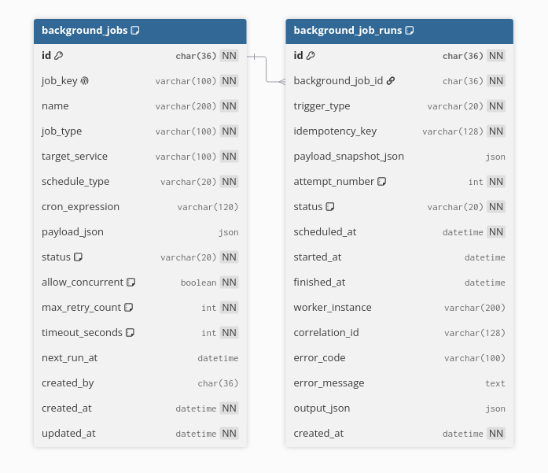

# Data model — Scheduler Service

**Service/database sở hữu:** Scheduler Service / `lms_scheduler_db`.

Scheduler chỉ sở hữu định nghĩa tác vụ dùng chung và lịch sử run. Nó không lưu
notification content/recipient, media metadata hay dữ liệu Course/Student. Các
ID ngoài service là logical reference; bảng dùng InnoDB, UUID `CHAR(36)` ASCII
và thời gian `DATETIME(6)` UTC.

## `background_jobs`

| Cột | Kiểu / null / mặc định | Ý nghĩa |
| --- | --- | --- |
| `id` | `CHAR(36)`, PK | UUID cấu hình job. |
| `job_key` | `VARCHAR(100)`, `NOT NULL`, unique | Khóa register/lookup ổn định. |
| `name` | `VARCHAR(200)`, `NOT NULL` | Tên vận hành. |
| `job_type` | `VARCHAR(100)`, `NOT NULL` | Handler tương lai, ví dụ `MEDIA_PENDING_CLEANUP`. |
| `target_service` | `VARCHAR(100)`, `NOT NULL` | Service sẽ nhận hành động nghiệp vụ. |
| `schedule_type` | `VARCHAR(20)`, `NOT NULL` | `MANUAL` hoặc `CRON`. |
| `cron_expression` | `VARCHAR(120)`, `NULL` | Bắt buộc khi `CRON`, null khi `MANUAL`; UTC. |
| `payload_json` | `JSON`, `NULL` | Cấu hình nhỏ; cấm recipient list/dữ liệu domain lớn. |
| `status` | `VARCHAR(20)`, `NOT NULL`, `ACTIVE` | `ACTIVE`, `PAUSED`, `DISABLED`. |
| `allow_concurrent` | `TINYINT(1)`, `NOT NULL`, `0` | Có cho phép nhiều run cùng job. |
| `max_retry_count` | `INT UNSIGNED`, `NOT NULL`, `0` | Retry execution tối đa. |
| `timeout_seconds` | `INT UNSIGNED`, `NOT NULL`, `300` | Phải > 0. |
| `next_run_at` | `DATETIME(6)`, `NULL` | Lần CRON kế tiếp; null với MANUAL/chưa tính. |
| `created_by` | `CHAR(36)`, `NULL` | Logical actor; null với system job. |
| `created_at`, `updated_at` | `DATETIME(6)`, `NOT NULL` | Tạo / lần sửa cuối. |

Có unique `job_key`, check schedule/status/timeout, index `(status, next_run_at)`
để tìm job đến hạn và `(target_service, job_type)` cho vận hành/định tuyến.

## `background_job_runs`

| Cột | Kiểu / null / mặc định | Ý nghĩa |
| --- | --- | --- |
| `id` | `CHAR(36)`, PK | UUID một lần thực thi. |
| `background_job_id` | `CHAR(36)`, `NOT NULL`, FK | `background_jobs.id`, `ON DELETE RESTRICT` để giữ lịch sử. |
| `trigger_type` | `VARCHAR(20)`, `NOT NULL` | `MANUAL`, `CRON`, `RETRY`. |
| `idempotency_key` | `VARCHAR(128)`, `NOT NULL` | Unique trong một job, chống tạo run trùng. |
| `payload_snapshot_json` | `JSON`, `NULL` | Snapshot payload tại lúc trigger. |
| `attempt_number` | `INT UNSIGNED`, `NOT NULL`, `1` | Bắt đầu từ 1. |
| `status` | `VARCHAR(20)`, `NOT NULL`, `QUEUED` | `QUEUED`, `RUNNING`, `SUCCEEDED`, `FAILED`, `CANCELLED`, `TIMED_OUT`, `SKIPPED`. |
| `scheduled_at` | `DATETIME(6)`, `NOT NULL` | Lúc trigger/lên lịch. |
| `started_at`, `finished_at` | `DATETIME(6)`, `NULL` | Mốc worker; `finished_at >= started_at` nếu cùng có giá trị. |
| `worker_instance` | `VARCHAR(200)`, `NULL` | Worker đang/đã chạy. |
| `correlation_id` | `VARCHAR(128)`, `NULL` | Nối log với service đích. |
| `error_code` / `error_message` | `VARCHAR(100)` / `TEXT`, `NULL` | Mã lỗi ổn định và lỗi an toàn. |
| `output_json` | `JSON`, `NULL` | Kết quả tóm tắt, không thay database nghiệp vụ. |
| `created_at` | `DATETIME(6)`, `NOT NULL`, `CURRENT_TIMESTAMP(6)` | Lúc tạo run. |

Unique `(background_job_id, idempotency_key)`, index `(status, scheduled_at)`
và `(background_job_id, created_at DESC)` cùng check enum/attempt/timestamp là
các ràng buộc hiện có.

## Messaging: chưa có bảng MassTransit

`V001__create_scheduler_tables.sql` **chưa tạo** `InboxState`, `OutboxState`,
`OutboxMessage`; Scheduler hiện cũng chưa có polling CRON, claim run hay handler
và Notification batch không dùng Scheduler.

Khi Scheduler commit `background_job_runs` rồi gửi command tới `target_service`,
phải thêm `OutboxState` + `OutboxMessage` trong `lms_scheduler_db` để tránh
dual-write. Nếu Scheduler consume trigger/event có ghi run/state, phải thêm
`InboxState` để deduplicate delivery. Các bảng phải dùng chuẩn MassTransit 8.x
giống [Notification Service](../notification-service/data-model.md) và
[Media Service](../media-service/data-model.md), đồng thời vẫn giữ unique
`(background_job_id, idempotency_key)` như business idempotency.

Không dùng `background_job_runs` như RabbitMQ queue và không dùng outbox của
service khác. Migration mới phải thuộc Scheduler Service, không sửa `V001`.
