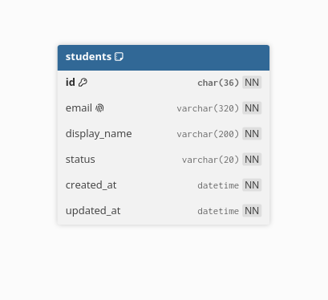

# Data model — Student Service

**Service/database sở hữu:** Student Service / `lms_student_db`.

Student Service là nguồn hồ sơ học viên. Notification Worker chỉ query qua HTTP
phân trang để snapshot `ACTIVE` students; không truy cập trực tiếp database này.
Mọi bảng dùng InnoDB, UUID `CHAR(36)` ASCII và timestamp `DATETIME(6)` UTC.

## `students`

| Cột | Kiểu / null / mặc định | Ý nghĩa và quy tắc |
| --- | --- | --- |
| `id` | `CHAR(36)`, `NOT NULL`, PK | UUID học viên. |
| `email` | `VARCHAR(320)`, `NOT NULL` | Email liên hệ/đăng nhập; unique. Application chịu trách nhiệm normalize trước khi ghi. |
| `display_name` | `VARCHAR(200)`, `NOT NULL` | Tên hiển thị. |
| `status` | `VARCHAR(20)`, `NOT NULL` | `ACTIVE`, `INACTIVE`, `BLOCKED`. |
| `created_at` | `DATETIME(6)`, `NOT NULL`, `CURRENT_TIMESTAMP(6)` | Lúc tạo UTC. |
| `updated_at` | `DATETIME(6)`, `NOT NULL`, tự cập nhật | Lần sửa cuối UTC. |

Ràng buộc/chỉ mục hiện có:

- `pk_students(id)`;
- `uq_students_email(email)`;
- `chk_students_status` giới hạn ba trạng thái trên;
- `ix_students_status_created_at(status, created_at DESC)` phục vụ list/filter
  theo trạng thái.

Student list hỗ trợ substring search trên `display_name` hoặc `email`. Không thêm B-tree index vì không tăng tốc từ khóa ở giữa chuỗi; khi có SLA lớn, đánh giá Full-Text Search hoặc search service trước khi đổi schema.

Nếu endpoint Student dùng cursor `status + created_at DESC + id DESC`, tạo
migration riêng bổ sung `(status, created_at DESC, id DESC)`. Không thêm trước
khi query thật dùng nó vì chỉ mục làm tăng chi phí insert/update.

## Messaging và quan hệ service

Student hiện **không** có `InboxState`, `OutboxState`, `OutboxMessage`: requirement
batch chỉ là HTTP query, không phải command/event. Không copy bảng `students`
sang Notification database; Notification lưu snapshot giới hạn theo batch tại
`notification_batch_items`.

Khi Student bắt đầu publish event sau transaction (ví dụ thay đổi trạng thái
học viên) cần `OutboxState` + `OutboxMessage`; nếu consume command/event có ghi
dữ liệu cần thêm `InboxState`. Cả ba bảng phải được tạo trong chính
`lms_student_db`, không dùng chung outbox của Notification/Media.

## Seed và migration

`V001__create_students_table.sql` là nguồn sự thật. Seeder tạo 100k Student có
UUID xác định từ random seed; dữ liệu phát triển không được ghi vào migration
hay `schema_migrations`.

Xem thêm: [Course Service](../course-service/data-model.md),
[Notification Service](../notification-service/data-model.md).
