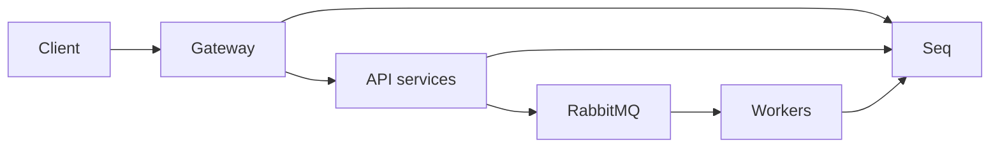

# Observability local

## Mục đích

Local stack gửi structured log của Gateway, toàn bộ API và Worker vào Seq để
tra cứu một request hoặc message xuyên service. Console vẫn giữ log tức thời;
Seq là nơi xem và lọc tập trung.



## Khởi động và sử dụng

```bash
docker compose up -d --build
```

Mở [Seq](http://localhost:8081). RabbitMQ Management vẫn ở
[http://localhost:15672](http://localhost:15672).

Seq local không yêu cầu đăng nhập. Không dùng cấu hình này cho môi trường có
thể truy cập ngoài máy phát triển.

Các field chính trong Seq:

| Field | Ý nghĩa |
| --- | --- |
| `Service` | Gateway, API hoặc Worker phát log. |
| `Environment` | Môi trường chạy host. |
| `TraceId` / `CorrelationId` | Theo dõi một HTTP request. Gửi `X-Correlation-ID` để giữ ID do client chọn. |
| `MessageId` | ID message MassTransit/RabbitMQ khi có. |

Ví dụ query:

```text
CorrelationId = 'trace-demo-001'
Service = 'Notification' and @Level >= 'Warning'
MessageId is not null
```

## Phạm vi log

- HTTP request: method, path, status, elapsed time; `4xx` là Warning, `5xx` và exception là Error.
- Host API/Worker: startup, shutdown, migration và lỗi dependency.
- MassTransit/RabbitMQ: kết nối transport, consume, retry và fault ở mức `Information` trở lên.
- EF Core SQL thành công không được ghi để tránh nhiễu; warning/error database vẫn được giữ.

Không ghi password, connection string, access key, bucket/object key hoặc request body vào log.

## Khắc phục sự cố

| Hiện tượng | Kiểm tra |
| --- | --- |
| Seq không mở được | Chạy `docker compose ps seq`, sau đó xem `docker compose logs seq`. |
| Không thấy log service | Kiểm tra service có `Observability__Seq__ServerUrl=http://seq:5341` và restart container. |
| Không tìm được luồng HTTP | Gửi header `X-Correlation-ID` rồi lọc `CorrelationId` tương ứng. |
| Consumer lỗi | Lọc `Service` của Worker với `@Level >= 'Error'`, sau đó đối chiếu queue/error queue trong RabbitMQ Management. |
