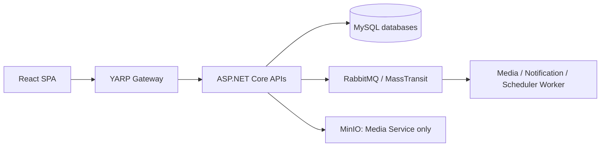

# Current Tech Stack

Tài liệu này phản ánh package, project reference, Docker Compose và source đang
có trong repository. Nó không phải danh sách công nghệ dự kiến cho tương lai.

| Category | Technology | Purpose | Status |
| --- | --- | --- | --- |
| Backend runtime | .NET 10, ASP.NET Core | API và Worker host | In use |
| Architecture | Clean Architecture | Domain, Application, Infrastructure, API/Worker boundary | In use |
| Gateway | YARP | Reverse proxy/public entry point | In use |
| API documentation | NSwag / OpenAPI | Swagger document tại Gateway và service API | In use |
| ORM/data access | EF Core 9, Pomelo.EntityFrameworkCore.MySql 9, MySqlConnector | DbContext, repository, health probe và SQL migration | In use |
| Database | MySQL 8.4 | Database riêng cho năm service | In use |
| Object storage | MinIO SDK 7, MinIO | Media object storage; chỉ Media Service truy cập | In use |
| Media processing | SkiaSharp 4 | Thumbnail/image processing | In use |
| Messaging | MassTransit 8.5, RabbitMQ 4.1 | Command/event, consumer, retry, Outbox và Worker | In use |
| HTTP communication | Typed `HttpClient`, `Microsoft.Extensions.Http.Resilience` | Query liên service, correlation ID và retry | In use |
| Shared presentation | BuildingBlocks.Presentation | Response envelope, middleware, CORS, health/info | In use |
| Migration | SQL migration runner, EF Core design-time tools | Versioned schema migration | In use |
| Frontend | React 19, Vite 8, JavaScript | SPA runtime/build | In use |
| Frontend state/network | Redux Toolkit, React Router, Axios, Tailwind CSS | State, routing, HTTP client và styling | In use |
| Testing | NUnit 4, Microsoft.NET.Test.Sdk, coverlet | Unit/component/integration test | In use |
| Test boundary | TestServer, Testcontainers (MySQL/MinIO/RabbitMQ) | HTTP và dependency thật cô lập | In use |
| Development tool | Lms.DataSeeder, Spectre.Console | Seed dữ liệu Development có kiểm soát | In use |
| Container | Docker, Docker Compose | Local infrastructure và service stack | In use |

## Architecture & Communication



HTTP/typed `HttpClient` được dùng cho query cần response; RabbitMQ/MassTransit
được dùng cho command/event và background processing. Xem thêm
[communication architecture](../architecture/backend/shared/service-communication.md).

## Chưa xác nhận / Planned

- Serilog có xuất hiện trong tài liệu cũ nhưng chưa xác nhận package/reference
  tập trung trong source; chưa ghi là In use.
- Benchmark batch, CSV 100k+, N+1, index/query plan, pagination và API benchmark
  là mục tiêu Phase sau; chỉ công bố kết quả sau khi đo thật.
- Scheduler Worker host đã có, nhưng Cron evaluation, polling, claim và job
  execution chưa là runtime behavior.

## Validation commands

```bash
dotnet test backend/Lms.sln -m:1
docker compose config
npm --prefix frontend/lms-web run build
```

## Troubleshooting

| Hiện tượng | Kiểm tra | Cách xử lý |
| --- | --- | --- |
| API/Worker không kết nối broker | `Messaging__RabbitMq__*` và RabbitMQ health | Khởi động RabbitMQ qua Compose, kiểm tra credentials/vhost. |
| Media storage không healthy | MinIO endpoint/credential/bucket | Chạy `minio-init`, kiểm tra `Storage__Minio__*`. |
| Integration test không chạy | Docker Engine | Khởi động Docker vì Testcontainers cần container thật. |
| Frontend build lỗi | Node modules và manifest | Cài dependency theo `frontend/lms-web/package.json`. |
