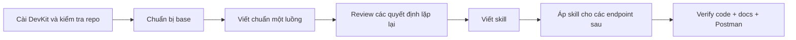
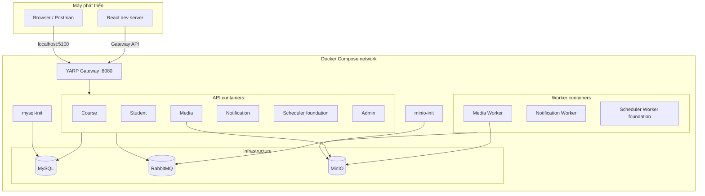
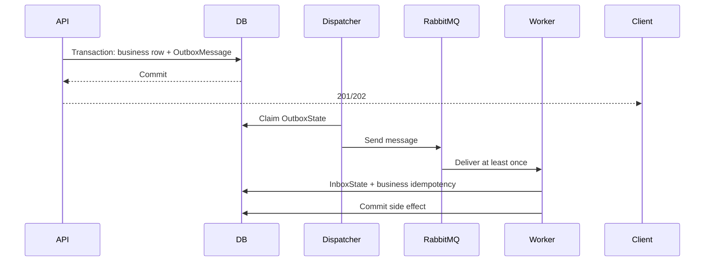
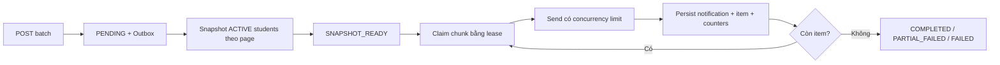
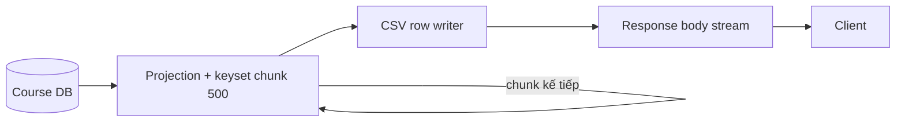
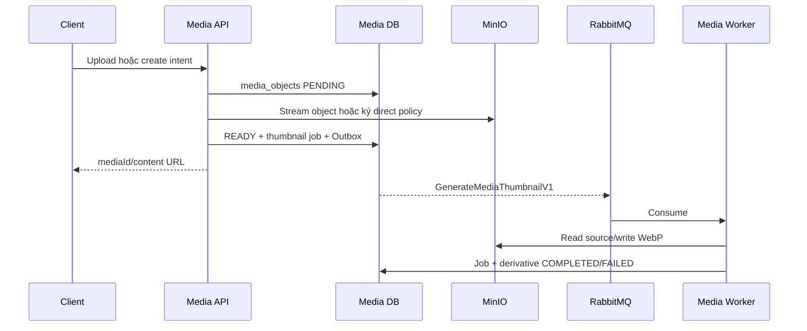

# Kịch bản thuyết trình Mini LMS

## Cách dùng tài liệu

- Phần **Nói** là câu chữ có thể tập theo gần như nguyên văn.
- Phần **Demo** là thao tác trên màn hình.
- Phần **Chốt** là thông điệp cần để người nghe nhớ.
- Các giá trị `<...>` phải được thay bằng ID hoặc số đo thật trước buổi nói.

Đây là kịch bản **long-form, không có hard-stop thời lượng**. Mỗi phần là một module có
thể nói sâu tùy mức độ quan tâm của người nghe. Phần **Nói** là trục chính;
diagram, bảng, code và SQL dùng để đào sâu hoặc trả lời câu hỏi. Không cần đọc
nguyên văn mọi dòng: hãy giữ đúng thứ tự câu chuyện và câu chốt của từng phần.

## Sườn tổng thể long-form

| Phần | Câu hỏi cần trả lời | Nhánh đào sâu |
| --- | --- | --- |
| 1. Dự án | Mini LMS là gì và giải quyết việc gì? | Actor, chức năng và phạm vi chưa hoàn thiện. |
| 2. Frontend | Người dùng thao tác hệ thống thế nào? | Admin/Student flow, Gateway, Redux/API client. |
| 3. Quy trình | Từ base project tới Skill ra sao? | DevKit, một luồng chuẩn, docs/test/Postman. |
| 4. Kiến trúc | Hệ thống được chia và chạy thế nào? | Ownership, Docker, network, DB, MinIO, Clean Architecture. |
| 5. Worker/Messaging | Việc nền và message đáng tin thế nào? | RabbitMQ, at-least-once, dual-write, Outbox/Inbox. |
| 6. Debug | Khi lỗi thì tìm từ đâu? | Console log, RabbitMQ, DB state và replay an toàn. |
| 7. Batch | Xử lý nhiều người nhận thế nào? | Snapshot, chunk, lease, retry, idempotency và DB. |
| 8. CSV | Xuất dữ liệu lớn thế nào? | Streaming, keyset, TTFB, memory và correctness hash. |
| 9. Media | Quản lý file và thumbnail thế nào? | Upload/direct upload, MinIO, usage, job và compensation. |
| 10. Performance | Chứng minh hiệu năng thế nào? | Runner, metric, raw evidence, N+1 và Index roadmap. |
| 11. Kết luận | Giá trị kỹ thuật lớn nhất là gì? | Ownership, failure design, observability và bước tiếp theo. |

Luồng kể chuyện:

```text
Người dùng thao tác
→ request đi qua kiến trúc
→ việc nặng chuyển cho Worker
→ Outbox/Inbox bảo vệ message
→ console/RabbitMQ/DB giúp debug
→ từng bài toán được đo bằng evidence
```

---

## Phần 1 — Mở đầu: dự án là gì?

### Nói

> Em xây dựng một Mini Learning Management System. Hệ thống có hai nhóm người
> dùng: quản trị viên vận hành dữ liệu học tập và học viên tham gia khóa học.
> Quản trị viên có thể quản lý học viên, khóa học, bài học, media và gửi thông
> báo hàng loạt. Học viên có thể đăng ký, đăng nhập, xem khóa học đã ghi danh,
> tìm khóa học mới, mở bài học và theo dõi tiến độ.
>
> Điểm em tập trung không chỉ là số lượng màn hình. Em dùng dự án để giải quyết
> các vấn đề backend khi dữ liệu lớn lên: xử lý bất đồng bộ theo batch, tránh
> dual-write bằng Outbox, chống xử lý trùng bằng Inbox và business idempotency,
> stream CSV để kiểm soát memory, tránh N+1, và quản lý file qua một Media
> Service sở hữu MinIO.

### Chốt

```text
Mini LMS = luồng học tập chạy được
         + kiến trúc có ranh giới
         + bài toán dữ liệu lớn có thể đo và debug
```

> [!NOTE]
> Scheduler hiện mới có API/Worker foundation, chưa có CRON polling/claim/job
> execution. Không giới thiệu Scheduler như một nghiệp vụ đã hoàn tất.

---

## Phần 2 — Demo Frontend

### Nói trước khi thao tác

> Frontend là React SPA, chỉ gọi YARP Gateway. Em tách hai trải nghiệm: giao
> diện Admin thiên về vận hành API và giao diện Student thiên về học tập. Với
> trang quản trị một API, em dùng cùng một Workbench: Input bên trái, Output bên
> phải, giữ được request, response, trạng thái và trace ID để vừa thao tác vừa
> quan sát backend.

### Demo chính

1. Mở `/admin/dashboard`.
2. Mở Course detail để chỉ Course/Lesson và ownership dữ liệu.
3. Mở trang Notification Batch để chỉ operation bất đồng bộ, không chạy batch
   lớn.
4. Chuyển sang Student Home, mở một Course đã ghi danh rồi mở một Lesson.

### Nói trong lúc demo

> Page không gọi Axios trực tiếp. Luồng frontend là Page → Hook → Redux → API
> client → Gateway. Component UI chỉ nhận props. Cấu trúc này giúp mọi trang có
> loading, error, pagination, toast và trace ID nhất quán.

### Chỉ dùng khi còn thời gian

1. Mở `/student/login`, đăng nhập bằng tài khoản demo.
2. Mở Home để xem Course đã ghi danh và progress.
3. Mở menu Khóa học để xem Course `PUBLISHED` chưa ghi danh.
4. Vào Course detail, sau đó mở một Lesson ở player.
5. Chỉ nội dung Markdown/KaTeX và media/attachment nếu dataset có sẵn.

### Chốt

> FE không phải một mock UI độc lập. Nó đi qua Gateway, dùng đúng response
> envelope và thể hiện các trạng thái bất đồng bộ của backend, đặc biệt là
> Notification Batch và Media job.

---

## Phần 3 — Quy trình làm việc: từ base đến skill

### Nói

> Em bắt đầu bằng việc chuẩn bị môi trường và DevKit cho brownfield project:
> cấu hình workflow profile, kiểm tra `validate` và `doctor`, sau đó quản lý mỗi
> task trong một session riêng. DevKit hỗ trợ lấy context, chọn workflow, kiểm
> tra plan và compliance; nó không thay Git, test hay migration.

> Sau đó em dựng base dự án: Docker Compose, Gateway, BuildingBlocks, cấu trúc
> Clean Architecture, database migration, response/error envelope,
> Correlation ID, test foundation và base frontend.

> Khi base đã ổn định, em không viết hàng loạt endpoint ngay. Em làm chuẩn một
> luồng đầu tiên từ contract đến runtime: chốt API, business flow, database,
> code, test và Postman. Từ những quyết định lặp lại của luồng chuẩn đó, em mới
> đóng gói thành skill theo từng HTTP method và từng loại test.

### Sơ đồ trình bày



### Mở skill để minh họa

Mở `.agents/skills/api-post-endpoint/SKILL.md` và nói:

> Ví dụ với POST, skill bắt buộc phân loại `201 Created` hay `202 Accepted`,
> chốt `Location`, transaction, idempotency và side effect. Nó không chỉ sinh
> code. Definition of Done của một endpoint gồm đúng API doc, business flow
> 1:1, unit/component/integration test phù hợp và request Postman có success,
> validation, conflict hoặc replay case.

### Chốt

```text
Skill không phải prompt sinh code nhanh.
Skill là checklist chất lượng đã rút ra từ một implementation chuẩn.
```

---

## Phần 4 — Kiến trúc: phần trọng tâm

### Nói mở đầu

> Đây là phần em tâm đắc nhất. Em chọn microservices không phải để chia nhỏ cho
> nhiều project, mà để làm rõ ownership: mỗi service sở hữu dữ liệu và side
> effect của mình. Gateway là public entry point; client không gọi database hay
> internal service trực tiếp.

### Sơ đồ hệ thống

```mermaid
flowchart LR
    FE[React SPA] --> GW[YARP Gateway]
    GW --> Course[Course API]
    GW --> Student[Student API]
    GW --> Media[Media API]
    GW --> Notification[Notification API]
    GW --> Scheduler[Scheduler API foundation]
    Course --> CDB[(Course DB)]
    Student --> SDB[(Student DB)]
    Media --> MDB[(Media DB)]
    Notification --> NDB[(Notification DB)]
    Scheduler --> JDB[(Scheduler DB)]
    Media --> MinIO[(MinIO)]
    Notification -. query .-> Student
    Notification --> MQ[RabbitMQ]
    Media --> MQ
    MQ --> NW[Notification Worker]
    MQ --> MW[Media Worker]
    MQ --> SW[Scheduler Worker foundation]
```



### Phân biệt kiến trúc logic và runtime local

> Ở mức kiến trúc logic, mỗi service sở hữu database riêng. Trong môi trường
> local em dùng một MySQL container nhưng tạo các logical database và user tách
> biệt như `lms_course_db`, `lms_student_db`, `lms_media_db`,
> `lms_notification_db` và `lms_scheduler_db`. Như vậy em giữ được ownership
> boundary mà không phải chạy năm MySQL server trên máy phát triển.

> Docker Compose không thay đổi boundary của hệ thống. Nó chỉ là cách đóng gói
> runtime, cấu hình network, dependency, healthcheck, port và persistent volume
> để mọi người có cùng một môi trường chạy.

### Docker Compose: hệ thống chạy như thế nào?



#### Nói về Dockerfile

> Backend dùng một multi-stage Dockerfile chung. Stage build dùng .NET SDK để
> restore và publish project được truyền qua `PROJECT_PATH`. Stage runtime chỉ
> chứa ASP.NET runtime và artifact đã publish, nên image chạy không mang theo
> toàn bộ SDK. Cùng một công thức build được dùng cho từng API và Worker.

> Media Worker là ngoại lệ có chủ đích: runtime image cài thêm `ffmpeg`,
> `ffprobe` và `poppler-utils` để tạo thumbnail cho video và PDF. Dependency
> native nằm trong container Worker, không yêu cầu mọi máy phát triển tự cài.

#### Nói về startup dependency

```text
MySQL healthy → mysql-init tạo database/user → service API/Worker khởi động
MinIO healthy → minio-init tạo bucket/user/policy/CORS → Media API/Worker khởi động
RabbitMQ healthy → service dùng messaging khởi động
```

> `mysql-init` và `minio-init` là one-shot container. Chúng chạy idempotent rồi
> kết thúc; chúng không phải service nghiệp vụ chạy mãi. `depends_on` kết hợp
> healthcheck giúp tránh tình trạng API start khi dependency chưa sẵn sàng.

> [!TIP]
> [Mở luồng Docker startup toàn màn hình](interactive/01-docker-startup-flow.html).
> Chọn scenario **MinIO chưa healthy** để giải thích dependency gate.

<iframe title="Luồng tương tác: Docker startup" src="interactive/01-docker-startup-flow.html" width="100%" height="760" loading="lazy"></iframe>

#### Network, port và volume

| Khái niệm | Cách thiết kế |
| --- | --- |
| Container-to-container | Dùng DNS theo service name, ví dụ `mysql:3306`, `rabbitmq:5672`, `minio:9000`, `student-service:8080`. |
| Từ máy host | Dùng port publish, ví dụ Gateway `5100`, RabbitMQ UI `15672`, MinIO API `9000`, MinIO Console `9001`. |
| Persistent data | `mysql-data`, `rabbitmq-data`, `minio-data` giữ dữ liệu qua lần restart container. |
| Configuration | `.env` cung cấp credential, database name, bucket name, limit và public endpoint; không commit secret thật. |
| Healthcheck | MySQL ping, RabbitMQ diagnostics và MinIO live endpoint xác nhận dependency sẵn sàng. |

> Gateway là cổng public chính của backend. Port riêng của service tồn tại để
> phát triển và debug local; frontend vẫn nên gọi Gateway để không bypass route,
> CORS, envelope và public contract.

#### Demo Docker nếu muốn đào sâu

```powershell
docker compose config --services
docker compose ps
docker compose logs --since 10m api-gateway media-service media-worker
docker stats --no-stream
```

Khi mở `docker compose ps`, chỉ nhanh ba điều:

1. API và Worker là container tách biệt.
2. Init container kết thúc thành công là trạng thái bình thường.
3. Dependency có health status và dữ liệu hạ tầng nằm trong named volume.

### MinIO: vì sao cần và ai được quyền truy cập?

> MySQL giữ metadata, state, checksum và usage; MinIO giữ bytes của file. Chỉ
> Media Service và Media Worker có MinIO application credential. Course,
> Student và Notification chỉ giữ Media ID hoặc gọi Media API. Nhờ vậy bucket,
> object key, signed policy và cleanup không bị phân tán sang nhiều service.

#### Năm bucket theo loại media

| Media type | Bucket mặc định | Ví dụ |
| --- | --- | --- |
| `IMAGE` | `images` | PNG, JPEG, WebP và thumbnail derivative. |
| `VIDEO` | `videos` | MP4 hoặc video bài học. |
| `DOCUMENT` | `documents` | PDF và tài liệu đính kèm. |
| `AUDIO` | `audios` | Audio bài học. |
| `OTHER` | `other` | File hợp lệ không thuộc bốn nhóm trên. |

> Bên gọi chỉ truyền media type; không được tự chọn bucket. Infrastructure map
> category sang bucket đã cấu hình. `minio-init` tạo đủ năm bucket bằng
> `mc mb --ignore-existing`, tạo application user, gắn policy chỉ cho phép
> list/get/put/delete trong năm bucket và cấu hình CORS cho direct upload.

#### Thiết kế object key

```text
yyyy/MM/dd/{uuid-32-ký-tự}.{normalized-extension}
```

Ví dụ:

```text
bucket     = images
object_key = 2026/08/12/619319269e3946dab81657242c11bc86.png
address    = images/2026/08/12/619319269e3946dab81657242c11bc86.png
```

> Ngày dùng UTC, không dùng giờ local. UUID dạng `N` có 32 ký tự hex, không có
> dấu gạch ngang. Extension được normalize và validate. Original filename không
> nằm trong object key mà lưu riêng trong `media_objects.original_file_name` để
> hiển thị.

Lý do chọn cấu trúc này:

- prefix theo ngày giúp list, theo dõi lifecycle và cleanup theo khoảng thời gian;
- UUID tránh collision khi hai người upload file cùng tên;
- không lộ original filename, user ID hoặc business ID trên storage path;
- extension đã chuẩn hóa giúp adapter/tool xử lý đúng định dạng;
- cặp `(bucket, object_key)` có unique constraint trong database;
- key bị từ chối nếu bắt đầu bằng `/`, chứa `..` hoặc control character.

> Thumbnail là một `media_objects` derivative riêng, trỏ về source bằng
> `source_media_id`, có `derivation_type = THUMBNAIL`, nằm trong bucket
> `images` và dùng extension `.webp`. Nó không ghi đè file nguồn.

#### Internal endpoint và public endpoint

```text
Media API/Worker trong Compose → minio:9000
Browser direct upload          → MINIO_PUBLIC_ENDPOINT, ví dụ localhost:9000
MinIO Console cho người vận hành → localhost:9001
```

> Hostname `minio` chỉ resolve trong Docker network, browser trên máy host không
> dùng được. Vì vậy cấu hình tách `Endpoint` nội bộ và `PublicEndpoint` dùng để
> ký policy cho browser. `PublicUseSsl` phải khớp HTTP/HTTPS thực tế.

#### Hai luồng upload

1. **Upload qua API**

   ```text
   Client → Gateway → Media API → stream MinIO
                         ↓
                 SHA-256 + DB state
   ```

   Media được tạo `PENDING`, bytes được stream và tính checksum, sau đó chuyển
   `READY`; lỗi thì best-effort xóa object và đánh dấu `FAILED`.

2. **Direct upload bằng signed policy**

   ```text
   Client xin intent → Media API tạo PENDING + policy exact key
   Browser POST trực tiếp MinIO
   Client gọi complete → HEAD/ETag → promote sang final key → READY
   ```

   Policy mặc định hết hạn sau 900 giây và ràng buộc exact key, MIME, size và
   checksum metadata. Staging key và final key đều do server cấp; client không
   tự chế object key.

> Database mới là nguồn sự thật của workflow. Không vào MinIO Console để xóa
> object active bằng tay vì DB vẫn có thể còn reference/usage.

> [!TIP]
> [Mở luồng MinIO upload toàn màn hình](interactive/02-minio-upload-flow.html).
> Đổi giữa **Multipart qua API** và **Direct upload** để chỉ bytes đi qua đâu.

<iframe title="Luồng tương tác: MinIO upload" src="interactive/02-minio-upload-flow.html" width="100%" height="760" loading="lazy"></iframe>

#### Cách demo MinIO

1. Mở MinIO Console `http://localhost:9001`.
2. Chỉ đúng năm bucket, không mở credential hoặc object nhạy cảm.
3. Mở một prefix ngày và chỉ UUID key.
4. Quay lại DB chỉ `bucket`, `object_key`, `status`, `checksum_sha256` và
   `source_media_id`.
5. Chốt rằng client dùng `mediaId/content URL`, không dùng storage address.

#### Troubleshooting MinIO khi bị hỏi

| Hiện tượng | Nguyên nhân thường gặp | Cách kiểm tra |
| --- | --- | --- |
| Browser báo CORS | Origin không khớp cấu hình MinIO. | Kiểm tra `MINIO_API_CORS_ALLOW_ORIGIN`, chạy lại `minio-init`. |
| URL trả về chứa `minio:9000` | Dùng nhầm internal endpoint để ký cho browser. | Kiểm tra `MINIO_PUBLIC_ENDPOINT`. |
| Media health unhealthy | Thiếu bucket hoặc MinIO không reachable. | `docker compose ps`; kiểm tra đủ năm bucket. |
| Signature/policy expired | Policy quá hạn, clock/SSL/public host sai. | Tạo intent mới, không sửa signed fields. |
| Thumbnail failed | Thiếu native tool, source lỗi hoặc timeout. | Console `media-worker`, job state và dependency trong image. |

Chi tiết đối chiếu nằm tại
[Phao Docker và MinIO](07-phao-docker-minio.md) và
[Hướng dẫn phát triển MinIO](../development/minio.md).

### Nói theo sáu quyết định

1. **Database per service**

   > Course không join trực tiếp Student DB; `student_id` chỉ là logical
   > reference. Mỗi service tự bảo vệ invariant của mình. Điều này tránh coupling
   > schema, đổi lại phải thiết kế rõ giao tiếp và eventual consistency.

2. **HTTP cho query, RabbitMQ cho command/event**

   > Nếu cần response ngay, em dùng typed `HttpClient` và forward Correlation
   > ID. Nếu là command có một owner hoặc event cho nhiều subscriber, em dùng
   > RabbitMQ/MassTransit. Em không dùng message broker để giả làm một query.

3. **Clean Architecture trong từng service**

   > Dependency đi theo `API/Worker → Application → Domain`; Infrastructure
   > hiện thực port của Application. Domain không biết HTTP, EF Core, RabbitMQ
   > hay MinIO. API chỉ parse/map contract, Worker chỉ nhận message rồi gọi
   > handler.

4. **BuildingBlocks cho cross-cutting concern**

   > Response envelope, error middleware, Correlation ID, typed HTTP,
   > messaging registration, migration và observability được chuẩn hóa một lần.
   > BuildingBlocks chỉ chứa cơ chế dùng chung, không chứa nghiệp vụ Course,
   > Media hay Notification.

5. **Docker Compose tái lập runtime local**

   > Compose chuẩn hóa image, network, healthcheck, init job, port và volume.
   > Kiến trúc ownership không phụ thuộc việc local dùng một hay nhiều physical
   > database server.

6. **MinIO có một owner và storage address nội bộ**

   > Media Service chọn bucket/object key, quản lý credential, checksum, usage
   > và cleanup. Service khác chỉ biết Media ID hoặc public content URL.

### Câu chuyển ý

> Khi tách API khỏi công việc nền, kiến trúc xuất hiện một bài toán khó hơn:
> database commit thành công nhưng message chưa gửi thì sao? Đây là lý do em
> thiết kế Worker cùng Outbox/Inbox.

Xem phần giải thích sâu tại
[Kiến trúc, Worker và debug](02-kien-truc-worker-debug.md).

---

## Phần 5 — Worker, OutboxMessage, OutboxState và InboxState

### Nói về Worker

> Notification Worker có hai consumer chính: Snapshot recipient và Dispatch
> notification theo chunk. Media Worker xử lý thumbnail, đồng bộ media usage,
> xóa usage và theo dõi job/fault. Scheduler Worker hiện chỉ là host foundation.
> Worker không mở HTTP port nghiệp vụ; nó consume command từ RabbitMQ và dùng
> Application/Infrastructure của service owner.

### Nói về Outbox/Inbox

> RabbitMQ có delivery at-least-once. Vì vậy em giải quyết hai hướng lỗi khác
> nhau. Ở producer, Outbox giải quyết dual-write. Business row và message được
> ghi trong cùng database transaction; dispatcher gửi message sau commit. Ở
> consumer, Inbox deduplicate theo `MessageId + ConsumerId`, còn unique key và
> state machine của nghiệp vụ ngăn side effect bị nhân đôi.



> [!TIP]
> [Mở luồng Outbox/Inbox toàn màn hình](interactive/03-outbox-inbox-flow.html).
> Scenario **Worker chết trước ACK** cho thấy delivery hai lần nhưng side effect
> chỉ một lần.

<iframe title="Luồng tương tác: Outbox Inbox" src="interactive/03-outbox-inbox-flow.html" width="100%" height="760" loading="lazy"></iframe>

### Giải thích ba bảng

| Bảng | Câu nói ngắn |
| --- | --- |
| `OutboxMessage` | Payload và metadata durable; `SentTime` là timestamp message, không phải cờ broker đã nhận. |
| `OutboxState` | Scope và lock/sequence để nhiều dispatcher không gửi cùng outbox song song. |
| `InboxState` | Ghi nhận message đã consume theo consumer, hỗ trợ dedup/redelivery. |

> `Delivered` của Outbox không có nghĩa nghiệp vụ ở consumer đã thành công.
> Inbox cũng không thay thế business key; ví dụ Notification vẫn cần unique
> `(batch_id, student_id)` và `(notification_batch_id, recipient_student_id)`.

> Tên đúng là `InboxState`, không phải `InputState`. Chi tiết ý nghĩa từng bảng
> và audit trạng thái cấu hình hiện tại nằm tại
> [Giải thích Outbox và Inbox](05-outbox-inbox-notes.md).

> Trong source hiện tại, Notification/Media API đã bật Bus Outbox và Media
> Worker đã gắn Consumer Outbox vào consumer endpoint. Notification Worker mới
> đăng ký EF outbox provider/table nhưng chưa thấy middleware Consumer Outbox
> được gắn vào Snapshot/Dispatch endpoint; đây là gap cấu hình cần nói rõ hoặc
> hoàn thiện trước khi demo.

---

## Phần 6 — Debug bằng Serilog console

### Nói

> Em debug từ console log của đúng service. Serilog giúp log có cấu trúc và có
> các field như service, level, Correlation ID, Message ID, HTTP status và thời
> gian xử lý. Em bắt đầu từ request lỗi, xác định service cuối cùng đã chạy, rồi
> mới đối chiếu RabbitMQ và database. Em không đoán và cũng không replay ngay.

### Demo nhanh

1. Gửi request có header:

   ```http
   X-Correlation-ID: demo-final-001
   ```

2. Mở console log của Gateway, Notification API và Worker:

   ```powershell
   docker compose logs -f --since 10m api-gateway notification-service notification-worker
   ```

3. Nếu log nhiều, lọc bằng Correlation ID, Message ID hoặc level:

   ```powershell
   docker compose logs --since 10m notification-service notification-worker |
     Select-String -Pattern 'demo-final-001|MessageId|Warning|Error|Exception'
   ```

4. Đối chiếu queue tại RabbitMQ Management `http://localhost:15672`:
   `Consumers`, `Ready`, `Unacked` và queue `_error`.
5. Đối chiếu Outbox/Inbox và business state trong database.

### Quy trình debug cụ thể

```text
Tái hiện có Correlation ID cố định
→ mở console log của Gateway/API/Worker
→ tìm theo Correlation ID, batchId hoặc thời điểm thao tác
→ xác định lỗi ở HTTP, DB commit hay message handoff
→ nếu có message, lấy MessageId/queue/consumer
→ kiểm tra retry và _error queue
→ kiểm tra Outbox/Inbox + business state
→ sửa root cause
→ chạy lại cùng input, xác nhận không duplicate side effect
```

### Chốt

> Log trả lời “đã đi qua đâu”; RabbitMQ trả lời “message đang ở đâu”; database
> state trả lời “side effect đã commit đến đâu”. Phải ghép cả ba mới debug được
> luồng bất đồng bộ.

> Nếu được hỏi sâu về `at-least-once`, `dual-write`, Outbox hoặc Inbox, em dùng
> [file phao RabbitMQ/Outbox/Inbox](06-phao-rabbitmq-outbox-inbox.md).

---

## Phần 7 — Bài toán 1: Batch Notification

### Bài toán

> Nếu API gửi ngay cho 100 nghìn học viên trong một HTTP request, request sẽ
> timeout, giữ lượng lớn object trong memory và khó retry từng người nhận. Em
> chuyển nó thành một operation bất đồng bộ trả `202 Accepted`.

### Hướng giải quyết

- API ghi `notification_batches` ở `PENDING` cùng snapshot command trong
  Outbox.
- Worker đọc Student `ACTIVE` theo page và snapshot vào
  `notification_batch_items`.
- Dispatch claim tối đa một chunk, mặc định 500 item, bằng
  `FOR UPDATE SKIP LOCKED` và lease token.
- Sender xử lý có giới hạn concurrency; kết quả được persist theo chunk.
- Lần lỗi nghiệp vụ đầu chuyển `RETRY`, lần hai chuyển `FAILED`.
- Command redelivery không gửi lại item `SUCCESS`.

### Giải thích kỹ cơ chế claim và lease token

> Worker claim chính xác là mỗi lần `DispatchNotificationBatchConsumer` nhận
> `DispatchNotificationBatchV1` rồi gọi `ClaimChunkAsync`. Repository sinh một
> GUID mới cho lần claim; token không phải ID cố định của container Worker.
>
> Trong transaction `READ COMMITTED`, Worker chọn tối đa `batchSize` item đang
> `PENDING`, `RETRY` hoặc `PROCESSING` đã hết lease bằng
> `FOR UPDATE SKIP LOCKED`. `FOR UPDATE` giữ row trong transaction ngắn;
> `SKIP LOCKED` giúp consumer khác bỏ qua row đó và claim row tiếp theo.
>
> Trước khi commit, item chuyển `PROCESSING`, gắn cùng `lease_token` và
> `lease_expires_at = now + 120 giây` theo mặc định. Commit xong thì row lock
> được nhả và Worker mới gửi notification. Khi ghi kết quả, repository bắt buộc
> khớp `batch_id + PROCESSING + lease_token`; token đã bị thay thì kết quả cũ bị
> từ chối.

```text
Row lock      = chống hai Worker chọn cùng item tại thời điểm claim
Lease expiry  = cho phép PROCESSING cũ trở lại tập có thể claim
Lease token   = bằng chứng quyền ghi kết quả của đúng lần claim
```

> [!IMPORTANT]
> Hết 120 giây không tự động chạy Worker. Item chỉ **eligible để reclaim** khi
> một Dispatch command khác đến sau expiry. Source hiện chưa có delayed
> redispatch/lease-reaper bảo đảm đánh thức batch một-chunk; đây là gap cần nói
> rõ, không claim auto-recovery tuyệt đối.

Xem SQL, timeline hai Worker và cách debug tại
[Phao giải thích Lease Token](08-phao-lease-token.md).

### Flow nói ngắn



> [!TIP]
> [Mở luồng Batch Notification toàn màn hình](interactive/04-batch-notification-flow.html).
> Dùng scenario **Worker chết giữa chunk** khi nói kỹ lease token.

<iframe title="Luồng tương tác: Batch Notification" src="interactive/04-batch-notification-flow.html" width="100%" height="760" loading="lazy"></iframe>

### Database cần chỉ

| Bảng | Vai trò |
| --- | --- |
| `notification_batches` | Operation, state, requested/total/processed/success/failed counters, batch size. |
| `notification_batch_items` | Recipient snapshot, retry count, error, lease token/expiry. |
| `notifications` | Inbox item thành công của từng Student. |
| `InboxState`, `OutboxState`, `OutboxMessage` | Độ bền và dedup ở transport boundary. |

### Demo

1. Tạo batch nhỏ hoặc 3k tùy thời gian.
2. Chỉ response `202`, `Location` và `batchId`.
3. Mở trang progress: Snapshot → Delivery → Media Usage.
4. Chỉ counter tăng và terminal status.
5. Nếu có failed item, mở danh sách lỗi/retry failed.

### Chốt

> Bounded memory đến từ paging/chunk; concurrency safety đến từ lease/token;
> retry safety đến từ terminal state và unique key; durable handoff đến từ
> Outbox.

---

## Phần 8 — Bài toán 2: Xuất CSV lớn

### Bài toán

> Cách đơn giản là `ToListAsync`, tạo một chuỗi CSV lớn rồi mới trả response.
> Cách đó có TTFB chậm và memory tăng theo dataset.

### Hướng giải quyết

- Validate filter trước khi ghi response.
- Query `AsNoTracking` và projection.
- Đọc tối đa 500 row/chunk theo keyset `createdAtUtc DESC, id DESC`.
- Escape từng field và ghi ngay bằng stream.
- Truyền `CancellationToken` tới query và response write.
- Ghi UTF-8 BOM để Excel đọc tiếng Việt đúng.



> [!TIP]
> [Mở luồng CSV streaming toàn màn hình](interactive/05-csv-streaming-flow.html).
> Đổi sang **Buffered baseline** để giải thích TTFB và memory shape.

<iframe title="Luồng tương tác: CSV streaming" src="interactive/05-csv-streaming-flow.html" width="100%" height="760" loading="lazy"></iframe>

### Database

CSV là read-only trên `courses`; không tạo Outbox/Inbox và không thay đổi dữ
liệu. Ordering phải ổn định để keyset không lặp row đã ghi.

### Chốt

> Mục tiêu của streaming không nhất thiết là tổng download nhanh hơn trong mọi
> môi trường. Mục tiêu chính là byte đầu tiên đến sớm và memory không tăng tuyến
> tính theo toàn bộ file. Correctness phải được kiểm tra bằng row count, byte và
> SHA-256 giữa hai cách.

---

## Phần 9 — Bài toán 3: Media

### Bài toán

> File binary lớn không phù hợp để nằm trong database, nhưng nếu mọi service tự
> truy cập MinIO thì ownership, credential và cleanup sẽ bị phân tán.

### Hướng giải quyết

- Chỉ Media Service truy cập MinIO.
- Database giữ metadata, state và usage; MinIO giữ bytes.
- Upload qua API stream hoặc direct upload bằng signed policy.
- Media gốc đi `PENDING → READY/FAILED`.
- Ảnh/video/PDF tạo thumbnail bất đồng bộ qua Media Worker.
- `media_usages` liên kết media với Course/Lesson/Notification bằng logical
  owner, tránh xóa file còn được dùng.



### Database cần chỉ

| Bảng | Vai trò |
| --- | --- |
| `media_objects` | Metadata file gốc/derivative, category, MIME, size, checksum, state và storage address nội bộ. |
| `media_usages` | Quan hệ idempotent giữa media và owner như Course/Lesson/Notification. |
| `media_background_jobs` | Job type, subject/correlation, progress, failure an toàn. |
| MassTransit persistence | Durable thumbnail/usage command và consumer dedup. |

### Chốt

> Database là nguồn trạng thái workflow; MinIO chỉ là object store. Client chỉ
> nhận Media ID/content URL, không nhận bucket, object key hay credential.

---

## Phần 10 — Performance, N+1 và Index

### Nói về tool

> Em viết `Lms.PerformanceRunner` là console tool chạy trên host. Tool gọi
> Gateway như client thật, poll batch status, download CSV, đồng thời lấy CPU và
> RAM của container qua `docker stats`. Tool hỗ trợ warm-up, nhiều measured run,
> timeout, live table và ghi raw JSON để kết quả có thể kiểm tra lại.

### Batch số liệu có thể trình bày

> Với raw result hiện tại, batch 3k trung bình khoảng 13.15 giây, 10k khoảng
> 51.47 giây và 100k khoảng 458.36 giây. Throughput end-to-end tương ứng khoảng
> 228.21, 194.52 và 218.75 item/giây. Cả 9 run kết thúc `COMPLETED`, không có
> failed item. Em ghi rõ đây là số của container local và metadata môi trường
> vẫn cần bổ sung trước khi coi là báo cáo benchmark hoàn chỉnh.

### CSV: nói trung thực về evidence

> Tool đã đo buffered và streaming, gồm TTFB, tổng thời gian, bytes, rows,
> SHA-256 và memory. Tuy nhiên raw result hiện tại có lỗi evidence: cả file gắn
> nhãn 10k, 100k và 300k đều nhận 300 nghìn rows và cùng hash. Vì vậy em không
> dùng các file này để kết luận tốc độ theo dataset. Em giữ chúng để chứng minh
> tool phát hiện correctness issue và sẽ chạy lại sau khi validate row count.

### N+1

> Repository có một path production tối đa ba query: Course, Lessons và toàn bộ
> Progress bằng `IN`; path benchmark cố ý query Progress cho từng Lesson. Với L
> Lesson, query count là `2 + L` so với tối đa 3. Hiện PerformanceRunner chưa có
> command N+1 và chưa có raw timing, nên em chỉ chứng minh query shape, chưa công
> bố milliseconds.

### Index

> Phần Index em tạm để trống vì chưa có bộ kết quả `EXPLAIN ANALYZE` trước/sau
> đủ điều kiện. Em không đưa kết luận hoặc số giả lên slide.

Xem bảng và giải thích từng field tại
[Performance và evidence](03-performance-evidence.md).

---

## Phần 11 — Kết luận

### Nói

> Điều em học được lớn nhất là một hệ thống đáng tin không chỉ nằm ở happy
> path. Phải thiết kế ownership, failure và khả năng quan sát ngay từ đầu.
> Batch cần bounded work và idempotency; messaging cần Outbox/Inbox; CSV cần
> stream và correctness hash; media cần một owner duy nhất; performance phải có
> dataset, môi trường và raw evidence.
>
> Phần em muốn phát triển tiếp là hoàn thiện evidence CSV/N+1, làm thí nghiệm
> Index bằng `EXPLAIN ANALYZE`, và triển khai thực sự Scheduler execution thay vì
> chỉ dừng ở foundation.

### Câu kết

```text
Em không chỉ xây một LMS chạy được;
em xây một cách làm để có thể giải thích, đo, debug và mở rộng nó.
```

---

## Các câu hỏi dễ bị hỏi

### Tại sao dùng microservice cho một mini project?

> Mục tiêu học tập là thực hành ownership, giao tiếp và consistency. Em chấp
> nhận operational complexity để chứng minh các boundary đó. Với sản phẩm nhỏ
> thực tế, modular monolith có thể là lựa chọn kinh tế hơn.

### Outbox có bảo đảm exactly-once không?

> Không. Broker vẫn at-least-once. Outbox bảo đảm durable handoff; Inbox và
> business idempotency làm side effect retry-safe. Em không claim distributed
> exactly-once.

### Vì sao streaming CSV hiện tổng thời gian chậm hơn buffered?

> Raw result CSV hiện chưa hợp lệ theo dataset nên em chưa kết luận. Về nguyên
> lý, streaming tối ưu TTFB và memory profile; tổng thời gian còn phụ thuộc số
> query chunk, flush, network và implementation. Phải đo lại trên cùng dataset.

### Tại sao không bật Lazy Loading?

> Lazy Loading che khuất số query và dễ tạo N+1. Em viết query shape rõ ràng,
> dùng projection và batch `IN` để số query cố định.

### Nếu Worker chết giữa chunk thì sao?

> Item được claim bằng lease/token. Khi lease hết hạn worker khác có thể reclaim;
> terminal item không xử lý lại, unique key và Inbox bảo vệ duplicate.

### Tại sao không lưu file vào MySQL?

> Database phù hợp cho metadata, quan hệ và transaction; object storage phù hợp
> cho binary lớn, streaming và lifecycle. Media Service giữ mapping giữa hai
> phía và là owner duy nhất của MinIO.

### Docker đang giải quyết vấn đề gì?

> Docker chuẩn hóa runtime, không phải business architecture. Cùng một Compose
> file định nghĩa image, network, environment, healthcheck, init job, port và
> volume; nhờ đó máy của thành viên khác chạy cùng dependency/version và cùng
> startup order.

### Local chỉ có một MySQL container thì có phải database-per-service không?

> Có ở mức ownership. Mỗi service có logical database, credential, migration và
> DbContext riêng; không join chéo database. Một physical MySQL instance chỉ là
> cách tiết kiệm tài nguyên local và có thể tách sau này.

### MinIO có bao nhiêu bucket?

> Có năm bucket mặc định: `images`, `videos`, `documents`, `audios` và `other`.
> Client truyền media type; Media Infrastructure chọn bucket, client không tự
> truyền tên bucket.

### Object key được thiết kế thế nào?

> Key dùng UTC `yyyy/MM/dd/{uuid:N}.{extension}`. Prefix ngày hỗ trợ vận hành và
> lifecycle; UUID tránh collision và không lộ filename/business ID; extension
> được normalize. Original filename lưu riêng trong DB.

### Tại sao tách MinIO internal endpoint và public endpoint?

> `minio:9000` chỉ resolve trong Docker network. Browser cần host public như
> `localhost:9000` hoặc domain thật để dùng signed policy. SSL flag của public
> endpoint phải khớp URL browser sử dụng.

### Có thể xóa file trực tiếp trong MinIO Console không?

> Không với object active. MinIO chỉ biết bytes, không biết Course/Lesson nào
> đang dùng, derivative nào liên quan và transaction nào đang retry. Cleanup
> phải recheck `media_objects`, `media_usages`, job state và reference trước.
