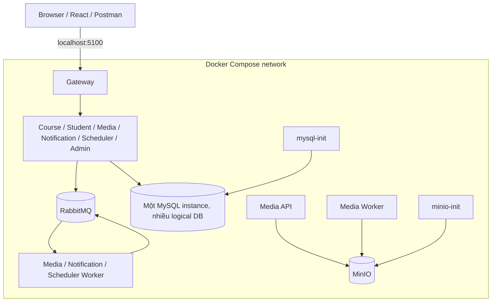
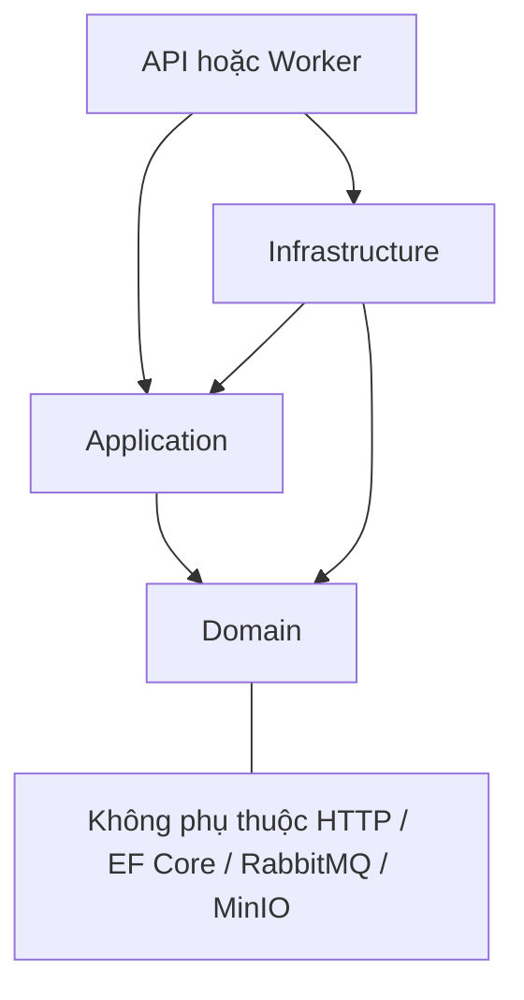
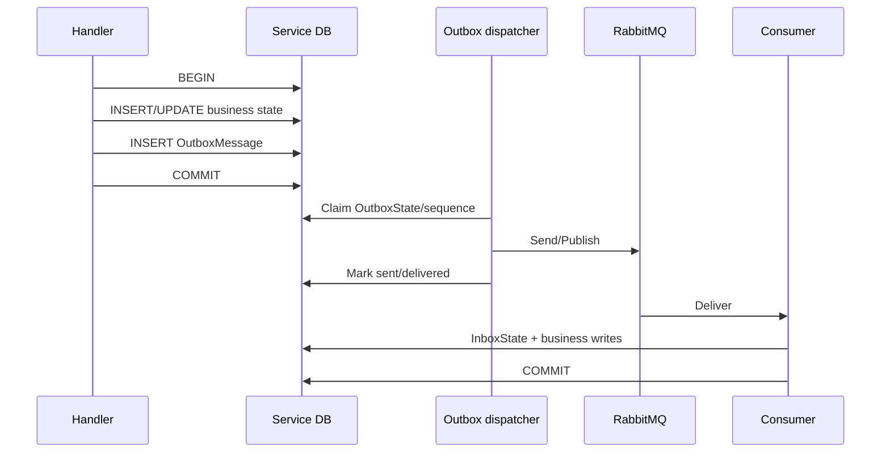
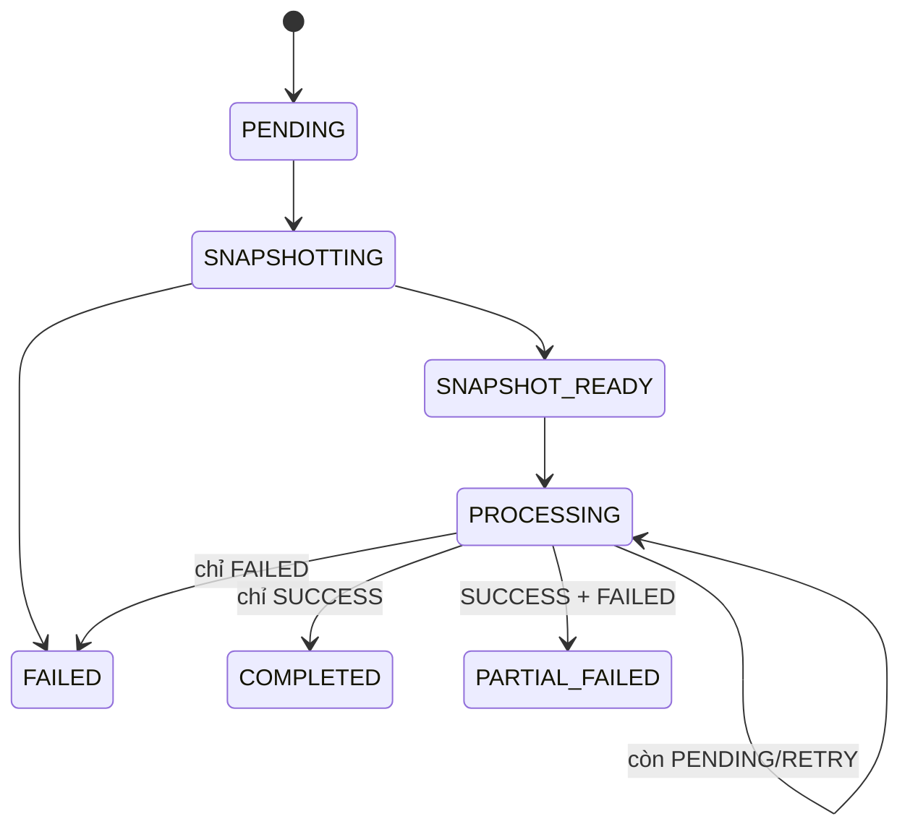
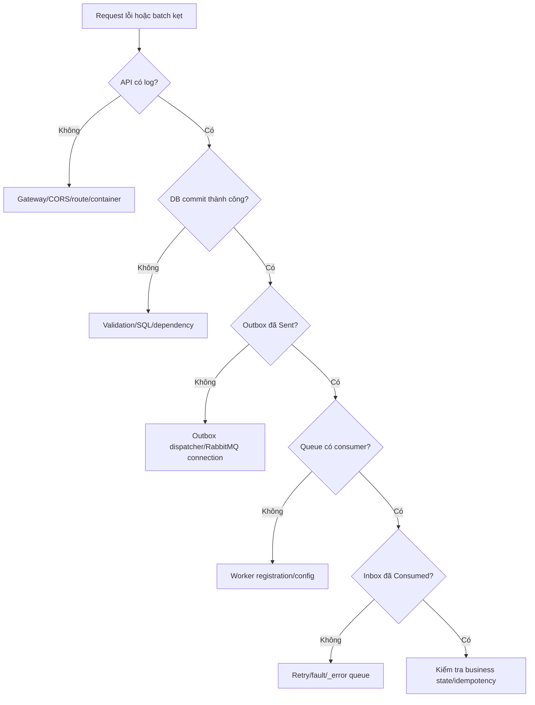

# Kiến trúc, Worker và quy trình debug

## 1. Thông điệp kiến trúc

Phần kiến trúc nên trả lời ba câu hỏi:

1. Thành phần nào sở hữu dữ liệu và side effect?
2. Một request/message đi qua những boundary nào?
3. Khi một bước thất bại, hệ thống phục hồi và truy vết bằng cách nào?

Không trình bày kiến trúc như danh sách framework. Công nghệ chỉ có ý nghĩa khi
gắn với một quyết định.

## 2. Bản đồ ownership

| Thành phần | Sở hữu | Không được làm |
| --- | --- | --- |
| YARP Gateway | Public routing, CORS, Swagger aggregation | Không chứa business rule hoặc truy cập DB. |
| Course Service | Course, Lesson, Enrollment, LessonProgress | Không đọc Student DB hoặc MinIO. |
| Student Service | Student, profile và authentication/session hiện tại | Không sở hữu Course/Notification. |
| Media Service | Media metadata, usage, background job và MinIO | Không để service khác dùng MinIO credential. |
| Notification Service | Notification đơn, batch, recipient item và inbox | Không đọc chéo Media/Student DB. |
| Scheduler Service | Schema và host foundation | Chưa được claim là có CRON/job execution. |

Mỗi database là nguồn sự thật của service owner. ID bên ngoài boundary là
logical reference; không có foreign key xuyên database.

## 3. Docker runtime local

Docker Compose đóng gói runtime nhưng không thay đổi ownership boundary:



### Image và process boundary

- Một multi-stage `backend/Dockerfile` dùng `PROJECT_PATH` để build từng API
  hoặc Worker.
- Build stage dùng .NET SDK; runtime stage dùng ASP.NET runtime.
- Media Worker cài thêm `ffmpeg` và `poppler-utils` cho video/PDF thumbnail.
- Worker không publish HTTP port nghiệp vụ.
- Frontend chạy ngoài Compose trong local và gọi Gateway.

### Dependency và bootstrap

```text
mysql healthy → mysql-init completed → API/Worker dùng DB
minio healthy → minio-init completed → Media API/Worker
rabbitmq healthy → messaging host
```

`mysql-init` tạo logical database/user. `minio-init` tạo năm bucket, application
user, policy và CORS. Đây là one-shot job; exit `0` là hoàn tất bình thường.

### Network và persistence

| Nội dung | Thiết kế |
| --- | --- |
| Internal DNS | `mysql`, `rabbitmq`, `minio`, `student-service`, v.v. |
| Public entry | Gateway `localhost:5100`. |
| Infra UI | RabbitMQ `15672`, MinIO Console `9001`. |
| Volumes | `mysql-data`, `rabbitmq-data`, `minio-data`. |
| Config | `.env` → Compose environment → .NET options. |

Local dùng một physical MySQL container nhưng mỗi service có logical database,
credential và migration riêng. Database-per-service ở đây là ownership rule,
không phải claim có năm MySQL server vật lý.

## 4. MinIO storage design

Chỉ Media Service và Media Worker dùng application credential truy cập MinIO.

### Bucket map

| Category | Bucket |
| --- | --- |
| `IMAGE` | `images` |
| `VIDEO` | `videos` |
| `DOCUMENT` | `documents` |
| `AUDIO` | `audios` |
| `OTHER` | `other` |

Caller truyền category; Infrastructure chọn bucket. Không cho client truyền
bucket tùy ý.

### Object key

```text
yyyy/MM/dd/{uuid:N}.{normalized-extension}
```

Ví dụ:

```text
images/2026/08/12/619319269e3946dab81657242c11bc86.png
```

- prefix ngày dùng UTC;
- UUID tránh collision và không lộ original filename/business ID;
- original filename lưu riêng trong database;
- `(bucket, object_key)` unique;
- key không được bắt đầu bằng `/`, chứa `..` hoặc control character;
- thumbnail là derivative WebP riêng trong `images`, không ghi đè source.

### Storage endpoint

| Caller | Endpoint |
| --- | --- |
| Media API/Worker trong Compose | `minio:9000`. |
| Browser direct upload | `MINIO_PUBLIC_ENDPOINT`, local là `localhost:9000`. |
| Người vận hành | MinIO Console `localhost:9001`. |

### Ownership DB và object store

```text
media_objects       → metadata, bucket/key, checksum, state, derivative
media_usages        → Course/Lesson/Notification/Student nào đang dùng
media_background_jobs → thumbnail/usage job state
MinIO               → binary bytes
```

Không xóa object active trực tiếp trong MinIO Console. Cleanup phải đối chiếu
DB reference, derivative và workflow state.

Xem phần trình bày đầy đủ tại
[Phao Docker và MinIO](07-phao-docker-minio.md).

## 5. Dependency trong một service



| Layer | Chứa gì | Không chứa gì |
| --- | --- | --- |
| Domain | Entity/state transition/invariant/value object | HTTP, EF Core, RabbitMQ, MinIO. |
| Application | Use case, validation, port/repository/service abstraction | ASP.NET contract, DbContext, transport implementation. |
| Infrastructure | EF repository, typed HTTP adapter, MassTransit, MinIO | Quy tắc nghiệp vụ nằm rải rác. |
| API/Worker | Binding, mapping, middleware, DI, consumer entry | Business rule và persistence query trực tiếp. |

Điểm nên mở code:

- Notification Domain state:
  `backend/Services/Notification/NotificationService.Domain/Entities/NotificationBatchState.cs`.
- Application batch handler:
  `backend/Services/Notification/NotificationService.Application/UseCases/NotificationBatches/Dispatch/DispatchNotificationBatchHandler.cs`.
- Infrastructure repository:
  `backend/Services/Notification/NotificationService.Infrastructure/Persistence/Repositories/EfNotificationBatchRepository.cs`.
- Worker consumer:
  `backend/Services/Notification/NotificationService.Worker/Consumers/NotificationBatches/DispatchNotificationBatchConsumer.cs`.

## 6. Giao tiếp liên service

| Tình huống | Cơ chế | Lý do |
| --- | --- | --- |
| Cần dữ liệu trả về ngay | Typed HTTP | Request/response rõ, timeout/retry query idempotent và forward correlation. |
| Yêu cầu một owner xử lý | COMMAND qua RabbitMQ `Send` | Tách HTTP khỏi background work; đúng một owner queue. |
| Thông báo việc đã xảy ra | EVENT qua RabbitMQ `Publish` | Nhiều subscriber có queue riêng. |

Ví dụ Notification Batch:

- Notification → Student là query danh sách active Student: dùng HTTP.
- Notification API → Notification Worker là snapshot command: dùng RabbitMQ.
- Notification Worker → Media Worker là register usage command: dùng RabbitMQ.

## 7. Worker inventory

### Notification Worker

| Consumer | Input | Trách nhiệm |
| --- | --- | --- |
| `SnapshotNotificationBatchConsumer` | `SnapshotNotificationBatchV1` | Chuyển batch sang snapshotting, đọc Student theo page, upsert recipient item, phát dispatch command. |
| `DispatchNotificationBatchConsumer` | `DispatchNotificationBatchV1` | Claim chunk bằng lease, send, persist notification/item/counter và phát continuation/media usage command. |

### Media Worker

| Nhóm consumer | Trách nhiệm |
| --- | --- |
| Thumbnail | Tạo WebP derivative, cập nhật media/job hoặc fault terminal. |
| Notification media usage | Validate media `READY`, tạo usage idempotent cho notification đơn/batch. |
| Markdown usage sync | Đồng bộ usage khi nội dung Course/Lesson thay đổi. |
| Usage deletion | Xóa/deactivate usage theo owner command. |
| Job marker/fault | Theo dõi `QUEUED/PROCESSING/COMPLETED/PARTIAL_FAILED/FAILED`. |

### Scheduler Worker

Chỉ là MassTransit host foundation. Chưa có polling, CRON evaluation, claim run
hoặc cleanup consumer nghiệp vụ. Khi bị hỏi, tách rõ “kiến trúc dự kiến” và
“runtime đã triển khai”.

## 8. Transactional Outbox và Consumer Inbox

### Vấn đề dual-write

Hai thao tác dưới đây không thể được coi là atomic nếu làm tuần tự:

```text
1. COMMIT business row vào MySQL
2. SEND message sang RabbitMQ
```

- Commit thành công, send lỗi: dữ liệu tồn tại nhưng Worker không chạy.
- Send thành công, commit rollback: Worker xử lý một nghiệp vụ không tồn tại.

### Cách giải quyết



### Ý nghĩa bảng MassTransit

#### `OutboxMessage`

- `SequenceNumber`: thứ tự durable.
- `MessageId`: ID transport.
- `MessageType`, `Body`, `Headers`, `Properties`: contract đã serialize.
- `InboxMessageId/InboxConsumerId`: liên hệ consumer outbox nếu message phát
  trong lúc consume.
- `OutboxId`: scope bus outbox.
- `SentTime`: timestamp message envelope; không phải bằng chứng broker đã nhận.
- `EnqueueTime`, `ExpirationTime`: enqueue/schedule và TTL khi có.
- `CorrelationId`, `ConversationId`, `InitiatorId`, `RequestId`: trace metadata.
- Address fields: source/destination/response/fault queue.

#### `OutboxState`

- `OutboxId`: identity của scope.
- `LockId` và `RowVersion`: concurrency control của dispatcher.
- `Created`, `Delivered`: thời điểm tạo và handoff.
- `LastSequenceNumber`: sequence cao nhất đã xử lý.

#### `InboxState`

- `MessageId + ConsumerId`: unique transport dedup key.
- `LockId/RowVersion`: concurrency control.
- `Received`, `ReceiveCount`: lần đầu nhận và số attempt.
- `Consumed`, `Delivered`: consume commit và consumer outbox delivery.
- `ExpirationTime`: retention dedup.

> [!IMPORTANT]
> Outbox `Delivered` chỉ cho biết message đã được handoff tới broker. Nó không
> chứng minh business handler downstream thành công.

### Ba lớp idempotency

| Lớp | Bảo vệ |
| --- | --- |
| Inbox transport | Cùng một message không commit consumer transaction hai lần theo consumer. |
| Unique business key | Redelivery với message khác nhưng cùng nghiệp vụ không tạo row trùng. |
| State transition/lease token | Side effect cũ không ghi đè claim mới hoặc chạy lại terminal item. |

Trong Batch Notification, hai business key quan trọng là:

```text
UNIQUE(batch_id, student_id)
UNIQUE(notification_batch_id, recipient_student_id)
```

> [!IMPORTANT]
> Audit source hiện tại: Notification/Media API đã bật Bus Outbox; Media Worker
> đã gắn Consumer Outbox vào consumer definitions. Notification Worker mới đăng
> ký EF outbox provider/entity nhưng chưa thấy
> `UseEntityFrameworkOutbox<NotificationDbContext>` trên Snapshot/Dispatch
> receive endpoint. Xem phân tích và ý nghĩa từng bảng tại
> [Giải thích Outbox và Inbox](05-outbox-inbox-notes.md).

## 9. State machine Batch Notification



Item state:

```text
PENDING → PROCESSING → SUCCESS
                     → RETRY → PROCESSING → SUCCESS | FAILED
```

Claim dùng transaction ngắn với `FOR UPDATE SKIP LOCKED`, gắn `lease_token` và
`lease_expires_at`, rồi commit trước khi gọi sender. Update kết quả chỉ hợp lệ
khi token vẫn khớp.

## 10. Debug có phương pháp

### 10.1 Chuẩn bị observability

```bash
docker compose up -d --build
docker compose ps
```

- RabbitMQ Management: `http://localhost:15672`.
- Console chính: `docker compose logs -f --since 10m <service>`.

Serilog cấu hình:

- Structured console log.
- Enrich `Service`, `Environment`, `TraceId`, `CorrelationId`, `MessageId`.
- HTTP log có method, path, status và elapsed.
- `4xx` ở Warning; `5xx`/exception ở Error.
- EF SQL thành công bị giảm noise; database warning/error vẫn giữ.

### 10.2 Quy trình debug HTTP

1. Chọn một Correlation ID duy nhất, ví dụ `demo-final-001`.
2. Gửi request qua Gateway với `X-Correlation-ID`.
3. Mở console log và lọc theo Correlation ID:

   ```powershell
   docker compose logs --since 10m api-gateway notification-service |
     Select-String -Pattern 'demo-final-001|Warning|Error|Exception'
   ```

4. Xác định service cuối cùng có log và status/elapsed.
5. Nếu mất correlation sau typed HTTP, kiểm tra
   `CorrelationIdDelegatingHandler` và request downstream.
6. Kiểm tra response `meta.traceId` và header trả về để đối chiếu.

### 10.3 Quy trình debug message/Worker

1. Từ log producer lấy `MessageId`, message type và destination.
2. Kiểm tra RabbitMQ:
   - queue có consumer không;
   - Ready/Unacked tăng hay không;
   - message có vào `<queue>_error` không.
3. Trong console Worker, lọc theo `MessageId`, Correlation ID hoặc batch ID:

   ```powershell
   docker compose logs --since 10m notification-worker |
     Select-String -Pattern '<message-id>|demo-final-001|<batch-id>|Error|Exception'
   ```

4. Kiểm tra `OutboxState.Delivered`:
   - null: Bus Outbox chưa hoàn tất handoff hoặc đang được xử lý;
   - có giá trị: chuyển sang kiểm tra broker/consumer.
   - Không dùng `OutboxMessage.SentTime` làm delivery flag; đây là timestamp
     của message envelope.
5. Kiểm tra `InboxState`:
   - chưa có: consumer chưa commit;
   - có `ReceiveCount` tăng: redelivery/retry;
   - có `Consumed`: consumer transaction đã commit.
6. Kiểm tra business state:
   - batch/item status, counters, lease expiry;
   - media background job status/error code;
   - notification/media usage unique row.
7. Sau khi sửa, replay cùng business input và xác nhận không có duplicate row
   hoặc side effect.

### 10.4 Cây quyết định nhanh



## 11. Không log gì

Không đưa vào Serilog console:

- password, connection string, access key hoặc secret;
- request body chứa dữ liệu nhạy cảm;
- MinIO bucket/object key hoặc signed policy;
- raw SQL exception/stack trace trong API response;
- message payload nếu có nội dung nhạy cảm.

## 12. Troubleshooting khi demo

| Hiện tượng | Kiểm tra | Cách xử lý |
| --- | --- | --- |
| Không thấy console log | `docker compose ps`; `docker compose logs --since 10m <service>` | Kiểm tra đúng service name và container có đang chạy; restart đúng container nếu cần. |
| Batch đứng ở snapshot | Student health, snapshot consumer, outbox, Student HTTP log | Dùng batch ID/correlation để lọc, không gửi batch thứ hai ngay. |
| Batch đứng ở processing | Dispatch queue, lease expiry, item status, `_error` | Xác định active lease hay worker đã chết trước khi retry. |
| Thumbnail failed | Media Worker log, job record, ffmpeg/pdf tool, source media | Dùng retry endpoint sau khi sửa dependency. |
| Message redelivery | `InboxState.ReceiveCount`, retry log, business unique key | Xác nhận side effect không duplicate trước khi purge/replay. |
