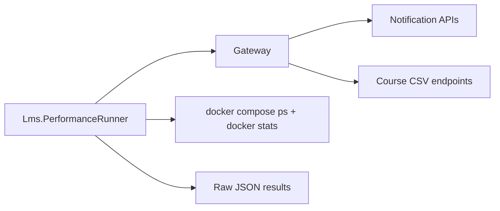

# Performance và evidence trình bày

## 1. Nguyên tắc công bố

Mọi kết luận performance phải có:

```text
commit + môi trường + dataset + seed + cấu hình
+ warm-up/measured runs + raw result + cách tổng hợp
```

Không so sánh hai cách nếu output không tương đương. Không dùng tên file hoặc
`datasetCount` làm bằng chứng duy nhất; phải kiểm tra cả `RowsReceived`, bytes và
hash.

> [!IMPORTANT]
> Evidence hiện có chưa đồng đều. Batch có đủ 3 run cho ba dataset và counter
> hợp lệ. CSV bị mismatch row count. N+1 chưa có raw measurement. Index tạm để
> trống. Vì vậy chỉ Batch đủ dữ liệu để trình bày số đo hiện tại, nhưng vẫn cần
> bổ sung thông tin máy/Docker limit để báo cáo hoàn chỉnh.

## 2. Tool đã viết

Project:

```text
backend/Tools/Lms.PerformanceRunner
```

Tool chạy trên host và thực hiện ba nhóm việc:



- Gọi Gateway bằng HTTP như một client thật.
- Với batch: POST, poll snapshot/delivery đến terminal.
- Với CSV: download hết response, đếm row/bytes và tính SHA-256.
- Sample CPU/RAM của container `notification-worker` hoặc `course-service`.
- Hiển thị live table nếu không dùng `--plain`.
- Ghi raw JSON vào `performance/results/`.

### Phạm vi hiện tại của CLI

```text
batch --users <3000|10000|100000>
csv --records <10000|100000|300000>
```

CLI hiện **không có command N+1, Index hoặc Pagination**. Hai path N+1 có trong
Course repository nhưng chưa được PerformanceRunner gọi.

## 3. Chuẩn bị môi trường

```bash
docker compose up -d --build
docker compose ps
curl -fsS http://localhost:5100/course/health
curl -fsS http://localhost:5100/notification/health
dotnet run --project backend/Tools/Lms.PerformanceRunner -- --help
```

Trước mỗi dataset chính thức:

1. Reset Development database bằng script có `--confirm`.
2. Seed đúng dataset, giữ nguyên `--random-seed`.
3. Ghi commit SHA, CPU/RAM host, Docker resource limit, MySQL/.NET version.
4. Không chạy workload khác trên máy.
5. Chạy warm-up trước measured run.

Runner chưa tự reset/seed dù parser có `--prepare-data --confirm-reset`; hiện
vẫn phải chuẩn bị dataset thủ công theo
[Performance runner guide](../performance/README.md).

## 4. Lệnh chạy

### Batch

```bash
dotnet run --project backend/Tools/Lms.PerformanceRunner -- \
  batch --users 10000 --warmup 1 --runs 3 \
  --poll-interval-ms 500 \
  --memory-sample-interval-ms 1000 \
  --timeout 00:30:00
```

Chạy cả ba kích thước:

```bash
dotnet run --project backend/Tools/Lms.PerformanceRunner -- \
  batch --all --warmup 1 --runs 3
```

### CSV

```bash
dotnet run --project backend/Tools/Lms.PerformanceRunner -- \
  csv --records 100000 --approach both --warmup 1 --runs 3 \
  --memory-sample-interval-ms 1000 \
  --timeout 00:10:00
```

Chạy cả ba kích thước:

```bash
dotnet run --project backend/Tools/Lms.PerformanceRunner -- \
  csv --all --approach both --warmup 1 --runs 3
```

`buffered` là endpoint Development-only dùng làm baseline. Production phải trả
`404` cho path benchmark này.

## 5. Ý nghĩa option CLI

| Option | Ý nghĩa khi trình bày |
| --- | --- |
| `--gateway-url` | Hệ thống đích; mặc định `http://localhost:5100`. |
| `--output` | Nơi lưu raw evidence; mặc định `performance/results`. |
| `--warmup` | Số run làm nóng JIT/cache, không đưa vào kết quả đo. |
| `--runs` | Số measured run; nên ít nhất 3 để thấy biến động. |
| `--poll-interval-ms` | Khoảng cách giữa hai lần đọc status batch; tạo sai số cho timing suy ra từ polling. |
| `--memory-sample-interval-ms` | Chu kỳ `docker stats`; càng dài càng có thể bỏ lỡ peak ngắn. |
| `--timeout` | Giới hạn cả scenario, không phải SLO của API. |
| `--approach` | CSV `buffered`, `streaming` hoặc `both`. |
| `--records` | Giới hạn Course kỳ vọng endpoint trả về. Phải đối chiếu `RowsReceived`. |
| `--plain` | Tắt live table, phù hợp redirect log/CI. |

## 6. Ý nghĩa metric Batch

| Field | Cách tính/ý nghĩa | Cách đọc |
| --- | --- | --- |
| `PostLatency` | Trước POST đến khi nhận `202`. | Đo độ nhanh của acceptance, không phải thời gian gửi xong. |
| `TotalDuration` | Trước POST đến delivery terminal. | End-to-end time người vận hành chờ. |
| `SnapshotDuration` | Từ accepted đến khi snapshot terminal, suy ra bằng polling. | Có sai số tối đa xấp xỉ poll interval. |
| `SnapshotTimingErrorMilliseconds` | Biên sai số do polling. | Không báo precision nhỏ hơn biên này. |
| `DispatchDurationMilliseconds` | `durationMs` do status API cung cấp khi có. | Thời gian dispatch nghiệp vụ, tách khỏi POST/snapshot. |
| `TotalCount` | Recipient đã snapshot. | Phải khớp dataset/requested count. |
| `ProcessedCount` | Item terminal đã xử lý. | Ở terminal phải bằng `TotalCount`. |
| `SuccessCount`/`FailedCount` | Kết quả cuối. | Tổng phải bằng `ProcessedCount`. |
| `EndToEndThroughput` | `ProcessedCount / TotalDuration`. | Throughput toàn flow, gồm snapshot/poll overhead. |
| `DispatchThroughput` | `ProcessedCount / DispatchDuration`. | Tập trung phần dispatch. |
| `BaselineMegabytes` | Median memory trước workload. | Mốc so sánh của container, không phải 0 MB. |
| `PeakMegabytes` | Sample memory lớn nhất. | Phụ thuộc sample interval. |
| `AverageMegabytes` | Trung bình các sample. | Cho thấy mức giữ memory trong cả run. |
| `DeltaMegabytes` | `Peak - Baseline`. | Hữu ích hơn peak tuyệt đối để so workload. |
| `PeakCpuPercent`/`AverageCpuPercent` | CPU container qua `docker stats`. | Không phải CPU toàn máy; có thể thiếu nếu raw run không có resource sample. |

## 7. Kết quả Batch hiện có

Nguồn raw:

- `performance/results/batch-3000.json`
- `performance/results/batch-10000.json`
- `performance/results/batch-100000.json`

Trung bình cộng của 3 measured runs:

| Dataset | Trạng thái | Avg total | Avg end-to-end throughput | Avg peak RAM | Avg RAM delta | Ghi chú |
| ---: | --- | ---: | ---: | ---: | ---: | --- |
| 3,000 | 3/3 `COMPLETED` | 13.15 s | 228.21 item/s | 124.47 MB | 1.07 MB | CPU peak trung bình 46.54%. |
| 10,000 | 3/3 `COMPLETED` | 51.47 s | 194.52 item/s | 126.53 MB | 2.67 MB | CPU peak trung bình 44.44%. |
| 100,000 | 3/3 `COMPLETED` | 458.36 s | 218.75 item/s | 123.73 MB | 7.17 MB | Raw result không có CPU resource summary. |

Tất cả run hiện có đều ghi `successCount = totalCount`, `failedCount = 0`.

### Cách nói kết quả Batch

> Khi dataset tăng từ 3 nghìn lên 100 nghìn, peak RAM container vẫn quanh
> 124–127 MB và RAM delta trung bình chỉ khoảng 1–7 MB. Đây là dấu hiệu phù hợp
> với thiết kế paging/chunk, nhưng chưa phải bằng chứng production vì môi trường
> local và Docker limit chưa được ghi đủ. Total time tăng gần tuyến tính, còn
> throughput dao động khoảng 195–228 item/giây.

Không nói “RAM luôn cố định” vì `docker stats` là sampling và baseline giữa các
run khác nhau.

## 8. Ý nghĩa metric CSV

| Field | Ý nghĩa | Cách đọc |
| --- | --- | --- |
| `ResponseHeadersTime` | Request đến khi nhận headers. | Với response stream, headers có thể đến trước body. |
| `Ttfb` | Request đến byte body đầu tiên. | Chỉ số chính để chứng minh streaming bắt đầu sớm. |
| `TotalDownloadTime` | Request đến khi đọc hết body. | Bao gồm server, network và client read. |
| `ResponseBytes` | Tổng bytes body. | Hai approach cùng dataset phải tương đương. |
| `RowsReceived` | Số data row runner đếm được. | Phải khớp `--records` hoặc số row thực tế theo filter. |
| `ContentSha256` | Hash toàn body. | `both` phải cùng hash; khác hash là correctness failure. |
| Memory baseline/peak/average/delta | Memory container `course-service`. | So delta và profile, không chỉ peak tuyệt đối. |
| CPU | CPU container nếu runner ghi resource summary. | Raw CSV hiện không có CPU summary riêng. |

Streaming không tự động đồng nghĩa `TotalDownloadTime` thấp hơn. Mục tiêu cần
chứng minh là TTFB sớm, output đúng và memory bounded.

## 9. Audit CSV evidence hiện có

Các file raw hiện đều ghi `RowsReceived = 300000` và cùng SHA-256, bất kể tên
file/dataset count:

| File | `datasetCount` | `RowsReceived` thực tế | Đánh giá |
| --- | ---: | ---: | --- |
| `csv-10000.json` | 10,000 | 300,000 | Không khớp, không dùng làm kết quả 10k. |
| `csv-100000.json` | 100,000 | 300,000 | Không khớp, không dùng làm kết quả 100k. |
| `csv-300000.json` | 300,000 | 300,000 | Khớp row count nhưng metadata chung vẫn chưa đủ. |

Hash buffered/streaming giống nhau trong từng run, đây là tín hiệu correctness
tốt cho cùng response 300k. Tuy nhiên không được dùng ba file để vẽ trend theo
10k/100k/300k.

`performance/results/metadata.json` hiện chỉ phản ánh lần chạy Batch 10k gần
nhất (`warmupRuns = 0`, `measuredRuns = 3`) và không lưu metadata riêng theo
từng file. Nó không đủ để chứng minh cấu hình của toàn bộ evidence directory.

### Việc cần làm trước khi đưa CSV lên slide

1. Xác nhận endpoint streaming và buffered đều bind query `limit`.
2. Reset/seed đúng dataset.
3. Chạy riêng từng dataset vào output directory khác nhau:

   ```bash
   dotnet run --project backend/Tools/Lms.PerformanceRunner -- \
     csv --records 10000 --approach both --warmup 1 --runs 3 \
     --output performance/results/csv-10k-rerun
   ```

4. Gate kết quả: `RowsReceived == records`, bytes/hash của hai approach giống
   nhau và metadata ghi đúng command.
5. Chỉ sau đó tính trung bình/median/p95 và làm slide.

## 10. N+1: hiện trạng và cách đo đúng

### Query shape đã có

Production `GetWithoutNPlusOneAsync`:

```text
1 query Course
1 query toàn bộ Lessons
1 query toàn bộ LessonProgresses WHERE lesson_id IN (...)
= tối đa 3 query, không phụ thuộc số Lesson
```

Benchmark-only `GetWithNPlusOneAsync`:

```text
1 query Course
1 query toàn bộ Lessons
L query Progress, mỗi Lesson một query
= 2 + L query
```

Path N+1 không được gọi từ HTTP endpoint production.

### Evidence còn thiếu

- PerformanceRunner chưa có command/scenario N+1.
- Không có raw JSON N+1 trong `performance/results/`.
- Serilog hiện override EF command thành Warning nên successful SQL không hiện
  mặc định trong console log.

Vì vậy slide N+1 hiện chỉ được ghi:

| Scenario | Query count theo source | Response time | Dataset |
| --- | ---: | ---: | ---: |
| Naive | `2 + L` | Chưa đo | Chưa khóa |
| Optimized | Tối đa `3` | Chưa đo | Chưa khóa |

### Cách hoàn thiện trước buổi nói

Tạo một Development-only benchmark hoặc integration harness gọi trực tiếp cả
hai repository path trên cùng `courseId`, dùng `DbCommandInterceptor` để đếm
query và `Stopwatch` để đo thời gian. Chạy warm-up và ít nhất 3 measured run ở
cùng số Lesson/Progress; ghi raw result gồm:

```text
courseId, lessons, progresses, approach,
queryCount, totalDurationMs, run, commit, environment
```

Không expose path naive thành production endpoint chỉ để demo.

## 11. Index

> [!NOTE]
> Phần Index tạm thời để trống theo yêu cầu. Chưa đưa bảng trước/sau, chưa đưa
> `EXPLAIN ANALYZE` hoặc kết luận về index lên slide.

```text
Dataset:          <chưa có>
Query:            <chưa có evidence đã khóa>
Before plan:      <trống>
After plan:       <trống>
Rows examined:    <trống>
Execution time:   <trống>
Trade-off write:  <trống>
```

## 12. Checklist đọc raw result

Trước khi chép số vào slide:

- [ ] `datasetCount` khớp command.
- [ ] Batch `TotalCount == ProcessedCount == SuccessCount + FailedCount`.
- [ ] CSV `RowsReceived` khớp `--records`/filter.
- [ ] CSV buffered và streaming cùng `ResponseBytes`/`ContentSha256`.
- [ ] Có đủ sample memory và ghi rõ sample interval.
- [ ] Không biến missing CPU thành `0%`.
- [ ] Warm-up không bị tính vào measured runs.
- [ ] Ghi môi trường, commit, seed và Docker resource limit.
- [ ] Không có secret trong metadata/log/result.
- [ ] Bảng tổng hợp liên kết được về raw JSON.

## 13. Troubleshooting runner

| Lỗi | Kiểm tra/cách xử lý |
| --- | --- |
| Gateway không phản hồi | `docker compose ps` và health Course/Notification. |
| Không resolve container | Service name phải là `notification-worker` hoặc `course-service`. |
| Dataset sai | Reset/seed lại; không đổi nhãn file bằng tay. |
| CSV hash khác | Dừng kết luận; kiểm tra query/filter/order/escape/output. |
| Memory sample rỗng | Kiểm tra Docker CLI và quyền `docker stats`; chạy lại. |
| Timeout | Giữ partial raw để điều tra, ghi timeout mới vào metadata khi rerun. |
| `Ctrl+C` | Exit code `130`; không trộn partial run với complete result. |
