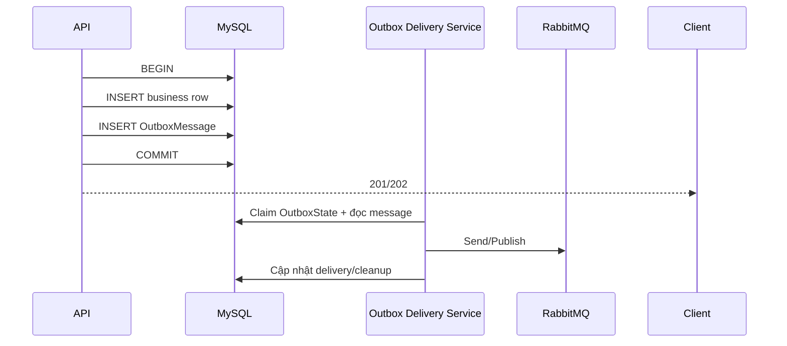
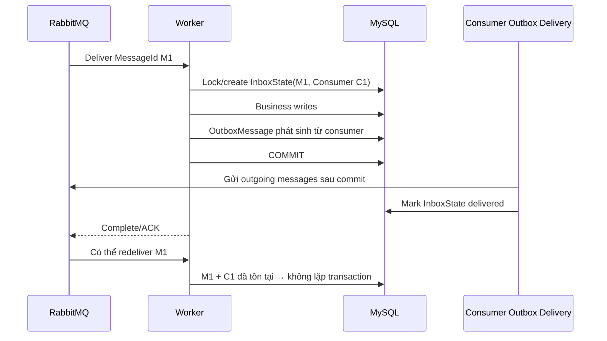

# Giải thích Outbox, Inbox và ba bảng MassTransit

## 1. Câu trả lời ngắn trong 30 giây

> Outbox là “hộp thư đi” bền vững trong database. Thay vì vừa commit dữ liệu vừa
> gửi RabbitMQ bằng hai thao tác rời nhau, service ghi business data và message
> cần gửi trong cùng một transaction. Sau commit, delivery service mới lấy
> message từ Outbox và gửi tới broker.
>
> Inbox là “sổ nhận thư” của consumer. Nó ghi nhận message nào đã được consumer
> nhận và xử lý, giúp phát hiện redelivery theo `MessageId + ConsumerId`. Inbox
> không thay thế unique key hoặc state machine của nghiệp vụ.

> [!NOTE]
> Tên bảng đúng là `InboxState`, không phải `InputState`. “Inbox” nghĩa là hộp
> thư đến; “input” không phải thuật ngữ của pattern này.

## 2. Tại sao cần Outbox và Inbox?

### 2.1 Producer có bài toán dual-write

Giả sử API phải làm hai việc:

```text
1. Ghi notification batch vào MySQL.
2. Gửi SnapshotNotificationBatchV1 vào RabbitMQ.
```

Nếu làm tuần tự mà không có Outbox:

| Tình huống lỗi | Hậu quả |
| --- | --- |
| DB commit thành công, gửi RabbitMQ thất bại | Batch đã tồn tại nhưng Worker không biết để xử lý. |
| Gửi RabbitMQ thành công, DB rollback | Worker nhận command trỏ tới batch không tồn tại. |
| Process chết giữa hai bước | Không biết thao tác nào đã hoàn thành để khôi phục an toàn. |

Outbox chuyển hai write này thành một database transaction:



Nếu RabbitMQ đang down, business transaction vẫn tồn tại và message vẫn nằm
trong database để delivery service thử lại sau khi broker phục hồi.

### 2.2 Consumer nhận message theo cơ chế at-least-once

RabbitMQ/MassTransit có thể giao lại cùng message khi:

- consumer xử lý xong nhưng chết trước khi ACK;
- kết nối bị mất;
- retry/redelivery policy chạy;
- operator replay message.

Nếu consumer chỉ `INSERT` lại mỗi lần nhận, side effect có thể bị nhân đôi.
Consumer Inbox ghi nhận message theo consumer và phối hợp với transaction:



## 3. Bus Outbox và Consumer Outbox khác nhau thế nào?

| Loại | Điểm bắt đầu | Bảo vệ điều gì? | Bảng liên hệ chính |
| --- | --- | --- | --- |
| Bus Outbox | API/Application gửi message ngoài consumer | Business DB write và outgoing message cùng transaction | `OutboxState.OutboxId` → `OutboxMessage.OutboxId` |
| Consumer Outbox | Worker đang consume một message | Inbox dedup, business write và outgoing message cùng consumer transaction | `InboxState(MessageId, ConsumerId)` → `OutboxMessage(InboxMessageId, InboxConsumerId)` |

Một `OutboxMessage` có các khóa liên hệ nullable vì nó có thể thuộc Bus Outbox
hoặc Consumer Outbox. Migration không tạo foreign key vật lý giữa ba bảng;
MassTransit quản lý quan hệ và lifecycle bằng ID/index.

## 4. Ý nghĩa từng bảng

### 4.1 `OutboxMessage` — nội dung thư cần gửi

Đây là bảng lưu từng outgoing message đã được serialize. Có thể hiểu một row là
“một phong bì chưa được giao xong hoặc đang được delivery service quản lý”.

| Cột/nhóm cột | Ý nghĩa dễ nhớ | Dùng khi debug |
| --- | --- | --- |
| `SequenceNumber` | Số thứ tự tăng dần của message trong Outbox. | Xem message nào đi trước/sau; delivery đọc theo sequence. |
| `MessageId` | ID duy nhất của message envelope. | Nối log producer, RabbitMQ và consumer. |
| `MessageType` | Tên contract message, ví dụ `SnapshotNotificationBatchV1`. | Xác định consumer/queue nào phải nhận. |
| `Body` | Payload đã serialize. | Chỉ xem khi an toàn; không chiếu dữ liệu nhạy cảm. |
| `ContentType` | Kiểu serializer/content. | Điều tra lỗi deserialize. |
| `Headers`, `Properties` | Metadata transport mở rộng. | Kiểm tra custom header/source service. |
| `SentTime` | Timestamp UTC của message envelope khi send/publish được tạo. | **Không dùng làm bằng chứng broker đã nhận.** |
| `EnqueueTime` | Thời điểm enqueue/schedule nếu message có giá trị này. | Điều tra message trì hoãn. |
| `ExpirationTime` | Hạn sử dụng/TTL của message. | Xem message có hết hạn trước khi giao không. |
| `OutboxId` | Liên hệ message với một Bus Outbox scope. | Group các message được tạo trong cùng scope. |
| `InboxMessageId`, `InboxConsumerId` | Liên hệ outgoing message với incoming message/consumer đã sinh ra nó. | Theo chuỗi consumer nhận M1 rồi phát M2. |
| `CorrelationId` | ID nghiệp vụ/operation dùng để trace. | Theo một batch xuyên nhiều message. |
| `ConversationId` | ID cuộc hội thoại message dài hơn một hop. | Gom toàn bộ chuỗi message liên quan. |
| `InitiatorId` | Correlation của message khởi phát message hiện tại. | Tìm message cha. |
| `RequestId` | Liên hệ request/response messaging nếu có. | Điều tra request client timeout. |
| Address fields | Source, destination, response và fault address. | Xác định gửi nhầm queue hoặc fault route. |

> [!IMPORTANT]
> `SentTime` là header thời gian của message, không phải delivery status. Muốn
> biết Bus Outbox scope đã giao xong, xem `OutboxState.Delivered`. Muốn biết
> outgoing messages của consumer đã giao xong, xem `InboxState.Delivered`.

### 4.2 `OutboxState` — trạng thái giao của Bus Outbox scope

Đây là “phiếu theo dõi một lô thư đi” dành cho message được gửi ngoài consumer,
ví dụ API dùng `UseBusOutbox()`.

| Cột | Ý nghĩa dễ nhớ | Dùng khi debug |
| --- | --- | --- |
| `OutboxId` | ID của một Bus Outbox scope; khóa chính. | Join logic với `OutboxMessage.OutboxId`. |
| `Created` | Thời điểm scope được tạo. | Tìm outbox cũ chưa giao. |
| `Delivered` | Thời điểm các message trong scope đã được delivery service giao tới transport. | `NULL` là chưa hoàn tất delivery; có giá trị **không có nghĩa downstream business đã thành công**. |
| `LastSequenceNumber` | Sequence cuối mà scope theo dõi/đã xử lý. | Xác định delivery tiến tới message nào. |
| `LockId` | Token khóa của delivery worker đang claim scope. | Điều tra nhiều instance tranh nhau gửi. |
| `RowVersion` | Token optimistic concurrency. | Phát hiện/update cạnh tranh an toàn. |

Quan hệ logic:

```text
OutboxState.OutboxId
       1
       |
       +------ N OutboxMessage.OutboxId
```

### 4.3 `InboxState` — trạng thái nhận và dedup của consumer

Đây là “sổ thư đến”. Một message có thể được nhiều consumer khác nhau xử lý, vì
vậy unique key phải là cặp `(MessageId, ConsumerId)`, không chỉ `MessageId`.

| Cột | Ý nghĩa dễ nhớ | Dùng khi debug |
| --- | --- | --- |
| `Id` | Khóa surrogate của row. | Chủ yếu cho persistence nội bộ. |
| `MessageId` | Message incoming được broker giao. | Nối log/RabbitMQ/Outbox producer. |
| `ConsumerId` | Identity của consumer endpoint xử lý message. | Cùng message vẫn được consumer khác xử lý hợp lệ. |
| `Received` | Lúc Inbox ghi nhận lần đầu. | Biết message bắt đầu vào consumer khi nào. |
| `ReceiveCount` | Số lần transport giao/attempt được ghi nhận. | Phát hiện retry/redelivery; không phải `retry_count` nghiệp vụ. |
| `Consumed` | Consumer transaction đã xử lý và commit. | Chứng minh local consumer DB work đã commit. |
| `Delivered` | Outgoing messages do consumer sinh ra đã được giao tới transport. | Không chứng minh consumer tiếp theo đã xử lý xong. |
| `ExpirationTime` | Mốc giữ row cho duplicate-detection window. | Sau window row có thể được cleanup. |
| `LastSequenceNumber` | Sequence outgoing cuối thuộc consumer transaction. | Theo dõi delivery các message con. |
| `LockId`, `RowVersion` | Khóa/concurrency token. | Ngăn hai worker cùng commit một incoming message. |

Unique constraint:

```text
UNIQUE(MessageId, ConsumerId)
```

Quan hệ logic với outgoing message của consumer:

```text
InboxState.(MessageId, ConsumerId)
                1
                |
                +------ N OutboxMessage.(InboxMessageId, InboxConsumerId)
```

## 5. Cách đọc ba bảng theo tình huống

| Quan sát | Cách hiểu đúng | Bước tiếp theo |
| --- | --- | --- |
| Có `OutboxState`, `Delivered IS NULL` | Bus Outbox chưa hoàn tất handoff; có thể đang chờ hoặc đang được claim. | Kiểm tra tuổi row, `LockId`, RabbitMQ connection và log delivery service. |
| `OutboxState.Delivered` có giá trị | Scope đã handoff transport. | Sang RabbitMQ/consumer log; chưa kết luận business downstream thành công. |
| Có `InboxState.Received`, `Consumed IS NULL` | Consumer chưa commit thành công hoặc đang retry. | Xem exception, retry và `_error` queue. |
| `InboxState.Consumed` có giá trị | Local business transaction đã commit. | Kiểm tra business rows và outgoing delivery. |
| `Consumed` có nhưng `Delivered IS NULL` | Consumer đã commit nhưng outgoing messages chưa giao xong. | Kiểm tra Outbox delivery/broker. |
| `ReceiveCount > 1` | Có transport retry/redelivery. | Xác nhận business unique key/state không duplicate. |
| Không thấy row | Có thể chưa đi qua outbox/inbox, middleware chưa bật, hoặc row đã cleanup. | Không kết luận ngay; đối chiếu config, log, broker và retention. |

## 6. Outbox/Inbox không bảo đảm điều gì?

Không nên nói:

```text
"Có Outbox nên toàn hệ thống exactly-once."
```

Nên nói:

> Outbox bảo đảm durable handoff giữa database và broker. Consumer Inbox hỗ trợ
> duplicate detection theo message/consumer. Broker vẫn at-least-once, vì vậy
> nghiệp vụ vẫn phải có unique key, state transition và idempotent side effect.

Ba lớp bảo vệ trong Batch Notification:

| Lớp | Ví dụ |
| --- | --- |
| Transport duplicate detection | `InboxState(MessageId, ConsumerId)`. |
| Business uniqueness | `UNIQUE(batch_id, student_id)` và `UNIQUE(notification_batch_id, recipient_student_id)`. |
| State/concurrency | Terminal item không xử lý lại; lease token phải khớp khi cập nhật kết quả. |

Nếu consumer gọi external API/MinIO, database transaction cũng không thể rollback
external side effect. Vẫn cần idempotency key, ordering hoặc compensation riêng.

## 7. Áp dụng trong repository hiện tại

### API — Bus Outbox đã bật

Notification API và Media API cấu hình:

```csharp
registration.AddEntityFrameworkOutbox<ServiceDbContext>(outbox =>
{
    outbox.UseMySql();
    outbox.UseBusOutbox();
});
```

Ý nghĩa: `IPublishEndpoint`/`ISendEndpointProvider` scoped trong API có thể ghi
message vào EF Bus Outbox cùng transaction của `DbContext`, rồi hosted delivery
service gửi sau commit.

### Media Worker — Consumer Outbox đã gắn vào endpoint

Các Media consumer definition có:

```csharp
endpointConfigurator.UseEntityFrameworkOutbox<MediaDbContext>(context);
```

Ý nghĩa: incoming message, Media business write và outgoing message của consumer
được phối hợp bằng Consumer Inbox/Outbox.

### Notification Worker — audit note cần xử lý

Notification Worker đã đăng ký:

```csharp
registration.AddEntityFrameworkOutbox<NotificationDbContext>(outbox =>
    outbox.UseMySql());
```

và `NotificationDbContext` map đủ ba entity. Tuy nhiên source hiện tại chưa thấy
`UseEntityFrameworkOutbox<NotificationDbContext>(context)` gắn vào receive
endpoint của `SnapshotNotificationBatchConsumer` hoặc
`DispatchNotificationBatchConsumer`.

> [!IMPORTANT]
> Chỉ đăng ký provider/table chưa đồng nghĩa Consumer Outbox middleware đã được
> áp dụng cho consumer. Trước khi thuyết trình “Notification Worker dùng
> Inbox/Consumer Outbox”, cần bổ sung/cấu hình và kiểm thử, hoặc nói trung thực
> rằng Notification API đã dùng Bus Outbox còn Notification Worker đang có gap
> cấu hình Consumer Outbox.

## 8. SQL kiểm tra khi demo/debug

### Bus Outbox scope

```sql
SELECT OutboxId, Created, Delivered, LastSequenceNumber, LockId
FROM OutboxState
ORDER BY Created DESC
LIMIT 20;
```

### Message đang còn trong Outbox

```sql
SELECT SequenceNumber, MessageId, MessageType,
       OutboxId, InboxMessageId, InboxConsumerId,
       CorrelationId, DestinationAddress,
       SentTime, EnqueueTime, ExpirationTime
FROM OutboxMessage
ORDER BY SequenceNumber DESC
LIMIT 20;
```

### Consumer Inbox

```sql
SELECT Id, MessageId, ConsumerId,
       Received, ReceiveCount, Consumed, Delivered,
       ExpirationTime, LastSequenceNumber
FROM InboxState
ORDER BY Received DESC
LIMIT 20;
```

> [!NOTE]
> Delivered message/Inbox rows có thể được hosted cleanup service xóa sau
> duplicate-detection/retention window. Không thấy row cũ không chứng minh
> message chưa từng được xử lý.

## 9. Quy trình debug Outbox/Inbox

```text
1. Lấy `CorrelationId`, `MessageId` hoặc business ID từ console log.
2. Xác định message phát từ API hay từ consumer.
3. API: kiểm tra OutboxState và OutboxMessage theo OutboxId/CorrelationId.
4. Nếu delivery hoàn tất: kiểm tra RabbitMQ queue, consumer và _error queue.
5. Consumer: kiểm tra InboxState theo MessageId + ConsumerId.
6. Kiểm tra business row/state/unique key, không chỉ bảng hạ tầng.
7. Replay chỉ sau khi biết side effect cũ đã commit đến đâu.
```

## 10. Câu hỏi thường gặp

### Tại sao cần cả Inbox và business unique key?

Inbox deduplicate cùng transport `MessageId`. Một nghiệp vụ có thể được gửi lại
bằng message mới với `MessageId` khác; unique business key vẫn phải chặn duplicate
row/side effect.

### `Delivered` có nghĩa người dùng đã nhận notification chưa?

Không. `Delivered` trong các bảng MassTransit chỉ nói về delivery tới transport
ở boundary tương ứng. Notification business success phải đọc
`notification_batch_items`, `notifications` và batch counters.

### Có nên query/sửa trực tiếp ba bảng không?

Chỉ query read-only để debug. Không sửa `LockId`, `Delivered`, sequence hoặc xóa
row thủ công khi service đang chạy; MassTransit quản lý lifecycle của chúng.

### Tại sao OutboxMessage biến mất sau khi gửi?

Delivery/cleanup service có thể xóa row đã giao. Đây là operational persistence,
không phải business audit log lâu dài. Audit nghiệp vụ phải nằm trong bảng do
service sở hữu.

## 11. Nguồn đối chiếu

- Migration thực tế:
  `backend/Services/Notification/NotificationService.Infrastructure/Database/Migrations/V002__add_snapshot_and_outbox.sql`.
- Notification configuration:
  `backend/Services/Notification/NotificationService.Api/Program.cs` và
  `backend/Services/Notification/NotificationService.Worker/Program.cs`.
- Media configuration:
  `backend/Services/Media/MediaService.Api/Program.cs` và các consumer definition
  trong `backend/Services/Media/MediaService.Worker/Consumers/`.
- [MassTransit Outbox configuration](https://masstransit.io/documentation/configuration/middleware/outbox).
- [MassTransit message headers](https://masstransit.io/documentation/concepts/messages).
