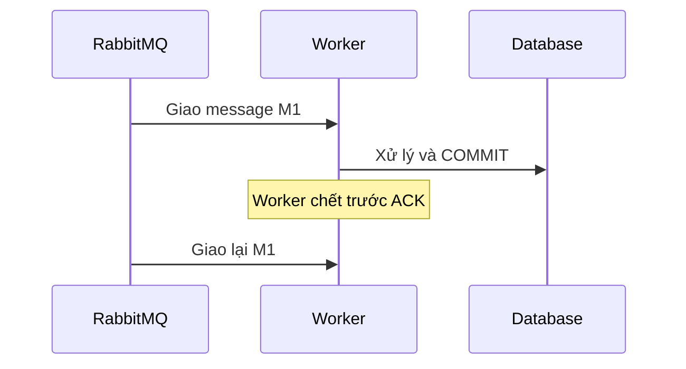
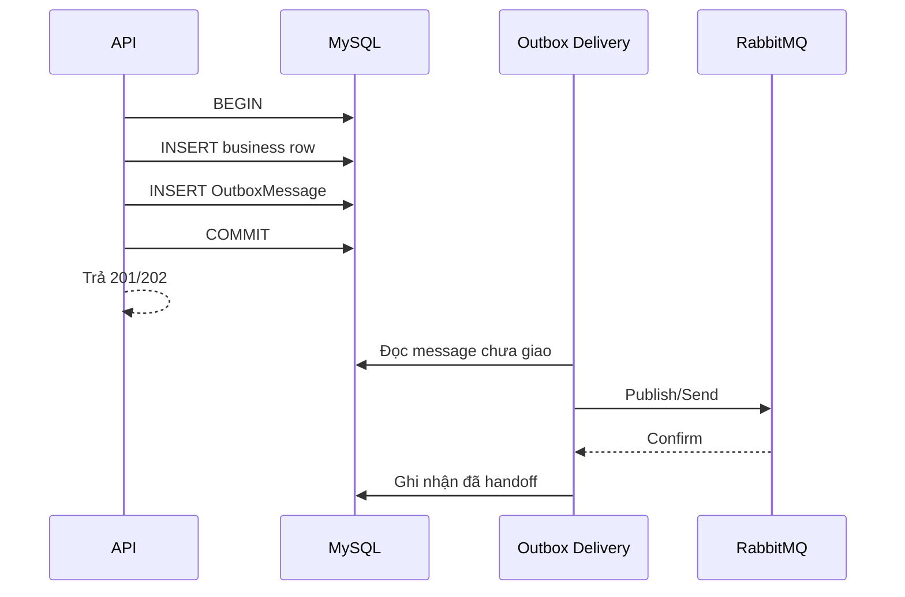
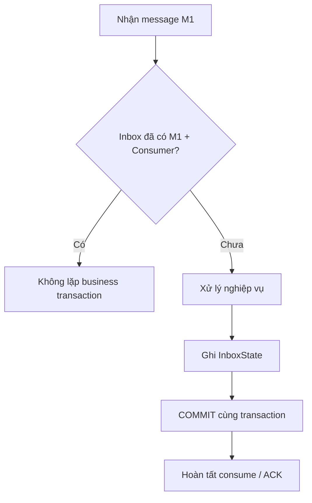
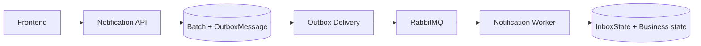
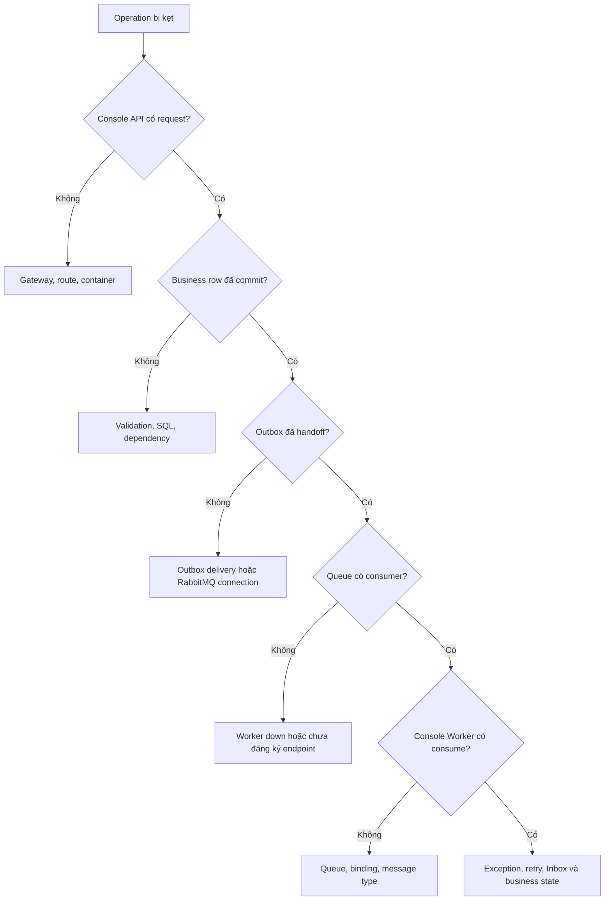

# Phao thuyết trình: RabbitMQ, at-least-once, dual-write, Outbox và Inbox

## 1. Mục đích

File này dùng để:

- ôn nhanh trước khi thuyết trình;
- giải thích cho người chưa biết message broker;
- trả lời câu hỏi của lead về `at-least-once`, `dual-write`, Outbox và Inbox;
- debug bằng **console log**, RabbitMQ Management và database.

## 2. Bản đồ 20 giây

```text
Dual-write tạo nguy cơ mất message
        ↓
Outbox bảo vệ phía gửi
        ↓
RabbitMQ giao at-least-once nên có thể giao trùng
        ↓
Inbox + idempotency bảo vệ phía nhận
```

Câu dễ nhớ:

> **Outbox chống mất, Inbox chống trùng, at-least-once nối hai bên.**

## 3. Giải thích như nói với người mới

Hãy coi RabbitMQ là bưu điện:

| Thành phần | Cách hình dung |
| --- | --- |
| Producer | Người gửi thư, ví dụ Notification API. |
| RabbitMQ | Bưu điện nhận và chuyển thư. |
| Queue | Hòm thư chờ người nhận lấy. |
| Consumer | Người nhận và xử lý thư, ví dụ Notification Worker. |
| ACK | Consumer báo với bưu điện: “Tôi xử lý xong rồi”. |
| Outbox | Sổ/hộp thư đi bền vững của producer. |
| Inbox | Sổ thư đã nhận của consumer. |

## 4. Delivery at-least-once là gì?

`At-least-once` nghĩa là một message được giao **ít nhất một lần**, nhưng có thể
được giao lại nhiều lần.



Tình huống thường gặp:

1. RabbitMQ giao message `M1`.
2. Worker ghi database thành công.
3. Worker chết hoặc mất kết nối trước khi gửi ACK.
4. RabbitMQ chưa nhận ACK nên giao lại `M1`.

### Tại sao không ACK trước khi ghi database?

Nếu ACK trước rồi Worker chết trước khi commit:

```text
RabbitMQ đã xóa message ✅
Business data chưa được ghi ❌
→ Mất nghiệp vụ
```

Vì vậy ACK chỉ nên xảy ra sau khi local transaction xử lý thành công. MassTransit
điều phối ACK; application không tự ACK thủ công.

### Điều kiện để nói về at-least-once

RabbitMQ không tự tạo ra bảo đảm end-to-end chỉ bằng việc cài broker. Luồng cần:

- queue/message có durability phù hợp;
- producer biết broker đã nhận thông qua publisher confirm hoặc cơ chế tương đương;
- consumer chỉ hoàn tất/ACK sau khi xử lý thành công;
- message chưa ACK được requeue/redeliver;
- consumer chịu được duplicate.

> [!IMPORTANT]
> `At-least-once delivery` không có nghĩa `exactly-once business`.

## 5. Dual-write là gì?

Dual-write xảy ra khi một use case phải ghi vào hai hệ thống độc lập:

```text
1. INSERT notification_batches vào MySQL
2. Publish SnapshotNotificationBatchV1 lên RabbitMQ
```

MySQL và RabbitMQ không dùng chung local transaction, nên có khoảng lỗi giữa hai
bước.

### Ghi DB trước, publish sau

```text
INSERT DB thành công
        ↓
Process chết hoặc RabbitMQ lỗi
        ↓
Publish thất bại
```

Hậu quả: batch tồn tại nhưng Worker không biết để xử lý.

### Publish trước, ghi DB sau

```text
Publish thành công
        ↓
INSERT DB thất bại hoặc rollback
```

Hậu quả: Worker nhận command nhưng batch không tồn tại.

### Vì sao retry đơn thuần chưa đủ?

Producer có thể publish thành công nhưng mất kết nối trước khi nhận confirm.
Producer không biết broker đã nhận hay chưa:

- không retry: có nguy cơ mất message;
- retry: có nguy cơ publish trùng.

Đây là lý do hệ thống phải chấp nhận khả năng duplicate và thiết kế idempotency.

## 6. Outbox giải quyết dual-write như thế nào?

Producer không publish trực tiếp trong business transaction. Nó ghi business row
và message cần gửi vào **cùng một database transaction**.



Nếu transaction rollback thì cả business row và Outbox message cùng mất. Nếu
RabbitMQ đang down thì business row và message vẫn còn trong DB; delivery service
có thể thử lại.

### Outbox vẫn có thể publish trùng

```text
Publish lên RabbitMQ thành công
        ↓
Delivery process chết trước khi ghi nhận đã giao
        ↓
Sau khi restart, message được publish lại
```

Outbox giải quyết nguy cơ **mất handoff**, không tự tạo exactly-once.

## 7. Inbox giải quyết duplicate như thế nào?

Inbox là sổ ghi nhận consumer nào đã nhận message nào. Khóa nhận diện là:

```text
MessageId + ConsumerId
```



Cùng một message vẫn có thể được nhiều consumer khác nhau xử lý hợp lệ, nên chỉ
dùng `MessageId` là chưa đủ.

### Inbox chưa thay thế business idempotency

Hai message khác `MessageId` vẫn có thể yêu cầu cùng một nghiệp vụ. Vì vậy Batch
Notification còn cần:

```text
UNIQUE(batch_id, student_id)
UNIQUE(notification_batch_id, recipient_student_id)
terminal state không được xử lý lại
lease token phải khớp khi update kết quả
```

## 8. Ý nghĩa ba bảng MassTransit

### `OutboxMessage` — nội dung thư đi

Một row là một outgoing message đã serialize và đang được Outbox quản lý.

| Cột chính | Ý nghĩa |
| --- | --- |
| `MessageId` | ID của message envelope. |
| `MessageType` | Contract của message. |
| `Body` | Payload đã serialize; không mở khi có dữ liệu nhạy cảm. |
| `DestinationAddress` | Queue/exchange đích. |
| `OutboxId` | Message thuộc Bus Outbox scope nào. |
| `InboxMessageId`, `InboxConsumerId` | Incoming message/consumer nào đã sinh outgoing message này. |
| `CorrelationId` | Mã gom các log/message cùng một operation. |
| `SequenceNumber` | Thứ tự durable trong Outbox. |
| `SentTime` | Timestamp trên message, **không phải bằng chứng downstream đã xử lý**. |

### `OutboxState` — phiếu theo dõi Bus Outbox

| Cột chính | Ý nghĩa |
| --- | --- |
| `OutboxId` | ID của Outbox scope. |
| `Created` | Lúc scope được tạo. |
| `Delivered` | Outbox đã handoff tới transport; không có nghĩa nghiệp vụ downstream đã xong. |
| `LastSequenceNumber` | Sequence cuối scope theo dõi. |
| `LockId`, `RowVersion` | Điều phối concurrency giữa delivery instances. |

### `InboxState` — sổ thư đến

| Cột chính | Ý nghĩa |
| --- | --- |
| `MessageId`, `ConsumerId` | Cặp khóa duplicate detection. |
| `Received` | Lần đầu Inbox ghi nhận message. |
| `ReceiveCount` | Số lần nhận/redelivery được ghi nhận. |
| `Consumed` | Local consumer transaction đã commit. |
| `Delivered` | Outgoing message do consumer sinh ra đã handoff transport. |
| `ExpirationTime` | Mốc retention cho duplicate-detection window. |

> [!NOTE]
> Tên đúng là `InboxState`, không phải `InputState`.

## 9. Một luồng hoàn chỉnh trong Mini LMS



Ý nghĩa từng chặng:

1. API validate và tạo batch.
2. Batch cùng command được commit vào DB qua Bus Outbox.
3. Outbox Delivery gửi command lên RabbitMQ.
4. RabbitMQ có thể giao command một hoặc nhiều lần.
5. Worker dùng Inbox/unique key/state transition để không tạo side effect trùng.

> [!IMPORTANT]
> Source hiện tại đã bật Bus Outbox ở Notification/Media API và Consumer Outbox
> ở Media Worker. Notification Worker đã đăng ký EF provider/table nhưng chưa
> thấy middleware Consumer Outbox gắn vào Snapshot/Dispatch endpoint. Khi trình
> bày phải gọi đây là gap cấu hình, không claim đã hoàn thiện.

## 10. Debug chủ yếu bằng console

### Bước 1 — Mở log đúng service

```powershell
docker compose logs -f --since 10m api-gateway notification-service notification-worker
```

Nếu output quá nhiều, lọc ngay trong PowerShell:

```powershell
docker compose logs --since 10m notification-service notification-worker |
  Select-String -Pattern 'demo-final-batch-001|MessageId|Warning|Error|Exception'
```

`CorrelationId` chỉ là một chuỗi do mình đặt để tìm cùng một request trong nhiều
dòng console log:

```http
X-Correlation-ID: demo-final-batch-001
```

Nếu không có Correlation ID, dùng `batchId`, `mediaId`, thời điểm thao tác và tên
service để thu hẹp log.

### Bước 2 — Xác định chặng cuối có log

```text
Gateway có nhận request không?
→ API trả status gì?
→ API đã commit business row chưa?
→ Producer có log send/publish không?
→ Worker có log consume không?
→ Worker commit hay throw exception?
```

### Bước 3 — Kiểm tra RabbitMQ Management

Tại `http://localhost:15672`, xem:

| Field | Cách đọc |
| --- | --- |
| `Consumers` | Bằng `0` nghĩa chưa có Worker nghe queue. |
| `Ready` | Message đang chờ consumer lấy. Tăng lâu thường do không có consumer hoặc consumer chậm. |
| `Unacked` | Message đã giao nhưng chưa ACK. Tăng lâu thường do consumer đang kẹt/chậm. |
| `<queue>_error` | Message đã fault sau retry; mở header an toàn, không chiếu payload nhạy cảm. |

### Bước 4 — Kiểm tra database state

```sql
SELECT OutboxId, Created, Delivered, LastSequenceNumber, LockId
FROM OutboxState
ORDER BY Created DESC
LIMIT 20;

SELECT SequenceNumber, MessageId, MessageType,
       OutboxId, CorrelationId, DestinationAddress
FROM OutboxMessage
ORDER BY SequenceNumber DESC
LIMIT 20;

SELECT MessageId, ConsumerId, Received,
       ReceiveCount, Consumed, Delivered
FROM InboxState
ORDER BY Received DESC
LIMIT 20;
```

Sau đó luôn kiểm tra business table. Không được kết luận chỉ từ bảng hạ tầng.

## 11. Cây debug nhanh



## 12. Bảng chẩn đoán nhanh

| Hiện tượng | Khả năng | Kiểm tra |
| --- | --- | --- |
| Có business row, không thấy Worker log | Message chưa handoff hoặc queue không có consumer. | `OutboxState`, RabbitMQ `Ready/Consumers`, console producer. |
| `Ready` tăng, `Consumers = 0` | Worker không chạy hoặc endpoint sai. | `docker compose ps`, console Worker, queue name. |
| `Unacked` tăng lâu | Consumer kẹt hoặc xử lý lâu. | Console Worker, dependency, DB lock. |
| Message vào `_error` | Retry đã hết. | Exception trong console, message headers, business state. |
| `ReceiveCount > 1` | Đã retry/redelivery. | Unique key, terminal state, duplicate side effect. |
| `Consumed` có, business row sai | Local transaction/code nghiệp vụ có vấn đề. | Business table, handler log, transaction boundary. |
| `Delivered` có nhưng người dùng chưa nhận | Chỉ mới handoff transport. | Consumer tiếp theo và business delivery state. |

## 13. Các câu tuyệt đối không nói

| Không nên nói | Nên nói |
| --- | --- |
| “RabbitMQ đảm bảo exactly-once.” | “Transport at-least-once; business phải idempotent.” |
| “Có Outbox là không bao giờ duplicate.” | “Outbox chống mất handoff nhưng vẫn có thể publish lại.” |
| “Inbox chặn mọi duplicate nghiệp vụ.” | “Inbox chặn cùng MessageId/ConsumerId; vẫn cần business unique key.” |
| “Delivered nghĩa là người dùng nhận thành công.” | “Delivered chỉ là handoff tới transport tại boundary đó.” |
| “Đăng ký ba bảng là đã bật Consumer Outbox.” | “Consumer endpoint còn phải gắn middleware tương ứng.” |

## 14. Kịch bản nói 60–90 giây

> RabbitMQ của em dùng delivery at-least-once, nghĩa là ưu tiên không mất
> message nên cùng một message có thể được giao lại. Ví dụ Worker đã commit DB
> nhưng chết trước khi ACK thì RabbitMQ sẽ redeliver.
>
> Ở phía producer có bài toán dual-write: nếu vừa ghi MySQL vừa publish RabbitMQ
> bằng hai bước rời nhau thì có thể DB thành công nhưng message thất bại, hoặc
> ngược lại. Em dùng Outbox để ghi business row và OutboxMessage trong cùng một
> database transaction. Sau commit, delivery service mới gửi message lên broker.
>
> Vì Outbox vẫn có thể publish lại khi process chết đúng thời điểm, phía consumer
> cần Inbox để nhận diện `MessageId + ConsumerId`, đồng thời nghiệp vụ vẫn cần
> unique key và state transition. Khi debug, em xem console theo CorrelationId
> hoặc batchId, sau đó đối chiếu queue RabbitMQ, Outbox/Inbox và business state.

## 15. Câu hỏi thường gặp

### Outbox có cần RabbitMQ không?

Có. Outbox chỉ lưu bền message và điều phối handoff. RabbitMQ vẫn đảm nhiệm route,
queue và giao message tới consumer.

### RabbitMQ down thì API có mất message không?

Nếu business transaction và Outbox đã commit, message vẫn ở DB để delivery
service thử lại. API có thể đã trả `201/202`; hệ thống trở thành eventually
consistent cho tới khi broker phục hồi.

### Cùng một message có thể chạy hai lần không?

Có thể được **giao** hai lần. Mục tiêu là business side effect chỉ được commit
một lần nhờ Inbox, unique key và state machine.

### Có nên xóa message hoặc sửa bảng Outbox/Inbox khi demo lỗi không?

Không. Chỉ query read-only. Trước khi replay phải biết side effect cũ đã commit
đến đâu; nếu không có thể tạo duplicate.

### `Delivered` có phải success của Notification không?

Không. Notification success phải đọc business tables như batch item,
notification và counters. `Delivered` của MassTransit chỉ mô tả transport
handoff tại boundary tương ứng.
