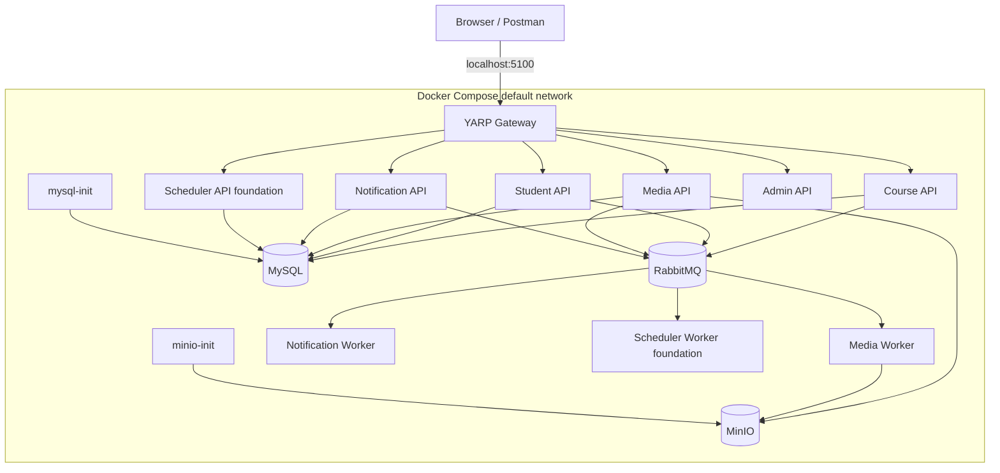
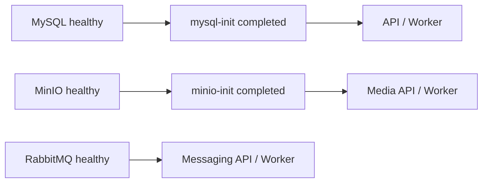
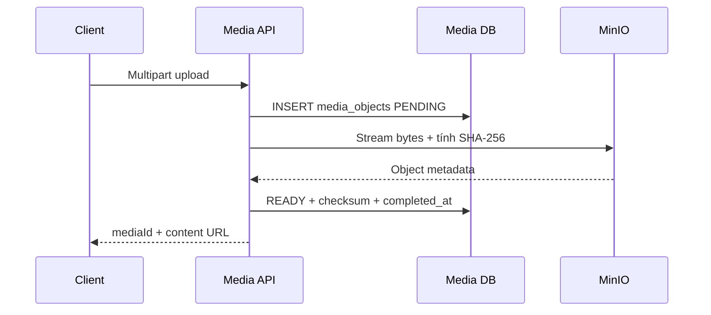
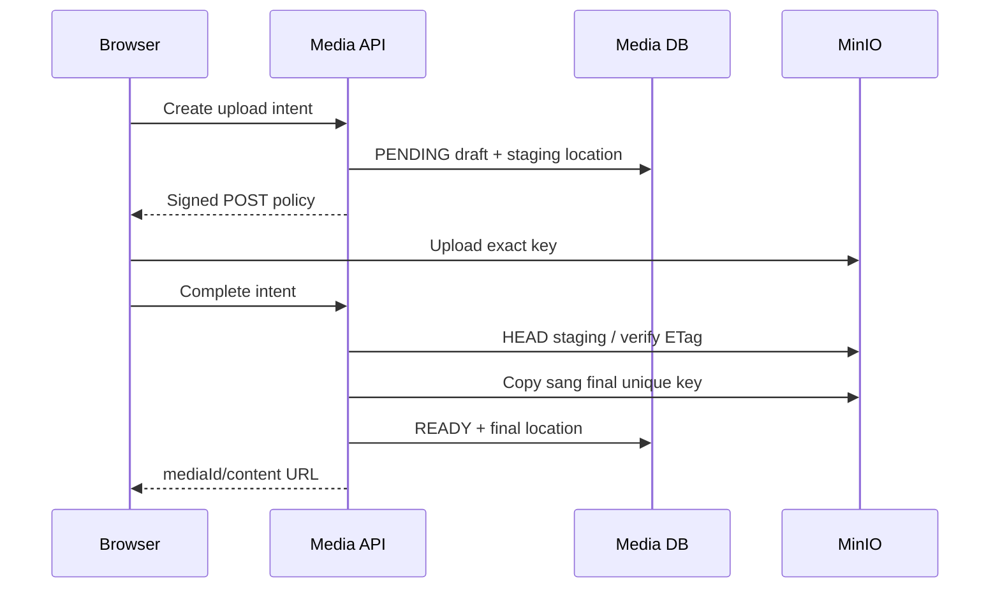

# Phao thuyết trình: Docker Compose và MinIO

## 1. Mục đích

File này dùng khi trình bày phần kiến trúc hoặc khi lead hỏi sâu:

- Docker đang giải quyết vấn đề gì trong dự án?
- Mỗi container chạy gì và phụ thuộc vào đâu?
- Local dùng một MySQL container có còn là database-per-service không?
- MinIO có những bucket nào?
- Object key được sinh như thế nào và vì sao không dùng original filename?
- Upload, direct upload, thumbnail, persistence và cleanup chạy ra sao?

## 2. Hai câu chốt dễ nhớ

> Docker Compose giúp em tái lập cùng một runtime local: image, network,
> configuration, healthcheck, dependency và volume đều được khai báo thành
> code.

> MinIO chỉ giữ bytes. Media Service mới là owner của metadata, state, usage,
> credential, bucket và object key.

## 3. Sơ đồ runtime Docker



## 4. Inventory container nên biết

### Application containers

| Container | Host port | Vai trò |
| --- | ---: | --- |
| `api-gateway` | `5100` | Public routing, CORS và Swagger aggregation. |
| `course-service` | `5101` | Course, Lesson, Enrollment và Progress. |
| `student-service` | `5102` | Student/profile. |
| `media-service` | `5103` | Media API, metadata và storage orchestration. |
| `notification-service` | `5104` | Notification API và batch operation. |
| `scheduler-service` | `5105` | Scheduler API foundation. |
| `admin-service` | `5106` | Admin identity/config local. |
| `media-worker` | Không publish HTTP port | Thumbnail và media usage background work. |
| `notification-worker` | Không publish HTTP port | Snapshot và dispatch notification batch. |
| `scheduler-worker` | Không publish HTTP port | Worker foundation, chưa có CRON execution. |

Port riêng của service phục vụ local development. Public client vẫn nên gọi
Gateway `5100` để không bypass route, CORS và public contract.

### Infrastructure và bootstrap containers

| Container | Host port | Vai trò |
| --- | ---: | --- |
| `mysql` | `3306` | Một physical MySQL server local, chứa logical DB tách theo service. |
| `mysql-init` | Không có | One-shot job tạo database/user theo cách idempotent. |
| `rabbitmq` | `5672`, UI `15672` | Message broker và management UI. |
| `minio` | API `9000`, Console `9001` | S3-compatible object storage. |
| `minio-init` | Không có | One-shot job tạo bucket, application user, policy và CORS. |
| `data-seeder` | Không có | Profile `seed`, chỉ chạy khi chủ động gọi. |

> [!NOTE]
> `mysql-init` và `minio-init` kết thúc với exit code `0` là bình thường. Đây là
> bootstrap job, không phải container phải luôn ở trạng thái running.

## 5. Một Dockerfile, nhiều project

Backend dùng một Dockerfile chung và truyền project cần build qua `PROJECT_PATH`:

```dockerfile
ARG PROJECT_PATH

FROM mcr.microsoft.com/dotnet/sdk:10.0 AS build
ARG PROJECT_PATH
RUN dotnet restore "${PROJECT_PATH}"
RUN dotnet publish "${PROJECT_PATH}" --configuration Release --output /app/publish

FROM mcr.microsoft.com/dotnet/aspnet:10.0 AS runtime
COPY --from=build /app/publish .
ENTRYPOINT ["dotnet"]
```

Ý nghĩa:

- SDK chỉ tồn tại ở build stage;
- runtime image chỉ có ASP.NET runtime và artifact đã publish;
- API và Worker dùng cùng quy trình build;
- Compose thay `PROJECT_PATH` và command cho từng project;
- tránh duy trì nhiều Dockerfile gần giống nhau.

Media Worker cần xử lý ảnh/video/PDF nên runtime stage cài thêm:

```text
ffmpeg
ffprobe
poppler-utils / pdftoppm
```

Dependency native nằm trong image, giúp môi trường chạy nhất quán.

## 6. Startup dependency và healthcheck



Các healthcheck chính:

| Dependency | Cách kiểm tra |
| --- | --- |
| MySQL | `mysqladmin ping`. |
| RabbitMQ | `rabbitmq-diagnostics -q ping`. |
| MinIO | `GET /minio/health/live`. |

`depends_on` dùng hai loại condition:

- `service_healthy`: dependency dài hạn đã sẵn sàng;
- `service_completed_successfully`: init job đã hoàn tất.

Điểm cần nói trung thực: `depends_on` hỗ trợ startup local, không thay thế retry,
health monitoring hoặc orchestration của môi trường production.

## 7. Network và service discovery

Compose tạo default network. Container gọi nhau bằng service name:

```text
mysql:3306
rabbitmq:5672
minio:9000
student-service:8080
media-service:8080
```

Không dùng `localhost` giữa container. Bên trong `media-service`, `localhost`
trỏ về chính container Media, không phải MinIO.

Phân biệt:

| Caller | Địa chỉ đúng |
| --- | --- |
| Media API → MinIO | `minio:9000`. |
| Notification → Student | `http://student-service:8080/`. |
| Browser → Gateway | `http://localhost:5100`. |
| Browser direct upload → MinIO | `http://localhost:9000` hoặc public host đã cấu hình. |

## 8. Database-per-service trong local Docker

Local chỉ chạy một MySQL container để tiết kiệm tài nguyên, nhưng tạo logical DB
và credential riêng:

```text
lms_course_db
lms_student_db
lms_media_db
lms_notification_db
lms_scheduler_db
```

Database-per-service là quy tắc ownership, không bắt buộc mỗi service phải có
một physical database server trong mọi môi trường.

Quy tắc vẫn giữ:

- service chỉ dùng connection string của database mình;
- không join chéo database;
- ID service khác chỉ là logical reference;
- migration nằm trong service owner;
- có thể tách physical MySQL server sau này mà không đổi contract nghiệp vụ.

## 9. Named volume

| Volume | Dữ liệu |
| --- | --- |
| `mysql-data` | MySQL data directory. |
| `rabbitmq-data` | Queue/broker state bền vững. |
| `minio-data` | Object bytes. |

`docker compose down` không mặc định xóa named volume. `docker compose down -v`
xóa dữ liệu local và là thao tác phá hủy; không chạy khi chưa xác nhận cần reset.

## 10. Cấu hình và secret

`.env.example` mô tả contract cấu hình; `.env` local chứa giá trị thật và không
được commit.

Nhóm cấu hình chính:

```dotenv
RABBITMQ_USER=...
RABBITMQ_PASSWORD=...

MEDIA_DB_NAME=lms_media_db
MEDIA_DB_USER=...
MEDIA_DB_PASSWORD=...

MINIO_ROOT_USER=...
MINIO_ROOT_PASSWORD=...
MINIO_APP_ACCESS_KEY=...
MINIO_APP_SECRET_KEY=...
```

Root credential chỉ dùng cho bootstrap. Media API/Worker dùng application
credential có policy giới hạn trong năm bucket.

## 11. Vì sao chọn MinIO?

File binary lớn có đặc tính khác dữ liệu quan hệ:

| MySQL phù hợp | Object storage phù hợp |
| --- | --- |
| Metadata, state và transaction. | Binary bytes lớn. |
| Quan hệ Media–Usage. | Streaming upload/download. |
| Unique key và lifecycle state. | Bucket/object lifecycle. |
| Query vận hành. | S3-compatible API. |

Thiết kế tách:

```text
MySQL = media là gì, trạng thái gì, ai dùng, checksum gì
MinIO = bytes đang nằm ở bucket/key nào
```

## 12. Năm bucket

| Media category | Bucket mặc định | Ghi chú |
| --- | --- | --- |
| `IMAGE` | `images` | File ảnh nguồn và WebP thumbnail. |
| `VIDEO` | `videos` | Video nguồn. |
| `DOCUMENT` | `documents` | PDF/tài liệu. |
| `AUDIO` | `audios` | Audio. |
| `OTHER` | `other` | File hợp lệ ngoài bốn category. |

Caller không được truyền bucket tùy ý. `MinioStorageLocationAllocator` chọn
bucket từ `StorageMediaCategory` và cấu hình `Storage__Minio__*Bucket`.

`minio-init` thực hiện:

1. kết nối bằng root credential;
2. `mc mb --ignore-existing` cho đủ năm bucket;
3. tạo policy list/get/put/delete chỉ trong năm bucket;
4. tạo lại application user và attach policy;
5. cấu hình CORS cho frontend origin;
6. restart MinIO để áp dụng CORS.

## 13. Object key convention

Định dạng production code:

```text
yyyy/MM/dd/{Guid.NewGuid():N}.{normalizedExtension}
```

Ví dụ với thời điểm UTC ngày 12/08/2026:

```text
2026/08/12/619319269e3946dab81657242c11bc86.png
```

Địa chỉ object hoàn chỉnh về mặt storage:

```text
images/2026/08/12/619319269e3946dab81657242c11bc86.png
└bucket┘ └──────────────────── object_key ────────────────────┘
```

### Ý nghĩa từng phần

| Phần | Ý nghĩa |
| --- | --- |
| `yyyy/MM/dd` | UTC date prefix. |
| UUID 32 hex | Tránh trùng và không lộ original filename/business ID. |
| Extension | Đã normalize và chỉ chứa chữ/số hợp lệ. |

### Tại sao không dùng original filename?

`lesson 01 final (2).pdf` có thể:

- trùng với file của người khác;
- chứa ký tự khó xử lý;
- lộ thông tin người dùng/nghiệp vụ;
- bị đổi tên trong khi content không đổi;
- tạo path traversal nếu validate kém.

Original filename vẫn được giữ trong database để hiển thị:

```text
media_objects.original_file_name
```

### Validation object key

Storage adapter từ chối key:

- rỗng;
- bắt đầu bằng `/`;
- chứa `..`;
- chứa control character.

Database có unique constraint:

```text
UNIQUE(bucket, object_key)
```

## 14. Source và thumbnail derivative

Thumbnail không ghi đè source. Nó là một media object riêng:

```text
source media
  id = A
  bucket = videos
  object_key = .../uuid.mp4

thumbnail derivative
  id = B
  source_media_id = A
  derivation_type = THUMBNAIL
  bucket = images
  object_key = .../uuid.webp
```

Lợi ích:

- source immutable;
- retry thumbnail không thay đổi source;
- có state/checksum/size riêng;
- usage có thể trỏ đúng derivative;
- cleanup biết quan hệ source–derivative.

## 15. Upload qua API



Nếu upload/commit lỗi:

1. best-effort xóa object;
2. đánh dấu media `FAILED` khi có thể;
3. không trả bucket/object key cho client;
4. stale `PENDING` được giữ cho cleanup an toàn trong tương lai.

## 16. Direct upload



Policy mặc định 900 giây và ràng buộc:

- exact object key;
- MIME/content type;
- content length;
- checksum metadata;
- public host và SSL scheme.

Browser không nhận application secret. Nó chỉ nhận signed policy giới hạn cho
một upload cụ thể. Checksum trong direct-upload policy là metadata frontend khai
báo và được ký; complete flow không tự stream lại toàn bộ bytes để tính SHA-256
server-side.

## 17. Internal endpoint và public endpoint

| Cấu hình | Caller | Ví dụ |
| --- | --- | --- |
| `Endpoint` | API/Worker trong Docker | `minio:9000`. |
| `PublicEndpoint` | Browser trên host/Internet | `localhost:9000` hoặc public domain. |
| `UseSsl` | Kết nối internal. | Local thường `false`. |
| `PublicUseSsl` | URL/policy cho browser. | Phải khớp public HTTPS. |

Lỗi kinh điển: trả URL `minio:9000` cho browser. Hostname này chỉ có ý nghĩa
trong Compose network.

## 18. Database là nguồn sự thật

`media_objects` giữ:

- bucket và object key;
- media type/MIME/original filename;
- size/checksum;
- `PENDING`, `READY`, `FAILED`;
- source/derivation;
- draft/deleted state.

`media_usages` giữ quan hệ media với Course, Lesson, Notification hoặc Student.
`media_background_jobs` giữ trạng thái thumbnail/usage job.

Không dùng MinIO Console để tự xóa object active. MinIO không biết:

- Course/Lesson nào đang dùng file;
- thumbnail nào liên quan source;
- business transaction đã commit chưa;
- operation có đang retry không.

## 19. Health và vận hành

Media `GET /health` kiểm tra database và sự tồn tại của cả năm bucket với timeout
ngắn. Health probe không upload object kiểm thử.

Lệnh kiểm tra:

```powershell
docker compose ps
docker compose logs --since 10m minio minio-init media-service media-worker
```

Kiểm tra bucket bằng MinIO Console:

```text
http://localhost:9001
```

Không trình chiếu root password, application secret, signed policy hoặc object
payload nhạy cảm.

## 20. Demo script Docker + MinIO

### Bước 1 — Docker

```powershell
docker compose config --services
docker compose ps
```

Nói:

> Đây là toàn bộ runtime local. API, Worker và infrastructure được tách thành
> container. Init jobs chạy một lần; named volume giữ state. Container gọi nhau
> bằng service name trên Compose network.

### Bước 2 — Dependency

Chỉ `mysql`, `mysql-init`, `rabbitmq`, `minio`, `minio-init` và một API/Worker.

Nói:

> API không khởi động mù. Nó chờ hạ tầng healthy và bootstrap hoàn tất. Tuy vậy
> application vẫn phải có retry và health monitoring vì runtime có thể lỗi sau
> lúc startup.

### Bước 3 — MinIO Console

Mở `http://localhost:9001`, chỉ năm bucket và một prefix ngày.

Nói:

> Bucket được chọn theo category; object key do server sinh bằng UTC date và
> UUID. Original filename chỉ nằm trong DB. Client không được chọn bucket/key.

### Bước 4 — Database

```sql
SELECT id, source_media_id, derivation_type,
       bucket, object_key, original_file_name,
       media_type, content_type, size_bytes,
       checksum_sha256, status
FROM media_objects
ORDER BY created_at DESC
LIMIT 10;
```

Nói:

> DB trả lời object là gì và đang ở trạng thái nào; MinIO chỉ trả lời bytes nằm
> ở đâu. Hai phía được nối bằng bucket và object key nội bộ.

## 21. Troubleshooting

| Hiện tượng | Nguyên nhân khả dĩ | Cách xử lý |
| --- | --- | --- |
| `media-service` không start | `minio-init` hoặc `mysql-init` chưa thành công. | Xem `docker compose ps` và log init container. |
| Thiếu bucket | Init job lỗi/config bucket lệch. | Chạy lại `minio-init` sau khi sửa `.env`. |
| Browser CORS | Exact origin chưa được allow. | Sửa `MINIO_API_CORS_ALLOW_ORIGIN`, chạy lại init. |
| Browser không resolve `minio` | Dùng nhầm internal endpoint. | Sửa `MINIO_PUBLIC_ENDPOINT`. |
| Signature mismatch | Public host, SSL, clock hoặc signed field bị đổi. | Tạo intent mới; không sửa field trong policy. |
| Media `PENDING` lâu | Upload/complete bị ngắt hoặc process chết. | Console Media, HEAD object, DB state; không tự chuyển READY. |
| Thumbnail `FAILED` | Source lỗi, native tool lỗi hoặc timeout. | Console Worker, job `last_error`, source metadata. |
| DB có row nhưng object thiếu | Compensation/commit mơ hồ hoặc xóa tay. | Đối chiếu status/checksum/log; không tạo object giả. |
| Object còn nhưng DB không active | Staging/loser/orphan cần cleanup an toàn. | Recheck reference trước xóa; không purge hàng loạt khi demo. |

## 22. Câu hỏi dễ bị hỏi

### Tại sao không chỉ có một bucket `media`?

Tách theo category giúp policy, quota/lifecycle, vận hành và health rõ hơn. Tuy
nhiên bucket không phải business owner; Media Service vẫn là owner duy nhất.

### Tại sao object key không có media ID?

Code hiện tại dùng UTC date + random UUID. Media ID và quan hệ nằm trong DB.
Thiết kế tránh lộ business ID và vẫn chống collision. Không được claim key có
media ID nếu source chưa triển khai điều đó.

### Có thể đoán public URL từ bucket/key không?

Không nên. Bucket/key là storage address nội bộ. Client dùng Media content
endpoint hoặc signed URL/policy do Media Service cấp.

### Vì sao một MySQL container vẫn gọi database-per-service?

Vì boundary nằm ở logical database, credential, migration và quyền truy cập.
Physical topology local được tối giản để tiết kiệm tài nguyên.

### Docker Compose có phải production architecture không?

Không. Compose mô tả runtime local/rehearsal. Các quyết định ownership, contract,
idempotency và storage vẫn dùng được; production orchestration, secret manager,
TLS, backup và scaling cần thiết kế riêng.

### Xóa container có mất file không?

Recreate container không nhất thiết mất dữ liệu vì MinIO dùng `minio-data`.
Nhưng xóa named volume sẽ mất object local.

## 23. Những câu không nên nói

| Không nên nói | Nên nói |
| --- | --- |
| “Mỗi service chạy một MySQL server.” | “Local dùng một MySQL instance, logical DB tách theo service.” |
| “Docker bảo đảm service không bao giờ lỗi.” | “Docker chuẩn hóa runtime; application vẫn cần resilience.” |
| “MinIO là database của Media.” | “DB giữ workflow state; MinIO giữ bytes.” |
| “Object key chứa Media ID.” | “Code hiện dùng UTC date + UUID + extension.” |
| “Client tự chọn bucket để upload.” | “Server map category sang bucket.” |
| “Thumbnail ghi đè file gốc.” | “Thumbnail là derivative WebP riêng.” |
| “MinIO Console có thể dùng để cleanup tùy ý.” | “Cleanup phải recheck DB reference và workflow state.” |

## 24. Kịch bản nói ngắn

> Toàn bộ backend local được đóng gói bằng Docker Compose. Em dùng một
> multi-stage Dockerfile chung và chọn project qua `PROJECT_PATH`; Media Worker
> cài thêm FFmpeg và Poppler. Compose tạo network, healthcheck, init job và
> volume. Local chỉ có một MySQL container nhưng mỗi service có logical database
> và credential riêng, nên ownership vẫn tách biệt.
>
> Với file, chỉ Media Service và Media Worker được truy cập MinIO. Hệ thống có
> năm bucket: images, videos, documents, audios và other. Caller gửi media type,
> server chọn bucket rồi sinh key theo UTC `yyyy/MM/dd/uuid.extension`.
> Original filename nằm trong DB, không nằm trong key. DB giữ metadata, state,
> checksum và usage; MinIO chỉ giữ bytes. Browser direct upload dùng public
> endpoint và signed policy, còn container dùng internal endpoint `minio:9000`.
