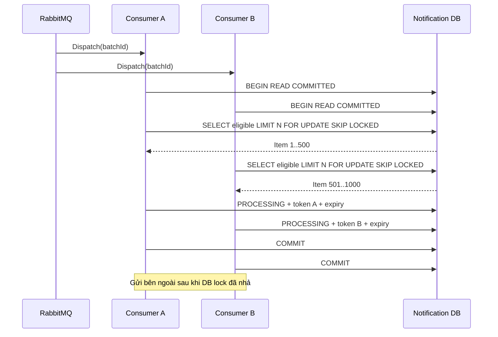

# Phao giải thích Lease Token của Notification Batch

## Mục đích

Lease giúp nhiều lần xử lý `DispatchNotificationBatchV1` không giành cùng một
nhóm recipient, đồng thời cho phép lấy lại phần việc nếu Worker dừng giữa chunk.

> Row lock bảo vệ lúc **chọn việc**; lease bảo vệ lúc **đang làm việc**; token
> bảo vệ lúc **ghi kết quả**.

## Lease token là gì?

`lease_token` là một GUID mới cho **mỗi lần claim chunk**. Nó không phải ID cố
định của container, pod, thread hay MassTransit consumer.

```text
Consumer nhận Dispatch command
→ DB giao tối đa batchSize item
→ DB đóng dấu cùng lease_token lên các item
→ consumer cầm token đó đi gửi notification
→ khi ghi kết quả, consumer phải trình đúng token
```

| Cột | Ý nghĩa |
| --- | --- |
| `lease_token` | Bằng chứng lần claim hiện tại đang sở hữu item. |
| `lease_expires_at` | Mốc item `PROCESSING` được phép xuất hiện trong lần claim mới. |

> [!IMPORTANT]
> Lease không phải database lock được giữ suốt 120 giây. Row lock chỉ tồn tại
> trong transaction claim rất ngắn. Sau commit, quyền xử lý được biểu diễn bằng
> `PROCESSING + lease_token + lease_expires_at`.

## Worker nào claim?

RabbitMQ giao `DispatchNotificationBatchV1(batchId)` cho
`DispatchNotificationBatchConsumer` trong Notification Worker. Mỗi lần consumer
xử lý command sẽ gọi `ClaimChunkAsync(batchId)`; chính lần thực thi đó là bên
claim.

- Snapshot handler phát số Dispatch command bằng `DispatchChunkConcurrency`.
- Docker Compose đặt concurrency này và MassTransit consumer concurrency cùng
  giá trị; mặc định đều là `1`.
- Nếu scale nhiều Worker hoặc tăng concurrency, nhiều consumer có thể claim
  đồng thời. Chúng không cần biết ID của nhau.

## Cơ chế claim



Repository chọn các item:

```sql
WHERE batch_id = @batchId
  AND (
    status IN ('PENDING', 'RETRY')
    OR (status = 'PROCESSING' AND lease_expires_at <= @now)
  )
ORDER BY id
LIMIT @batchSize
FOR UPDATE SKIP LOCKED;
```

| Thành phần | Tác dụng |
| --- | --- |
| `FOR UPDATE` | Khóa row vừa chọn tới khi transaction claim commit. |
| `SKIP LOCKED` | Consumer khác bỏ qua row đang khóa và lấy row tiếp theo. |
| `LIMIT batchSize` | Giữ lượng việc trong memory có giới hạn, mặc định 500. |
| `Guid.NewGuid()` | Sinh token riêng cho lần claim. |
| `now + ClaimLeaseSeconds` | Đặt hạn xử lý, mặc định 120 giây. |

Trong cùng transaction, item được đổi thành:

```text
status           = PROCESSING
lease_token      = token của lần claim
lease_expires_at = now + 120 giây
```

Sau `COMMIT`, Worker mới gọi sender. Thiết kế này tránh giữ DB transaction trong
lúc chờ I/O bên ngoài.

## Ghi kết quả và chống Worker cũ ghi đè

`CompleteClaimAsync` query lại bằng:

```text
batch_id    = claim.BatchId
status      = PROCESSING
lease_token = claim.LeaseToken
```

Nếu không tìm đủ đúng số item đã claim, repository từ chối kết quả vì claim đã
bị thay hoặc release. Nếu token còn đúng, một lần lưu sẽ:

1. xóa token và expiry;
2. chuyển item sang `SUCCESS`, `RETRY` hoặc `FAILED`;
3. tạo `notifications` cho item thành công;
4. cập nhật counters của batch.

Token hoạt động như một **fencing token**: sau khi Consumer B reclaim và đổi
token A thành token B, kết quả muộn của Consumer A không còn khớp DB.

## Worker chết giữa chunk

```text
10:00:00  A claim Item 1..500, token A, expiry 10:02:00
10:00:20  A dừng trước CompleteClaimAsync
10:01:00  B claim: chưa lấy Item 1..500 vì lease còn hạn
10:02:01  Có Dispatch command mới: B reclaim, thay bằng token B
10:02:10  A gửi kết quả token A: bị từ chối vì DB đang giữ token B
```

Chi tiết chính xác của code hiện tại: expiry chỉ làm item **đủ điều kiện
reclaim**. Nếu A complete sau expiry nhưng trước khi B reclaim, token A vẫn còn
trong DB nên A vẫn có thể complete. Token cũ chỉ bị vô hiệu chắc chắn khi token
mới đã thay nó.

## Giới hạn hiện tại

Hết hạn lease không tự đánh thức Worker. Phải có một
`DispatchNotificationBatchV1` khác đến **sau expiry** thì repository mới chạy và
reclaim row.

Source hiện tại trả `null` khi chưa có item eligible và chưa có scheduler/lease
reaper đặt một lần gọi mới đúng thời điểm expiry. Vì vậy câu nói chính xác là:

> Sau 120 giây, item **có thể được reclaim ở lần Dispatch tiếp theo**. Muốn bảo
> đảm batch một-chunk tự hồi phục cần delayed redelivery, scheduled redispatch
> hoặc lease-reaper.

Lease cũng không đảm bảo provider bên ngoài chỉ nhận một lần. Nếu sender đã gửi
xong nhưng Worker chết trước khi commit result, lần reclaim có thể gửi lại.
Provider thật vẫn cần idempotency key/dedup; project hiện dùng fake sender nên
không được suy diễn thành exactly-once.

## Debug bằng console và database

```sql
SELECT id, student_id, status, lease_token, lease_expires_at,
       retry_count, error_message
FROM notification_batch_items
WHERE batch_id = '<batch-id>'
ORDER BY id;
```

1. Tìm `batchId` trong console Notification Worker.
2. Nhiều row cùng token là cùng một chunk claim.
3. So `lease_expires_at` với UTC hiện tại.
4. Token đổi nghĩa là chunk đã được reclaim.
5. Lease hết hạn nhưng token không đổi và không có log Dispatch mới thường cho
   thấy thiếu trigger redispatch; không sửa row thủ công trước khi tìm root cause.

## Trả lời nhanh

**Token thuộc Worker nào?** Token thuộc một lần claim, không lưu Worker ID.  
**Hai Worker có claim trùng không?** Không tại thời điểm claim nhờ `FOR UPDATE SKIP LOCKED`.  
**Hết hạn có tự chạy lại không?** Không; chỉ làm row eligible cho lần Dispatch sau.  
**Worker cũ có ghi đè Worker mới không?** Không sau khi token đã được thay.

