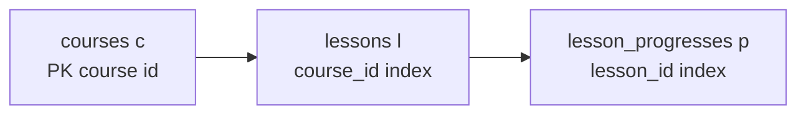

# Phao đọc MySQL `EXPLAIN` và index

## Mục đích

Tài liệu này giúp đọc output `EXPLAIN` khi demo hoặc trả lời câu hỏi về index.
Nó giải thích cả plan đang có của Course detail và các giá trị khác MySQL có thể
trả về; không nên chỉ nhớ `const` và `ref`.

> [!IMPORTANT]
> `EXPLAIN` dạng bảng chủ yếu là **ước tính** của optimizer. Chỉ kết luận về
> thời gian, số row thực tế hoặc bottleneck sau khi xem `EXPLAIN ANALYZE` trên
> data gần với môi trường cần đánh giá.

## Query plan đang được giải thích

File bạn gửi là output của `EXPLAIN` MySQL. Query đi qua ba bảng:

```text
c = courses
l = lessons
p = lesson_progresses
```



Kết quả của bạn là:

```text
id  select_type  table  type   possible_keys                               key                                          key_len  ref                   rows  filtered  Extra
1   SIMPLE       c      const  PRIMARY                                     PRIMARY                                      36       const                 1     100       Using temporary; Using filesort
1   SIMPLE       l      ref    uq_lessons_course_id_display_order          uq_lessons_course_id_display_order           36       const                 1     100
1   SIMPLE       p      ref    uq_lesson_progresses_lesson_id_student_id   uq_lesson_progresses_lesson_id_student_id    36       lms_course_db.l.id    1     100
```

Nhìn tổng thể trước: **plan này khá ổn về lookup/index**. Cả 3 bảng đều không `ALL` full table scan. `courses` được tìm bằng PK, `lessons` dùng index theo `course_id`, `lesson_progresses` dùng index theo `lesson_id`. Điểm đáng chú ý nhất là `Using temporary; Using filesort`.

---

## 1. `id`

```text
id = 1
```

`id` là **query block** mà table đó thuộc về.

Cả 3 đều:

```text
1
1
1
```

nghĩa là cả:

```text
courses
lessons
lesson_progresses
```

đều nằm trong cùng một `SELECT`.

Ví dụ:

```sql
SELECT ...
FROM courses c
LEFT JOIN lessons l ...
LEFT JOIN lesson_progresses p ...
```

Không có subquery riêng.

Nếu có:

```sql
SELECT ...
FROM courses
WHERE id IN (
    SELECT course_id
    FROM lessons
);
```

thì có thể xuất hiện:

```text
id = 1
id = 2
```

---

# 2. `select_type`

Cả ba:

```text
SIMPLE
```

`SIMPLE` nghĩa là query không có những cấu trúc như:

```text
UNION
subquery
derived table
```

Ví dụ query bình thường:

```sql
SELECT ...
FROM courses c
JOIN lessons l ...
```

→ `SIMPLE`.

Đây không phải chỉ số performance, chủ yếu mô tả cấu trúc query.

### Các giá trị `select_type` thường gặp

| Giá trị | Ý nghĩa | Khi cần chú ý |
| --- | --- | --- |
| `SIMPLE` | Query không có subquery/`UNION`/derived table. | Đây là plan hiện tại; dễ đọc nhất. |
| `PRIMARY` | Query block ngoài cùng khi có subquery hoặc `UNION`. | Đọc cùng các `id` còn lại để biết thứ tự block. |
| `SUBQUERY` | Subquery không phụ thuộc row query ngoài. | Có thể MySQL materialize hoặc chạy độc lập. |
| `DEPENDENT SUBQUERY` | Subquery phụ thuộc giá trị row query ngoài. | Cảnh giác khi outer query nhiều row vì subquery có thể lặp nhiều lần. |
| `DERIVED` | Derived table trong `FROM (SELECT ...) x`. | Xem MySQL merge hay materialize nó. |
| `MATERIALIZED` | Subquery được tính và lưu tạm trước khi dùng. | Kiểm tra `rows`, memory/disk và filter có được đẩy xuống sớm không. |
| `UNION` | Một nhánh sau `UNION`. | Có nhiều query block; `UNION` không có `ALL` có thể cần deduplicate. |
| `UNION RESULT` | Block gộp kết quả các nhánh `UNION`. | Có thể thấy temporary/filesort do merge/deduplicate. |
| `UNCACHEABLE SUBQUERY` | Subquery không thể cache do hàm non-deterministic hoặc dependency khác. | Cần xem số lần chạy trong `EXPLAIN ANALYZE`. |

`select_type` không xếp hạng nhanh/chậm. Nó trả lời **query block đang thuộc cấu
trúc nào**, còn access method vẫn xem ở `type`.

---

# 3. `table`

```text
c
l
p
```

Đây là alias của bảng mà MySQL đang xử lý.

```sql
courses c
lessons l
lesson_progresses p
```

Quan trọng hơn: **thứ tự các dòng cũng cho biết join order mà optimizer chọn**:

```text
1. c  → courses
2. l  → lessons
3. p  → lesson_progresses
```

Tức MySQL đang làm đại khái:

```text
courses
   ↓
lessons
   ↓
lesson_progresses
```

Trong trường hợp course được lookup bằng ID thì thứ tự này rất hợp lý.

---

# 4. `partitions`

Của bạn để trống:

```text
partitions = NULL
```

Trường này dùng khi table được **partition**.

Ví dụ một bảng cực lớn được chia:

```text
orders_2024
orders_2025
orders_2026
```

hoặc MySQL partition:

```sql
PARTITION BY RANGE (...)
```

EXPLAIN có thể nói nó chỉ đọc:

```text
p2026
```

Bảng của bạn không partition nên bỏ qua trường này.

---

# 5. `type` — trường cực kỳ quan trọng

Đây là một trong những trường bạn nên nhìn đầu tiên.

Nó cho biết:

> MySQL truy cập bảng bằng cách nào?

Bạn đang có:

```text
courses            const
lessons            ref
lesson_progresses  ref
```

Đây đều khá tốt.

Có thể nhớ thứ tự đại khái từ tốt → xấu:

```text
system
  ↓
const
  ↓
eq_ref
  ↓
ref
  ↓
range
  ↓
index
  ↓
ALL
```

`ALL` thường là thứ bạn cảnh giác nhất:

```text
ALL = full table scan
```

---

## `c.type = const`

```text
table = c
type  = const
```

Rất tốt.

Khả năng query đang có:

```sql
WHERE c.id = 'fffad147-...'
```

và:

```text
id
```

là `PRIMARY KEY`.

MySQL biết:

> Với primary key này, tối đa chỉ có đúng một Course.

Nó có thể coi row này gần như một constant trong phần còn lại của query.

Hình dung:

```text
courses 3,000,000 rows
        ↓
PRIMARY KEY lookup
        ↓
đúng 1 course
```

Không phải quét 3 triệu course.

---

## `l.type = ref`

```text
table = l
type  = ref
```

MySQL dùng một **non-unique lookup / prefix của index** để tìm Lesson.

Khả năng logic:

```sql
l.course_id = c.id
```

Một course có:

```text
Lesson 1
Lesson 2
Lesson 3
...
```

nên một `course_id` có thể match nhiều row.

Do đó không phải `const` hay `eq_ref`, mà là:

```text
ref
```

Hoàn toàn bình thường.

---

## `p.type = ref`

Tương tự:

```text
lesson_progresses
type = ref
```

Query có thể đang join:

```sql
p.lesson_id = l.id
```

Một lesson có thể có progress của nhiều student:

```text
lesson A
 ├─ student 1
 ├─ student 2
 ├─ student 3
 └─ ...
```

nên một `lesson_id` có nhiều row → `ref`.

---

## Các giá trị `type` còn lại có thể gặp

Đừng coi chuỗi `system → const → ... → ALL` là bảng xếp hạng tuyệt đối. Nó chỉ
gợi ý lượng dữ liệu MySQL có thể phải đọc. Khi đánh giá plan phải nhìn cùng
`key`, `rows`, `filtered`, `Extra` và kết quả `EXPLAIN ANALYZE`.

| `type` | Cơ chế truy cập | SQL hay gặp | Cách giải thích khi demo |
| --- | --- | --- | --- |
| `system` | Table system chỉ có tối đa một row. | Metadata đặc biệt. | Rất hiếm trong bảng nghiệp vụ; tốt nhất. |
| `const` | PK/unique key so với hằng số, tối đa một row. | `WHERE id = @id`. | Lookup đúng một row, như `courses` hiện tại. |
| `eq_ref` | Mỗi row/tổ hợp row bên trái join được tối đa một row bằng toàn bộ PK hoặc unique key. | `JOIN students s ON s.id = e.student_id`. | Join nhiều–một rất tốt; khác `ref` vì uniqueness bảo đảm tối đa một row. |
| `ref` | Non-unique index hoặc prefix trái của composite index. | `l.course_id = c.id`. | Một lookup có thể trả nhiều row; đúng cho quan hệ một–n. |
| `fulltext` | FULLTEXT index. | `MATCH(name) AGAINST ('react')`. | Chỉ xuất hiện khi dùng full-text search; B-tree không biến `LIKE '%react%'` thành `fulltext`. |
| `ref_or_null` | `ref` cộng nhánh lookup `NULL`. | `fk = @id OR fk IS NULL`. | Không hẳn xấu, nhưng xem `rows` nếu nhiều null. |
| `index_merge` | Kết hợp nhiều index qua `union`, `intersect` hoặc `sort_union`. | Điều kiện `OR` ở các cột khác nhau. | Không mặc định tốt; có thể composite index phù hợp hơn, phải benchmark. |
| `unique_subquery` | Tối ưu `IN (subquery)` bằng unique key. | `id IN (SELECT unique_id ...)`. | Tốt hơn scan subquery, nhưng vẫn xem actual `loops`. |
| `index_subquery` | Tối ưu `IN (subquery)` bằng non-unique index. | `id IN (SELECT foreign_id ...)`. | Có thể phát sinh nhiều lookup; nhìn actual rows/loops. |
| `range` | Quét một hoặc nhiều khoảng trong index. | `created_at >= @from`, `id IN (...)`. | Thường tốt; `rows` nói khoảng đó rộng bao nhiêu. |
| `index` | Quét toàn bộ index. | Covering query chỉ cần cột đã index. | Nhẹ hơn `ALL` khi index hẹp, nhưng vẫn là full index scan. |
| `ALL` | Quét toàn bộ table. | Không có index phù hợp hoặc optimizer thấy scan rẻ hơn. | Cảnh giác với bảng lớn; không luôn sai nếu query cần phần lớn table. |
| `NULL` | Bước này không cần table access. | `SELECT 1`, constant expression. | Không phải lỗi. |

Ví dụ để phân biệt `eq_ref` và `ref`:

```sql
-- `eq_ref`: mỗi enrollment chỉ trỏ đến tối đa một Student do students.id là PK.
SELECT *
FROM enrollments e
JOIN students s ON s.id = e.student_id;

-- `ref`: một Course có thể có nhiều Lesson.
SELECT *
FROM courses c
JOIN lessons l ON l.course_id = c.id;
```

Với plan hiện tại, `ref` ở `lessons` và `lesson_progresses` là kết quả mong đợi;
ép chúng thành `eq_ref` là sai mô hình dữ liệu vì một Course/Lesson thực tế có
nhiều bản ghi con.

---

# 6. `possible_keys`

Đây là:

> Những index MySQL **có khả năng sử dụng** cho phần query này.

Course:

```text
possible_keys = PRIMARY
```

MySQL nhìn query và thấy:

```text
À, điều kiện này có thể dùng Primary Key.
```

Lessons:

```text
possible_keys =
uq_lessons_course_id_display_order
```

Lesson Progress:

```text
possible_keys =
uq_lesson_progresses_lesson_id_student_id
```

Quan trọng:

```text
possible_keys
≠
index thực sự được sử dụng
```

Nó chỉ là:

> "Tôi có những lựa chọn này."

Muốn biết cuối cùng MySQL chọn gì phải nhìn `key`.

---

# 7. `key`

Đây mới là:

> **Index MySQL thực sự quyết định sử dụng.**

Course:

```text
possible_keys = PRIMARY
key           = PRIMARY
```

→ dùng PK thật.

Lesson:

```text
possible_keys = uq_lessons_course_id_display_order
key           = uq_lessons_course_id_display_order
```

→ dùng composite index đó thật.

Progress:

```text
possible_keys = uq_lesson_progresses_lesson_id_student_id
key           = uq_lesson_progresses_lesson_id_student_id
```

→ cũng dùng index.

Đây là tín hiệu đẹp:

```text
possible_keys ≠ NULL
key           ≠ NULL
```

Cả ba table đều đang dùng index.

---

# 8. `key_len`

Bạn đang có:

```text
36
36
36
```

Đây là:

> MySQL sử dụng bao nhiêu byte của index key.

Ví dụ `id` của bạn là UUID dạng:

```text
CHAR(36)
```

nên:

```text
key_len = 36
```

rất hợp lý nếu charset/storage tương ứng.

Nhưng `key_len` còn giúp đọc **composite index đang được dùng tới đâu**.

Ví dụ lesson có index:

```text
uq_lessons_course_id_display_order
```

giả sử cấu trúc:

```sql
(course_id, display_order)
```

nhưng:

```text
key_len = 36
```

thì nhiều khả năng MySQL đang chủ yếu dùng phần:

```text
course_id
```

để lookup.

Hình dung composite index:

```text
(course_id, display_order)
     ↑
  36 bytes
```

Tương tự progress:

```text
uq_lesson_progresses_lesson_id_student_id
```

có thể là:

```sql
(lesson_id, student_id)
```

nhưng `key_len = 36` cho thấy lookup hiện tại dùng phần đầu:

```text
lesson_id
```

Điều này hoàn toàn hợp với query:

```sql
p.lesson_id = l.id
```

---

# 9. `ref`

Trường này cho biết:

> Giá trị nào được dùng để lookup vào index?

Đây là chỗ rất hay.

## Course

```text
ref = const
```

Nghĩa là index lookup bằng một giá trị constant.

Ví dụ:

```sql
WHERE c.id = 'fffad147-c91a-...'
```

UUID kia là constant.

---

## Lesson

Bạn có:

```text
ref = const
```

Có thể vì optimizer đã xác định Course ID ở bước trước thành một constant.

Ví dụ:

```sql
WHERE c.id = @courseId
AND l.course_id = c.id
```

Do:

```text
c.id = constant
```

nên suy ra:

```text
l.course_id = constant
```

---

## Progress

Đây thú vị hơn:

```text
ref = lms_course_db.l.id
```

Nghĩa là MySQL lấy:

```text
l.id
```

từ row Lesson hiện tại để lookup vào index Progress:

```text
progress index
     ↑
lesson_id = l.id
```

Flow:

```text
Course
   ↓
Lesson l
   ↓
l.id
   ↓
lookup lesson_progresses index
```

Ví dụ:

```text
Lesson id = L001

↓ index lookup

WHERE p.lesson_id = 'L001'
```

---

# 10. `rows`

Bạn đang có:

```text
1
1
1
```

Đây **không nhất thiết là số row thực tế**.

Nó là:

> Số row MySQL **ước tính phải kiểm tra** ở bước đó.

Course:

```text
rows = 1
```

rất hợp lý vì PK lookup.

Lesson:

```text
rows = 1
```

MySQL estimate trung bình một course tương ứng khoảng một row dựa trên statistics hiện tại.

Progress:

```text
rows = 1
```

cũng là estimate.

Quan trọng:

```text
rows = estimate
```

chứ không phải:

```text
query chắc chắn trả đúng 1 row
```

Nếu một course thực tế có 100 lessons mà statistics chưa tốt, EXPLAIN vẫn có thể estimate lệch.

Nếu muốn biết **thực tế** thì:

```sql
EXPLAIN ANALYZE
SELECT ...
```

sẽ cho:

```text
estimated rows
actual rows
actual time
loops
```

cái đó đáng tin hơn để benchmark.

---

# 11. `filtered`

Bạn có:

```text
100.0
100.0
100.0
```

`filtered` là:

> Sau khi MySQL lấy các row theo access method/index, nó ước tính bao nhiêu phần trăm row còn lại sau các điều kiện filter.

Ví dụ:

```text
rows = 1000
filtered = 10%
```

ước tính còn:

```text
1000 × 10%
= 100 rows
```

Còn của bạn:

```text
rows     = 1
filtered = 100%
```

nghĩa là:

> Row được lấy bằng index gần như không cần bị loại thêm bởi condition khác.

Khá ổn.

Có thể nhớ công thức:

```text
estimated output
≈ rows × filtered / 100
```

---

# 12. `Extra`

Đây là trường chứa thông tin bổ sung rất đáng xem.

Course của bạn:

```text
Using temporary; Using filesort
```

Hai từ này đáng phân tích.

---

## `Using temporary`

MySQL cần tạo một **temporary table** trong quá trình xử lý query.

Không có nghĩa nó tạo table vĩnh viễn trong DB.

Nó là vùng tạm phục vụ query, ví dụ cho:

```text
ORDER BY
GROUP BY
DISTINCT
complex JOIN
```

Có thể nằm:

```text
RAM
```

hoặc nếu lớn quá:

```text
disk
```

Nếu dataset lớn, temporary table lớn mới đáng lo.

---

# 13. `Using filesort`

Tên này hơi troll.

`Using filesort` **không có nghĩa chắc chắn ghi file xuống disk**.

Nó nghĩa:

> MySQL không thể lấy kết quả theo đúng thứ tự mong muốn hoàn toàn từ index, nên phải thực hiện thêm một bước sort.

Ví dụ query có:

```sql
ORDER BY l.display_order
```

MySQL có thể:

```text
Join Course
   ↓
Join Lesson
   ↓
Join Progress
   ↓
temporary result
   ↓
SORT
   ↓
return
```

Đó là:

```text
Using filesort
```

---

# 14. Vậy `Using filesort` có xấu không?

Không phải cứ thấy là:

> "Query hỏng rồi!"

Không.

Phải nhìn data size và `EXPLAIN ANALYZE`.

Nếu chỉ sort:

```text
10 rows
```

thì chẳng đáng quan tâm.

Nếu sort:

```text
1,000,000 rows
```

thì mới đáng lo.

Trong plan hiện tại MySQL estimate:

```text
c: 1
l: 1
p: 1
```

nên chỉ nhìn EXPLAIN này thì chưa có dấu hiệu bottleneck nghiêm trọng.

Nhưng nếu Course có:

```text
100 lessons
```

mỗi lesson:

```text
10,000 progress
```

thì intermediate result có thể lớn:

```text
100 × 10,000
= 1,000,000
```

lúc đó `Using temporary; Using filesort` đáng điều tra.

---

# 15. Tại sao Course lại hiện `Using filesort`, trong khi sort có thể nằm ở Lesson?

Cái này rất dễ khiến bạn hiểu nhầm.

EXPLAIN dạng bảng thường gắn `Extra` vào một row của execution plan, nhưng nó có thể mô tả **operation ở cấp query/join result**, không nhất thiết nói:

> "Riêng table courses đang bị sort."

Nó có thể thực tế là:

```text
c
↓
join l
↓
join p
↓
temporary + sort toàn result
```

nên đừng hiểu:

```text
courses table bị filesort
```

mà nên hiểu:

> Execution plan của query cần temporary/filesort ở giai đoạn xử lý kết quả.

### Các giá trị `Extra` thường gặp ngoài plan hiện tại

| Giá trị | Ý nghĩa thực tế | Cần làm gì |
| --- | --- | --- |
| `Using where` | Row còn được lọc sau access method. | Bình thường; xem `filtered` và index có đưa condition vào lookup được không. |
| `Using index` | Covering index: MySQL chỉ đọc index, không cần đọc row table. | Thường tốt; không có nghĩa query luôn nhanh nếu vẫn scan index lớn. |
| `Using index condition` | Index Condition Pushdown lọc một phần condition ngay khi scan index. | Tín hiệu tốt; vẫn xem `rows` thực tế. |
| `Using temporary` | Dùng bảng kết quả tạm. | Chỉ tối ưu khi result lớn và evidence cho thấy tốn memory/disk. |
| `Using filesort` | Có bước sort ngoài thứ tự index. | Không mặc định xấu; kiểm tra số row được sort. |
| `Using join buffer` | Không có index join phù hợp hoặc optimizer chọn buffer join. | Cảnh giác với join table lớn; xem index join key. |
| `Using index for group-by` | Index phục vụ `GROUP BY`, giảm sort/temporary. | Tín hiệu tốt. |
| `Distinct` | Optimizer dừng tìm thêm row khi đủ cho `DISTINCT`. | Đọc cùng `GROUP BY`/join để biết deduplicate có cần thiết không. |
| `Impossible WHERE` | Optimizer chứng minh điều kiện không thể có row. | Không phải lỗi plan; thường do input/filter mâu thuẫn. |
| `No tables used` | Query chỉ có expression, không đọc table. | Bình thường với `SELECT 1`. |

---

# 16. Đọc plan của bạn thành tiếng

Nếu lead đưa plan này và hỏi bạn đọc, bạn có thể nói:

> Query bắt đầu từ `courses`, lookup một course bằng `PRIMARY KEY` nên access type là `const`, estimate một row. Sau đó MySQL join sang `lessons` bằng composite index `uq_lessons_course_id_display_order`, lookup theo `course_id`, access type `ref`. Từ mỗi Lesson, MySQL dùng `l.id` để lookup `lesson_progresses` qua index `uq_lesson_progresses_lesson_id_student_id`, cũng là `ref`. Không có bảng nào bị full table scan. Tuy nhiên execution plan có `Using temporary; Using filesort`, tức MySQL cần temporary result và một bước sort ngoài index, nên nếu result set lớn thì đây là phần cần kiểm tra thêm bằng `EXPLAIN ANALYZE`.

Đây là cách đọc khá chuẩn.

---

# 17. Màu cảnh báo khi nhìn EXPLAIN

Khi demo, bạn có thể scan nhanh theo thứ tự:

```text
1. type
2. key
3. rows
4. filtered
5. Extra
```

Và tự hỏi:

```text
type = ALL?              🚨 full scan
key = NULL?              🚨 không dùng index
rows = cực lớn?          🚨 đọc nhiều
filtered thấp?           ⚠️ đọc nhiều rồi bỏ nhiều
Using temporary?         ⚠️ kiểm tra
Using filesort?          ⚠️ kiểm tra sort
```

Plan của bạn:

```text
type:
const / ref / ref     ✅

key:
đều có                ✅

rows:
1 / 1 / 1             ✅ theo estimate

filtered:
100 / 100 / 100       ✅

Extra:
temporary + filesort  ⚠️ cần xem thêm
```

Nên **tổng thể plan này đang khá đẹp về index**, chỉ còn `temporary/filesort` là thứ đáng đào sâu.

Nếu bạn gửi luôn câu `SELECT` đã dùng để tạo EXPLAIN này, mình có thể chỉ chính xác **vì sao query của bạn sinh `Using temporary; Using filesort` và index nào đang hỗ trợ phần nào**.
