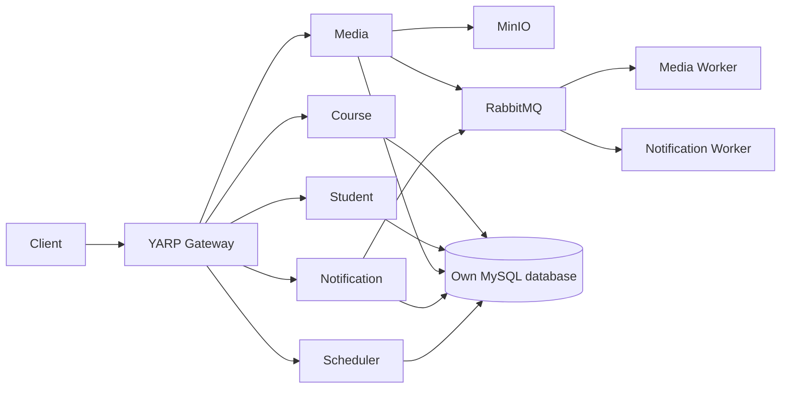

# Phase 2 — Project Planning

## Architecture Direction

Mỗi service giữ database riêng; HTTP dùng cho query cần response, RabbitMQ cho
command/event. Scheduler không sở hữu business data và job execution chưa có
evidence runtime. Xem [architecture](../../architecture/README.md).

## Service Responsibilities

| Service | Responsibility | Own DB | External dependency |
| --- | --- | --- | --- |
| Course | Course/Lesson/Enrollment/Progress boundary | Có | Student/Media chỉ logical reference. |
| Student | Student/profile query boundary | Có | Không cross-DB. |
| Media | Object metadata/usage và MinIO access | Có | MinIO, Student API, RabbitMQ. |
| Notification | Notification/batch/item | Có | Student API, Media messaging, RabbitMQ. |
| Scheduler | Background job/run data | Có | RabbitMQ host; execution Planned. |

## Tech Stack & Environment Strategy

| Category | Technology | Purpose | Status |
| --- | --- | --- | --- |
| Runtime | .NET / ASP.NET Core | API và Worker host | In use |
| Data | MySQL 8.4, EF Core/Pomelo | Database per service | In use |
| Storage | MinIO | Media object storage | In use, chỉ Media truy cập |
| Messaging | RabbitMQ, MassTransit | Command/event và Worker | In use |
| Gateway | YARP | Public HTTP entry point | In use |
| Container | Docker Compose | Local stack | In use |
| Testing | NUnit, TestServer, Testcontainers | Quality boundary | In use |
| Logging | Structured logging | Observability direction | Cần xác nhận implementation tập trung |

Local Development chạy infrastructure và service bằng Docker Compose. Khi benchmark,
giữ cùng máy, dataset, configuration; ghi warm-up, số lần chạy, thời gian, memory
và throughput. Không chạy benchmark trong Phase 0–2.

## Delivery, Quality & Environment

- Local infrastructure chạy Docker Compose; API/Worker build bằng Dockerfile.
- Test strategy: NUnit unit/component/integration; Testcontainers khi cần dependency thật.
- Git strategy tham chiếu [branch strategy](../../development/branch-and-commit-strategy.md); `ducnm3` là integration branch, ticket branch dùng `feature/<ticket>`.
- Milestone: Phase 0–2 → Requirements → Design/Testcase → Development → Verify/Demo.
- Deliverable Phase 0–2: scope, direction, assumptions/risks, traceability, planning DoD.
