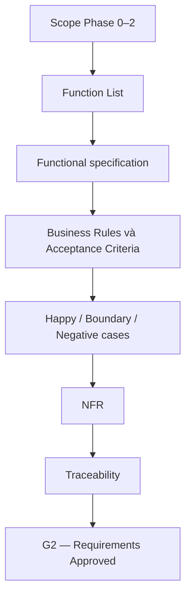

# Phase 3 — Requirements

## Mục đích

Phase 3 chuyển scope Phase 0–2 thành yêu cầu có thể review và kiểm thử cho Mini
LMS. Tài liệu trả lời hệ thống phải làm gì; không quyết định route API, schema,
ERD, sequence hoặc cách triển khai chi tiết.

## Artefact

- [Function List](function-list.md)
- [Course specification](course-spec.md)
- [Student specification](student-spec.md)
- [Media specification](media-spec.md)
- [Notification specification](notification-spec.md)
- [Scheduler specification](scheduler-spec.md)
- [Non-functional requirements](non-functional-requirements.md)
- [Traceability](traceability.md)

## Phạm vi và trạng thái

Phạm vi chỉ gồm Course/Lesson/Enrollment/Progress, Student query, Media,
Notification batch/inbox và Scheduler data boundary như đã chốt ở Phase 1.
Mỗi function có trạng thái `Existing` khi repository có evidence hiện tại hoặc
`Planned` khi chỉ là yêu cầu cho phase sau. `Planned` không phải cam kết đã có
runtime.

Phase 3 đối chiếu đủ 13 nhóm yêu cầu tại
[`docs/development/requirements-mapping.md`](../../development/requirements-mapping.md).
Các requirement về Docker, performance và error handling được quản lý như yêu
cầu xuyên suốt, không tạo thêm business function.

## Cách review và sử dụng

1. Đọc [Function List](function-list.md) để xác nhận scope, trạng thái và runtime
   evidence.
2. Review spec từng domain để xác nhận Business Rules, main/alternative flow,
   AC và ba nhóm case.
3. Đối chiếu [NFR](non-functional-requirements.md) với metric/điều kiện nghiệm
   thu, không điền kết quả benchmark giả.
4. Kiểm tra đủ 13 dòng tại [Traceability](traceability.md) trước khi sign-off G2.

## Xử lý sai lệch khi review

| Sai lệch | Cách xử lý |
| --- | --- |
| Có API doc nhưng chưa có runtime source | Giữ function ở trạng thái `Planned`. |
| Một dòng requirements mapping chưa có Function/BR/AC/NFR | Bổ sung requirement và traceability; chưa sign-off G2. |
| Requirement còn nhiều cách hiểu | Ghi Q&A và chốt semantics trước Phase 4. |
| Benchmark chưa chạy | Giữ như yêu cầu/kế hoạch đo; không ghi kết quả hoặc claim hoàn tất. |

## G2 — Requirements Approved

- [x] Scope được phân rã thành Function List và không phát sinh feature ngoài
  scope.
- [x] Mỗi function có purpose, actor, precondition, input/output, Business
  Rules, main/alternative flow, error cases, AC và nhóm case.
- [x] NFR performance/quality có metric hoặc điều kiện đo rõ ràng.
- [x] Cả 13 nhóm trong requirements mapping trace được tới function, rule, AC
  hoặc NFR.
- [ ] Lead review và sign-off G2.

> [!IMPORTANT]
> Chỉ sau G2, Phase 4 mới thiết kế Basic Design, API/database/message contract
> và testcase chi tiết. Không dùng tài liệu này làm contract triển khai trực tiếp.
