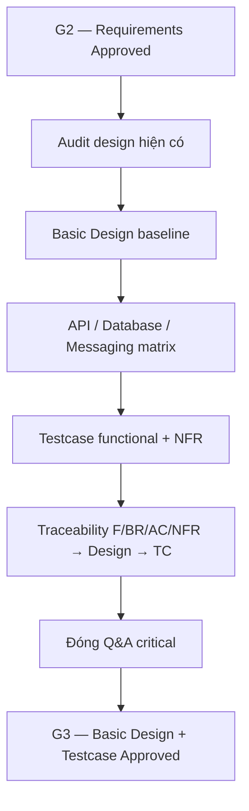

# Phase 4 — Basic Design + Testcase

## Mục đích

Phase 4 chuyển requirements F01–F18 và NFR của Phase 3 thành design baseline và
testcase có thể review. Phase này trả lời hệ thống phối hợp thành phần, API,
database, message và worker như thế nào ở mức thiết kế; chưa sửa application
code, migration hoặc công bố kết quả benchmark.

> [!IMPORTANT]
> Có thể chuẩn bị artefact Phase 4 trước, nhưng không sign-off G3 khi Lead chưa
> sign-off G2 hoặc còn Q&A critical. `Planned` là design cho Phase 5, không phải
> bằng chứng runtime đã tồn tại.

## Artefact

- [Design baseline](design-baseline.md)
- [API design matrix](api-design-matrix.md)
- [Database design matrix](database-design-matrix.md)
- [Messaging và worker design](messaging-worker-design.md)
- Functional testcase:
  - [Course](testcases/course-testcases.md)
  - [Student](testcases/student-testcases.md)
  - [Media](testcases/media-testcases.md)
  - [Notification](testcases/notification-testcases.md)
  - [Scheduler](testcases/scheduler-testcases.md)
- [Non-functional testcase](testcases/non-functional-testcases.md)
- [Traceability](traceability.md)
- [Q&A và design decisions](open-questions.md)

## Nguyên tắc quản lý tài liệu

`docs/project/4/` là approval baseline, không sao chép source of truth:

| Nội dung | Source of truth |
| --- | --- |
| Endpoint contract | `docs/api/<service>/endpoints/` |
| Actor/system flow và sequence | `docs/business-flows/` |
| Component/layer boundary | `docs/architecture/` |
| Table, constraint, index, migration | `docs/database/` và migration SQL |
| Automated test đã tồn tại | `docs/tests/` và test source |
| Requirement | `docs/project/3/` |

Khi một contract thay đổi, cập nhật source of truth trước rồi đồng bộ matrix và
traceability của Phase 4. Không gắn `Existing` chỉ vì đã có tài liệu.

## Trạng thái testcase

- `Designed`: testcase đã được mô tả ở Phase 4 nhưng chưa chứng minh có automated
  test.
- `Existing`: có test source hiện tại và được catalog trong `docs/tests/`.
- `Planned`: cần implement ở Phase 5 hoặc vòng test sau.

Mỗi testcase phải xác minh kết quả trả về và side effect liên quan. Với write
flow, không coi response thành công là đủ nếu chưa kiểm tra database, message,
storage hoặc counter tương ứng.

## G3 — Basic Design + Testcase Approved

- [ ] Lead xác nhận G2 đã Approved.
- [x] F01–F18 có design owner và tài liệu/matrix tương ứng.
- [x] Database ownership, transaction, constraint và index liên quan đã được
  ánh xạ.
- [x] Async flow có message, idempotency, retry và failure design.
- [x] Mỗi function có happy, boundary và negative testcase ở mức design.
- [x] Mỗi NFR có test method, dataset/condition và metrics/pass evidence.
- [x] Traceability nối requirement tới design và testcase.
- [ ] Q&A critical đã đóng.
- [ ] Lead/TL approve Basic Design và SQA/Lead approve testcase.

## Xử lý khi review gặp sai lệch

| Sai lệch | Cách xử lý |
| --- | --- |
| Matrix ghi `Existing` nhưng không có runtime/test source | Hạ về `Planned`; bổ sung evidence ở Phase 5. |
| API matrix khác endpoint doc | Endpoint doc là source of truth; sửa matrix và traceability. |
| Testcase không trace được AC/NFR | Không approve testcase; bổ sung mapping trước G3. |
| Chưa có SLO | Giữ baseline/metrics và cách đo; không tự đặt target millisecond. |
| Q&A làm thay đổi requirement | Quay lại cập nhật Phase 3 và xin lại G2 trước khi sửa design. |
