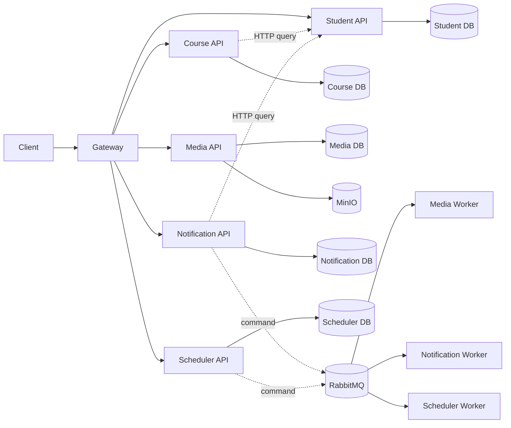

# Basic Design Baseline

## Kiến trúc áp dụng

Phase 4 giữ kiến trúc microservice và Clean Architecture đã được mô tả tại
[`docs/architecture/backend/`](../../architecture/backend/). Client chỉ đi qua
Gateway; mỗi service sở hữu database của mình; query cần response dùng HTTP,
command bất đồng bộ dùng RabbitMQ.

## Quyết định baseline

| ID | Quyết định |
| --- | --- |
| BD-01 | API/Application không truy cập database hoặc MinIO của service khác. UUID ngoài service là logical reference. |
| BD-02 | QUERY cần response dùng typed HTTP client và forward `X-Correlation-Id`; không dùng RabbitMQ cho query. |
| BD-03 | COMMAND có một owner dùng Send; consumer idempotent vì delivery at-least-once. Write + command quan trọng dùng Outbox/Inbox hoặc cơ chế chống dual-write tương đương. |
| BD-04 | JSON dùng response/error envelope chung; CSV và binary stream là ngoại lệ đã document. Không lộ SQL, stack trace, credential, bucket hoặc object key. |
| BD-05 | `Existing` cần runtime source; `Planned` là contract cho Phase 5. Design không nâng trạng thái runtime. |
| BD-06 | Performance test công bố dataset, cấu hình, warm-up, số lần chạy và raw metrics; không đặt SLO giả. |
| BD-07 | Mọi write testcase kiểm tra persistent state và side effect, không chỉ HTTP response. |

## Mapping function tới design owner

| Function | Owner | Thành phần chính | Design source |
| --- | --- | --- | --- |
| F01–F06 | Course Service | API, Application, Course DB, Student HTTP boundary | [Course architecture](../../architecture/backend/course-service/architecture.md), [Course flow](../../business-flows/course-learning/course-management.md), [Learning flow](../../business-flows/course-learning/enrollment-and-learning-progress.md) |
| F07–F08 | Student Service | API, Application, Student DB | [Student architecture](../../architecture/backend/student-service/architecture.md), [Student flows](../../business-flows/students/) |
| F09–F11 | Media Service | API/Worker, Media DB, MinIO, RabbitMQ | [Media architecture](../../architecture/backend/media-service/architecture.md), [Media flows](../../business-flows/media/) |
| F12–F17 | Notification Service | API/Worker, Notification DB, Student HTTP, RabbitMQ, Media Worker | [Notification architecture](../../architecture/backend/notification-service/architecture.md), [Notification flows](../../business-flows/notifications/) |
| F18 | Scheduler + Media Service | Scheduler Worker/DB, command bus, Media cleanup port/MinIO | [Scheduler architecture](../../architecture/backend/scheduler-service/architecture.md), [Cleanup flow](../../business-flows/scheduler/media-cleanup.md) |

## Transaction và consistency boundary

| Flow | Atomic boundary | Ngoài transaction | Cơ chế nhất quán |
| --- | --- | --- | --- |
| Course/Lesson/Enrollment/Progress | Một transaction Course DB | Student status query | Validate trước write; unique constraint bảo vệ duplicate/race. |
| Media upload | Metadata transaction riêng | Stream MinIO | `PENDING → READY/FAILED`; compensation/cleanup cho object hoặc metadata dang dở. |
| Media usage | Một transaction Media DB | Actor/owner query nếu cần | Unique active usage và soft-delete trong cùng transaction. |
| Notification đơn | Notification + outbox cùng transaction | Media usage consumer | Command idempotent; chỉ tạo usage sau notification thành công. |
| Notification batch | Batch/item/notification + outbox theo bounded chunk | Student paging và sender | Snapshot unique, lease token, retry một lần, item `SUCCESS` không xử lý lại. |
| Scheduler cleanup | Job run/idempotency trong Scheduler DB | Media cleanup command | Một run/idempotency key; Media là owner quyết định và thực thi xóa. |

## Luồng lỗi dùng chung

1. API validate syntax trước side effect.
2. Application validate authorization, ownership, state và invariant.
3. Infrastructure map duplicate/concurrency/dependency failure thành error an
   toàn; không lộ chi tiết adapter.
4. Worker lưu trạng thái/counter traceable trước khi ack khi flow yêu cầu.
5. Log giữ correlation ID, operation/message type và attempt; không log secret
   hoặc payload nhạy cảm.

## Giới hạn Phase 4

- Không tạo migration hoặc scaffold EF.
- Không cập nhật Postman vì endpoint mới chưa được implement.
- Không claim benchmark/test pass khi chưa chạy ở Phase 5.
- Contract còn thiếu trong [API matrix](api-design-matrix.md) phải có endpoint
  doc và business-flow 1:1 trước khi code tương ứng được merge.

